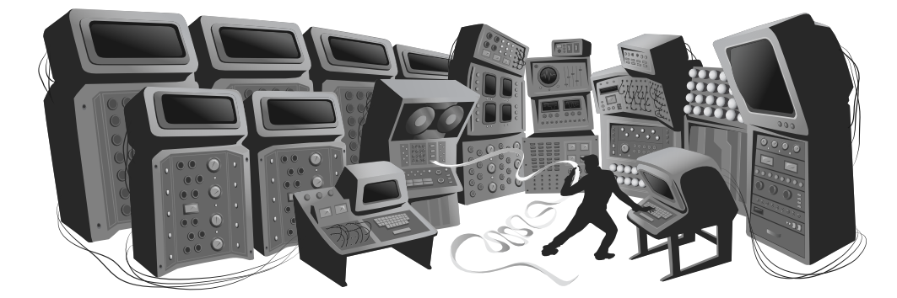

#Выразительный Javascript  
2-е издание

**Автор: Марейн Хавербек  
Переводчик:  Вячеслав Голованов  
Редактор: Антон Кармазин**

*Распространяется под лицензией [Creative Commons Attribution-Noncommercial](http://creativecommons.org/licenses/by-nc/3.0/).  
Исходный код в книге распростроняется под лицензией [MIT](http://opensource.org/licenses/MIT).*

           
           

#Введение
Это книга рассказывает, как заставить компьютеры делать то, что вам от них нужно. Компьютеры сегодня так же распространены, как отвёртки – но содержат гораздо больше скрытых сложностей, и поэтому их сложнее понять и с ними сложнее работать. Для многих они остаются чуждыми, слегка угрожающими штуками.

Мы обнаружили два эффективных способа уменьшить коммуникационный разрыв между нами – водянистыми биологическими организмами, у которых есть талант к социальным связям и пространным рассуждениям, и компьютерами – бесчувственными манипуляторами, работающими с бессмысленными данными. Первый – обратиться к нашему ощущению физического мира, и строить интерфейсы, имитирующие его, чтобы мы могли при помощи пальцев манипулировать формами на экране. Для простого взаимодействия с компьютером это неплохо подходит.

Но мы не нашли хороший способ передавать компьютеру при помощи перемещений и нажатий мышью те вещи, которые дизайнер интерфейса не предусмотрел. Для того, чтобы взаимодействовать с компьютером на более сложных уровнях, например задавать ему произвольные задачи на выполнение, лучше подходит наш талант к общению: мы обучаем компьютер языку.

Человеческие языки позволяют комбинировать слова великим множеством способов, так, что мы можем сказать очень много разных вещей. Компьютерные языки устроены примерно так же, хотя и менее гибки грамматически.

За последние 20 лет работа с компьютером стала очень распространённым явлением, и интерфейсы, построенные на языке (а когда-то это был единственный способ общения с компьютером) почти вытеснены графическими. Но они всё ещё есть – если вы знаете, где их искать. Один из таких языков, JavaScript, встроен почти в любой веб-браузер, и потому доступен почти на каждом вычислительном устройстве.

Эта книга ставит целью познакомить вас с этим языком достаточно для того, чтобы вы могли заставить компьютер делать то, что вам нужно.

