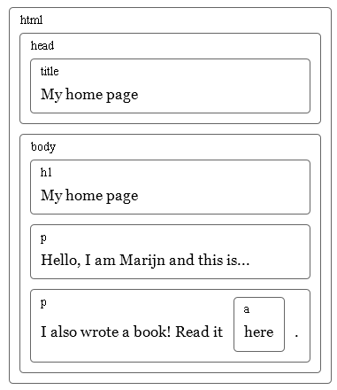
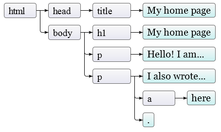
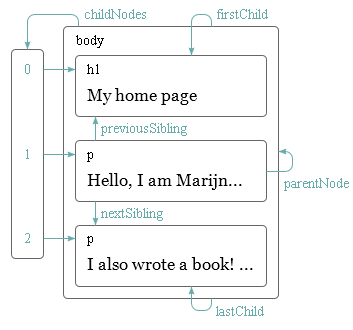
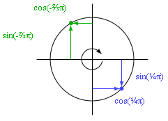

#Document Object Model

Когда вы открываете веб-страницу в браузере, он получает исходный текст HTML и разбирает (парсит) его примерно так, как наш парсер из главы 11 разбирал программу. Браузер строит модель структуры документа и использует её, чтобы нарисовать страницу на экране.

Это представление документа и есть одна из игрушек, доступных в песочнице JavaScript. Вы можете читать её и изменять. Она изменяется в реальном времени – как только вы её подправляете, страница на экране обновляется, отражая изменения.

Структура документа

Можно представить HTML как набор вложенных коробок. Теги вроде `<body>` и `</body>` включают в себя другие теги, которые в свою очередь включают теги, или текст. Вот вам пример документа из предыдущей главы:

```html
<!doctype html>
<html>
  <head>
    <title>Моя домашняя страничка</title>
  </head>
  <body>
    <h1> Моя домашняя страничка </h1>
    <p>Привет, я Марийн и это моя домашняя страничка.</p>
    <p>А ещё я книжку написал! Читайте её
      <a href="http://eloquentjavascript.net">здесь</a>.</p>
  </body>
</html>
```

У этой страницы следующая структура:



Структура данных, использующаяся браузером для представления документа, отражает его форму. Для каждой коробки есть объект, с которым мы можем взаимодействовать и узнавать про него разные данные – какой тег он представляет, какие коробки и текст содержит. Это представление называется Document Object Model (объектная модель документа), или сокращённо DOM.

Мы можем получить доступ к этим объектам через глобальную переменную document. Её свойство documentElement ссылается на объект, представляющий тег . Он также предоставляет свойства head и body, в которых содержатся объекты для соответствующих элементов.

##Деревья
Вспомните синтаксические деревья из главы 11. Их структура удивительно похожа на структуру документа браузера. Каждый узел может ссылаться на другие узлы, у каждого из ответвлений может быть своё ответвление. Эта структура – типичный пример вложенных структур, где элементы содержат подэлементы, похожие на них самих.

Мы зовём структуру данных деревом, когда она разветвляется, не имеет циклов (узел не может содержать сам себя), и имеет единственный ярко выраженный «корень». В случае DOM в качестве корня выступает document.documentElement.

Деревья часто встречаются в вычислительной науке. В дополнение к представлению рекурсивных структур вроде документа HTML или программ, они часто используются для работы с сортированными наборами данных, потому что элементы обычно проще найти или вставлять в отсортированное дерево, чем в отсортированный одномерный массив.

У типичного дерева есть разные узлы. У синтаксического дерева языка Egg были переменные, значения и приложения. У приложений всегда были дочерние ветви, а переменные и значения были «листьями», то есть узлами без дочерних ответвлений.

То же и у DOM. Узлы для обычных элементов, представляющих теги HTML, определяют структуру документа. У них могут быть дочерние узлы. Пример такого узла — document.body. Некоторые из этих дочерних узлов могут оказаться листьями – например, текст или комментарии (в HTML комментарии записываются между символами `<!--` и `-->`).

У каждого узлового объекта DOM есть свойство nodeType, содержащее цифровой код, определяющий тип узла. У обычных элементов он равен 1, что также определено в виде свойства-константы document.ELEMENT_NODE. У текстовых узлов, представляющих отрывки текста, он равен 3 (document.TEXT_NODE). У комментариев — 8 (document.COMMENT_NODE).

То есть, вот ещё один способ графически представить дерево документа:



Листья – текстовые узлы, а стрелки показывают взаимоотношения отец-ребёнок между узлами.

##Стандарт
Использовать загадочные цифры для представления типа узла – это подход не в стиле JavaScript. Позже мы встретимся с другими частями интерфейса DOM, которые тоже кажутся чуждыми и нескладными. Причина в том, что DOM разрабатывался не только для JavaScript. Он пытается определить интерфейс, не зависящий от языка, который можно использовать и в других системах – не только в HTML, но и в XML, который представляет из себя формат данных общего назначения с синтаксисом, напоминающим HTML.

Получается неудобно. Хотя стандарты – и весьма полезная штука, в нашем случае преимущество независимости от языка не такое уж и полезное. Лучше иметь интерфейс, хорошо приспособленный к языку, который вы используете, чем интерфейс, который будет знаком при использовании разных языков.

Чтобы показать неудобную интеграцию с языком, рассмотрим свойство childNodes, которое есть у узлов DOM. В нём содержится объект, похожий на массив, со свойством length, и пронумерованные свойства для доступа к дочерним узлам. Но это – экземпляр типа NodeList, не настоящий массив, поэтому у него нет методов вроде forEach.

Есть также проблемы, связанные с плохой продуманностью системы. К примеру, нельзя создать новый узел и сразу добавить к нему свойства или дочерние узлы. Сначала нужно его создать, затем добавить дочерние по одному, и в конце назначить свойства по одному, с использованием побочных эффектов. Код, плотно работающий с DOM, получается длинным, некрасивым и со множеством повторов.

Но эти проблемы не фатальные. JavaScript позволяет создавать абстракции. Легко написать вспомогательные функции, позволяющие выражать операции более понятно и коротко. Вообще, такого рода инструменты предоставляют много библиотек, направленных на программирование для браузера.

##Обход дерева
Узлы DOM содержат много ссылок на соседние. Это показано на диаграмме:



Хотя тут показано только по одной ссылке каждого типа, у каждого узла есть свойство parentNode, указывающего на его родительский узел. Также у каждого узла-элемента (тип 1) есть свойство childNodes, указывающее на массивоподобный объект, содержащий его дочерние узлы.

В теории можно пройти в любую часть дерева, используя только эти ссылки. Но JavaScript предоставляет нам много дополнительных вспомогательных ссылок. Свойства firstChild и lastChild показывают на первый и последний дочерний элементы, или содержат null у тех узлов, у которых нет дочерних. previousSibling и nextSibling указывают на соседние узлы – узлы того же родителя, что и текущего узла, но находящиеся в списке сразу до или после текущей. У первого узла свойство previousSibling будет null, а у последнего nextSibling будет null.

При работе с такими вложенными структурами пригождаются рекурсивные функции. Следующая ищет в документе текстовые узлы, содержащие заданную строку, и возвращает true, когда находит:

```js
function talksAbout(node, string) {
  if (node.nodeType == document.ELEMENT_NODE) {
    for (var i = 0; i < node.childNodes.length; i++) {
      if (talksAbout(node.childNodes[i], string))
        return true;
    }
    return false;
  } else if (node.nodeType == document.TEXT_NODE) {
    return node.nodeValue.indexOf(string) > -1;
  }
}

console.log(talksAbout(document.body, "книг"));
// → true
```

Свойства текстового узла nodeValue содержит строчку текста.

##Поиск элементов
Часто бывает полезным ориентироваться по этим ссылкам между родителями, детьми и родственными узлами и проходить по всему документу. Однако если нам нужен конкретный узел в документе, очень неудобно идти по нему, начиная с document.body и тупо перебирая жёстко заданный в коде путь. Поступая так, мы вносим в программу допущения о точной структуре документа – а её мы позже можем захотеть поменять. Другой усложняющий фактор – текстовые узлы создаются даже для пробелов между узлами. В документе из примера у тега body не три дочерних (h1 и два p), а целых семь: эти три плюс пробелы до, после и между ними.

Так что если нам нужен атрибут href из ссылки, мы не должны писать в программе что-то вроде: «второй ребёнок шестого ребёнка document.body». Лучше бы, если б мы могли сказать: «первая ссылка в документе». И так можно сделать:

```js
var link = document.body.getElementsByTagName("a")[0];
console.log(link.href);
```

У всех узлов-элементов есть метод getElementsByTagName, собирающий все элементы с данным тэгом, которые происходят (прямые или не прямые потомки) от этого узла, и возвращает его в виде массивоподобного объекта.

Чтобы найти конкретный узел, можно задать ему атрибут id и использовать метод document.getElementById.

```html
<p>Мой страус Гертруда:</p>
<p></p>

<script>
  var ostrich = document.getElementById("gertrude");
  console.log(ostrich.src);
</script>
```

Третий метод – getElementsByClassName, который, как и getElementsByTagName, ищет в содержимом узла-элемента и возвращает все элементы, содержащие в своём классе заданную строчку.

##Меняем документ
Почти всё в структуре DOM можно менять. У узлов-элементов есть набор методов, которые используются для их изменения. Метод removeChild удаляет заданную дочерний узел. Для добавления узла можно использовать appendChild, который добавляет узел в конец списка, либо insertBefore, добавляющий узел, переданную первым аргументом, перед узлом, переданным вторым аргументом.

```html
<p>Один</p>
<p>Два</p>
<p>Три</p>

<script>
  var paragraphs = document.body.getElementsByTagName("p");
  document.body.insertBefore(paragraphs[2], paragraphs[0]);
</script>
```

Узел может существовать в документе только в одном месте. Поэтому вставляя параграф «Три» перед параграфом «Один» мы фактически удаляем его из конца списка и вставляем в начало, и получаем «Три/Один/Два». Все операции по вставке узла приведут к его исчезновению с текущей позиции (если у него таковая была).

Метод replaceChild используется для замены одного дочернего узла другим. Он принимает два узла: новый, и тот, который надо заменить. Заменяемый узел должен быть дочерним узлом того элемента, чей метод мы вызываем. Как replaceChild, так и insertBefore в качестве первого аргумента ожидают получить новый узел.

##Создание узлов
В следующем примере нам надо сделать скрипт, заменяющий все картинки (тег ``) в документе текстом, содержащимся в их атрибуте “alt”, который задаёт альтернативное текстовое представление картинки.

Для этого надо не только удалить картинки, но и добавить новые текстовые узлы им на замену. Для этого мы используем метод document.createTextNode.

```html
<p>Это  в
  .</p>

<p><button onclick="replaceImages()">Заменить</button></p>

<script>
  function replaceImages() {
    var images = document.body.getElementsByTagName("img");
    for (var i = images.length - 1; i >= 0; i--) {
      var image = images[i];
      if (image.alt) {
        var text = document.createTextNode(image.alt);
        image.parentNode.replaceChild(text, image);
      }
    }
  }
</script>
```

Получая строку, createTextNode даёт нам тип 3 узла DOM (текстовый), который мы можем вставить в документ, чтобы он был показан на экране.

Цикл по картинкам начинается в конце списка узлов. Это сделано потому, что список узлов, возвращаемый методом getElementsByTagName (или свойством childNodes) постоянно обновляется при изменениях документа. Если б мы начали с начала, удаление первой картинки привело бы к потере списком первого элемента, и во время второго прохода цикла, когда i равно 1, он бы остановился, потому что длина списка стала бы также равняться 1.

Если вам нужно работать с фиксированным списком узлов вместо «живого», можно преобразовать его в настоящий массив при помощи метода slice.

```js
var arrayish = {0: "один", 1: "два", length: 2};
var real = Array.prototype.slice.call(arrayish, 0);
real.forEach(function(elt) { console.log(elt); });
// → один
//   два
```

Для создания узлов-элементов (тип 1) можно использовать document.createElement. Метод принимает имя тега и возвращает новый пустой узел заданного типа. Следующий пример определяет инструмент elt, создающий узел-элемент и использующий остальные аргументы в качестве его детей. Эта функция потом используется для добавления дополнительной информации к цитате.

```html
<blockquote id="quote">
Никакая книга не может быть закончена. Во время работы над ней мы узнаём достаточно для того, чтобы найти её незрелой сразу же после того, как мы отвлеклись от неё.
</blockquote>

<script>
  function elt(type) {
    var node = document.createElement(type);
    for (var i = 1; i < arguments.length; i++) {
      var child = arguments[i];
      if (typeof child == "string")
        child = document.createTextNode(child);
      node.appendChild(child);
    }
    return node;
  }

  document.getElementById("quote").appendChild(
    elt("footer", "—",
        elt("strong", "Карл Поппер"),
        ", предисловие ко второму изданию ",
        elt("em", "Открытое общество и его враги "),
        ", 1950"));
</script>
```

##Атрибуты
К некоторым элементам атрибутов, типа href у ссылок, можно получить доступ через одноимённое свойство объекта. Это возможно для ограниченного числа часто используемых стандартных атрибутов.

Но HTML позволяет назначать узлам любые атрибуты. Это полезно, т.к. позволяет вам хранить дополнительную информацию в документе. Если вы придумаете свои названия атрибутов, их не будет среди свойств узла-элемента. Вместо этого вам надо будет использовать методы getAttribute и setAttribute для работы с ними.

```html
<p data-classified="secret">Код запуска 00000000.</p>
<p data-classified="unclassified">У кошки четыре ноги.</p>

<script>
  var paras = document.body.getElementsByTagName("p");
  Array.prototype.forEach.call(paras, function(para) {
    if (para.getAttribute("data-classified") == "secret")
      para.parentNode.removeChild(para);
  });
</script>
```

Рекомендую перед именами придуманных атрибутов ставить “data-“, чтобы быть уверенным, что они не конфликтуют с любыми другими. В качестве простого примера мы напишем подсветку синтаксиса, который ищет теги `<pre>` (“preformatted”, предварительно отформатированный – используется для кода и простого текста) с атрибутом data-language (язык) и довольно грубо пытается подсветить ключевые слова в языке.

```js
function highlightCode(node, keywords) {
  var text = node.textContent;
  node.textContent = ""; // Очистим узел

  var match, pos = 0;
  while (match = keywords.exec(text)) {
    var before = text.slice(pos, match.index);
    node.appendChild(document.createTextNode(before));
    var strong = document.createElement("strong");
    strong.appendChild(document.createTextNode(match[0]));
    node.appendChild(strong);
    pos = keywords.lastIndex;
  }
  var after = text.slice(pos);
  node.appendChild(document.createTextNode(after));
}
```

Функция highlightCode принимает узел `<pre>` и регулярку (с включённой настройкой global), совпадающую с ключевым словом языка программирования, которое содержит элемент.

Свойство textContent используется для получения всего текста узла, а затем устанавливается в пустую строку, что приводит к очищению узла. Мы в цикле проходим по всем вхождениям выражения keyword, добавляем между ними текст в виде простых текстовых узлов, а совпавший текст (ключевые слова) добавляем, заключая их в элементы `<strong>` (жирный шрифт).

Мы можем автоматически подсветить весь код страницы, перебирая в цикле все элементы `<pre>`, у которых есть атрибут `data-language`, и вызывая на каждом `highlightCode` с правильной регуляркой.

```js
var languages = {
  javascript: /\b(function|return|var)\b/g /* … etc */
};

function highlightAllCode() {
  var pres = document.body.getElementsByTagName("pre");
  for (var i = 0; i < pres.length; i++) {
    var pre = pres[i];
    var lang = pre.getAttribute("data-language");
    if (languages.hasOwnProperty(lang))
      highlightCode(pre, languages[lang]);
  }
}
```

Вот пример:

```html
<source lang="html">
<p>А вот и она, функция идентификации:</p>
<pre data-language="javascript">
function id(x) { return x; }
```


Есть один часто используемый атрибут, `class`, имя которого является ключевым словом в JavaScript. По историческим причинам, когда старые реализации JavaScript не умели обращаться с именами свойств, совпадавшими с ключевыми словами, этот атрибут доступен через свойство под названием `className`. Вы также можете получить к нему доступ по его настоящему имени `class` через методы `getAttribute` и `setAttribute`.

##Расположение элементов (layout)
Вы могли заметить, что разные типы элементов располагаются по-разному. Некоторые, типа параграфов `<p>` и заголовков `<h1>` растягиваются на всю ширину документа и появляются на отдельных строках. Такие элементы называют блочными. Другие, как ссылки `<a>` или жирный текст `<strong>` появляются на одной строчке с окружающим их текстом. Они называются встроенными (inline).

Для любого документа браузеры могут построить расположение элементов, расклад, в котором у каждого будет размер и положение на основе его типа и содержимого. Затем этот расклад используется для создания внешнего вида документа.

Размер и положение элемента можно узнать через JavaScript. Свойства offsetWidth и offsetHeight выдают размер в пикселях, занимаемый элементом. Пиксель – основная единица измерений в браузерах, и обычно соответствует размеру минимальной точки экрана. Сходным образом, clientWidth и clientHeight дают размер внутренней части элемента, не влючая ширину его границ (border).

```html
<p style="border: 3px solid red">
  Я в коробочке
</p>

<script>
  var para = document.body.getElementsByTagName("p")[0];
  console.log("clientHeight:", para.clientHeight);
  console.log("offsetHeight:", para.offsetHeight);
</script>
```

Самый эффективный способ узнать точное расположение элемента на экране – метод getBoundingClientRect. Он возвращает объект со свойствами top, bottom, left, и right (сверху, снизу, слева и справа), которые содержат положение элемента относительно левого верхнего угла экрана в пикселях. Если вам надо получить эти данные относительно всего документа, вам надо прибавить текущую позицию прокрутки, которая содержится в глобальных переменных pageXOffset и pageYOffset.

Разбор документа – задача сложная. В целях быстродействия браузерные движки не перестраивают документ каждый раз после его изменения, а ждут так долго, как это возможно. Когда программа JavaScript, изменившая документ, заканчивает работу, браузеру надо будет просчитать новую раскладку страницы, чтобы вывести изменённый документ на экран. Когда программа запрашивает позицию или размер чего-либо, читая свойства типа offsetHeight или вызывая getBoundingClientRect, для предоставления корректной информации тоже необходимо рассчитывать раскладку.

Программа, которая периодически считывает раскладку DOM и изменяет DOM, заставляет браузер много раз пересчитывать раскладку, и в связи с этим будет работать медленно. В следующем примере есть две разные программы, которые строят линию из символов X шириной в 2000 пикс, и измеряют время работы.

```html
<p><span id="one"></span></p>
<p><span id="two"></span></p>

<script>
  function time(name, action) {
    var start = Date.now(); // Текущее время в миллисекундах
    action();
    console.log(name, "заняло", Date.now() - start, "ms");
  }

  time("тупо", function() {
    var target = document.getElementById("one");
    while (target.offsetWidth < 2000)
      target.appendChild(document.createTextNode("X"));
  });
  // → тупо заняло 32 ms

  time("умно", function() {
    var target = document.getElementById("two");
    target.appendChild(document.createTextNode("XXXXX"));
    var total = Math.ceil(2000 / (target.offsetWidth / 5));
    for (var i = 5; i < total; i++)
      target.appendChild(document.createTextNode("X"));
  });
  // → умно заняло 1 ms
</script>
```

##Стили
Мы видели, что разные элементы HTML ведут себя по-разному. Некоторые показываются в виде блоков, другие встроенные. Некоторые добавляют визуальный стиль – например, `<strong>` делает жирным текст и `<a>` делает текст подчёркнутым и синим.

Внешний вид картинки в теге `` или то, что ссылка в теге `<a>` при клике открывает новую страницу, связано с типом элемента. Но основные стили, связанные с элементом, вроде цвета текста или подчёркивания, могут быть нами изменены. Вот пример использования свойства style (стиль):

```html
<p><a href=".">Обычная ссылка</a></p>
<p><a href="." style="color: green">Зелёная ссылка</a></p>
```

Атрибут style может содержать одно или несколько объявлений свойств (color), за которым следует двоеточие и значение. В случае нескольких объявлений они разделяются точкой с запятой: “color: red; border: none”.

Много всякого можно изменить при помощи стилей. Например, свойство display контролирует, показывается ли элемент в блочном или встроенном виде.

```html
Текст показан <strong>встроенным</strong>,
<strong style="display: block">в виде блока</strong>, и
<strong style="display: none">вообще не виден</strong>.
```

Блочный элемент выводится отдельным блоком, а последний вообще не виден – display: none отключает показ элементов. Таким образом можно прятать элементы. Обычно это предпочтительно полному удалению их из документа, потому что их легче потом при необходимости снова показать.

Код JavaScript может напрямую действовать на стиль элемента через свойство узла style. В нём содержится объект, имеющий свойства для всех свойств стилей. Их значения – строки, в которые мы можем писать для смены какого-то аспекта стиля элемента.

```html
<p id="para" style="color: purple">
  Красотень
</p>

<script>
  var para = document.getElementById("para");
  console.log(para.style.color);
  para.style.color = "magenta";
</script>
```

Некоторые имена свойств стилей содержат дефисы, например font-family. Так как с ними неудобно было бы работать в JavaScript (пришлось бы писать style[«font-family»]), названия свойств в объекте стилей пишутся без дефиса, а вместо этого в них появляются прописные буквы: style.fontFamily

##Каскадные стили
Система стилей в HTML называется CSS (Cascading Style Sheets, каскадные таблицы стилей). Таблица стилей – набор стилей в документе. Его можно писать внутри тега `<style>`:

```html
<style>
  strong {
    font-style: italic;
    color: gray;
  }
</style>
<p>Теперь <strong>текст тега strong</strong> наклонный и серый.</p>
```

«Каскадные» означает, что несколько правил комбинируются для получения окончательного стиля документа. В примере на стиль по умолчанию для `<strong>`, который делает текст жирным, накладывается правило из тега `<style>`, по которому добавляется font-style и цвет.

Когда значение свойства определяется несколькими правилами, приоритет остаётся у более поздних. Если бы стиль текста в `<style>` включал правило font-weight: normal, конфликтующее со стилем по умолчанию, то текст был бы обычный, а не жирный. Стили, которые применяются к узлу через атрибут style, имеют наивысший приоритет.

В CSS возможно задавать не только название тегов. Правило для .abc применяется ко всем элементам, у которых указан класс “abc”. Правило для #xyz применяется к элементу с атрибутом id равным “xyz” (атрибуты id необходимо делать уникальными для документа).

```css
.subtle {
  color: gray;
  font-size: 80%;
}
#header {
  background: blue;
  color: white;
}
/* Элементы p, у которых указаны классы a и b, а id задан как main */
p.a.b#main {
  margin-bottom: 20px;
}
```

Приоритет самых поздних правил работает, когда у правил одинаковая детализация. Это мера того, насколько точно оно описывает подходящие элементы, определяемая числом и видом необходимых аспектов элементов. К примеру, правило для p.a более детально, чем правила для p или просто .a, и будет иметь приоритет.

Запись `p > a {…}` применима ко всем тегам `<a>`, находящимся внутри тега `<p>` и являющимся его прямыми потомками.
`p a {…}` применимо также ко всем тегам `<a>` внутри `<p>`, при этом неважно, является ли `<a>` прямым потомком или нет.

##Селекторы запросов
В этой книге мы не будем часто использовать таблицы стилей. Понимание их работы критично для программирования в браузере, но подробное разъяснение всех их свойств заняло бы 2-3 книги. Главная причина знакомства с ними и с синтаксисом селекторов (записей, определяющих, к каким элементам относятся правила) – мы можем использовать тот же эффективный мини-язык для поиска элементов DOM.

Метод querySelectorAll, существующий и у объекта document, и у элементов-узлов, принимает строку селектора и возвращает массивоподобный объект, содержащий все элементы, подходящие под него.

```html
<p>Люблю грозу в начале
  <span>мая</span></p>
<p>Когда весенний первый гром</p>
<p>Как бы <span>резвяся
  <span>и играя</span></span></p>
<p>Грохочет в небе голубом.</p>

<script>
  function count(selector) {
    return document.querySelectorAll(selector).length;
  }
  console.log(count("p"));           // Все элементы <p>
  // → 4
  console.log(count(".animal"));     // Класс animal
  // → 2
  console.log(count("p .animal"));   // Класс animal внутри <p>
  // → 2
  console.log(count("p > .animal")); // Прямой потомок <p>
  // → 1
</script>
```

В отличие от методов вроде getElementsByTagName, возвращаемый querySelectorAll объект не интерактивный. Он не изменится, если вы измените документ.

Метод querySelector (без All) работает сходным образом. Он нужен, если вам необходим один конкретный элемент. Он вернёт только первое совпадение, или null, если совпадений нет.

##Расположение и анимация
Свойство стилей position сильно влияет на расположение элементов. По умолчанию оно равно static, что означает, что элемент находится на своём обычном месте в документе. Когда оно равно relative, элемент всё ещё занимает место, но теперь свойства top и left можно использовать для сдвига относительно его обычного расположения. Когда оно равно absolute, элемент удаляется из нормального «потока» документа – то есть, он не занимает место и может накладываться на другие. Кроме того, его свойства left и top можно использовать для абсолютного позиционирования относительно левого верхнего угла ближайшего включающего его элемента, у которого position не равно static. А если такого элемента нет, тогда он позиционируется относительно документа.

Мы можем использовать это для создания анимации. Следующий документ показывает картинку с котом, которая двигается по эллипсу.

```html
<p style="text-align: center">
  
</p>
<script>
  var cat = document.querySelector("img");
  var angle = 0, lastTime = null;
  function animate(time) {
    if (lastTime != null)
      angle += (time - lastTime) * 0.001;
    lastTime = time;
    cat.style.top = (Math.sin(angle) * 20) + "px";
    cat.style.left = (Math.cos(angle) * 200) + "px";
    requestAnimationFrame(animate);
  }
  requestAnimationFrame(animate);
</script>
```

Картинка отцентрирована на странице и ей задана position: relative. Мы постоянно обновляем свойства top и left картинки, чтобы она двигалась.

Скрипт использует requestAnimationFrame для вызова функции animate каждый раз, когда браузер готов перерисовывать экран. Функция animate сама опять вызывает requestAnimationFrame, чтобы запланировать следующее обновление. Когда окно браузера (или закладка) активна, это приведёт к обновлениям со скорость примерно 60 раз в секунду, что позволяет добиться хорошо выглядящей анимации.

Если бы мы просто обновляли DOM в цикле, страница бы зависла и ничего не было бы видно. Браузеры не обновляют страницу во время работы JavaScript, и не допускают в это время работы со страницей. Поэтому нам нужна requestAnimationFrame – она сообщает браузеру, что мы пока закончили, и он может заниматься своими браузерными вещами, например обновлять экран и отвечать на запросы пользователя.

Наша функция анимации передаётся текущее время через аргументы, которое оно сравнивает с предыдущим (переменная lastTime), чтобы движение кота было однородным, и анимация работала плавно. Если бы мы просто передвигали её на заданный промежуток на каждом шаге, движение бы запиналось если бы, например, другая задача загрузила бы компьютер.

Движение по кругу осуществляется с применением тригонометрических функций Math.cos и Math.sin. Я кратко опишу их для тех, кто с ними незнаком, так как они понадобятся нам в дальнейшем.

Math.cos и Math.sin полезны тогда, когда надо найти точки на круге с центром в точке (0, 0) и радиусом в единицу. Обе функции интерпретируют свой аргумент как позицию на круге, где 0 обозначает точку с правого края круга, затем нужно против часовой стрелки, пока путь диной в 2π (около 6.28) не проведёт нас по кругу. Math.cos считает координату по оси x той точки, которая является нашей текущей позицией на круге, а Math.sin выдаёт координату y. Позиции (или углы) больше, чем 2π или меньше чем 0, тоже допустимы – повороты повторяются так, что a+2π означает тот же самый угол, что и a.



##Использование синуса и косинуса для вычисления координат
Анимация кота хранит счётчик angle для текущего угла поворота анимации, и увеличивает его пропорционально прошедшему времени каждый раз при вызове функции animation. Этот угол используется для подсчёта текущей позиции элемента image. Стиль top подсчитывается через Math.sin и умножается на 20 – это вертикальный радиус нашего эллипса. Стиль left считается через Math.cos и умножается на 200, так что ширина эллипса сильно больше высоты.

Стилям обычно требуются единицы измерения. В нашем случае приходится добавлять px к числу, чтобы объяснить браузеру, что мы считаем в пикселях (а не в сантиметрах, ems или других единицах). Это легко забыть. Использование чисел без единиц измерения приведёт к игнорированию стиля – если только число не равно 0, что не зависит от единиц измерения.

##Итог
Программы JavaScript могут изучать и изменять текущий отображаемый браузером документ через структуру под названием DOM. Эта структура данных представляет модель документа браузера, а программа JavaScript может изменять её для изменения видимого документа. DOM организован в виде дерева, в котором элементы расположены иерархически в соответствии со структурой документа. У объектов элементов есть свойства типа parentNode и childNodes, которы используются для ориентирования на дереве.

Внешний вид документа можно изменять через стили, либо добавляя стили к узлам напрямую, либо определяя правила для каких-либо узлов. У стилей есть очень много свойств, таких, как color или display. JavaScript может влиять на стиль элемента напрямую через его свойство style.

##Упражнения
###Строим таблицу
Мы строили таблицы из простого текста в главе 6. HTML упрощает построение таблиц. Таблица в HTML строится при помощи следующих тегов:

```html
<table>
  <tr>
    <th>name</th>
    <th>height</th>
    <th>country</th>
  </tr>
  <tr>
    <td>Kilimanjaro</td>
    <td>5895</td>
    <td>Tanzania</td>
  </tr>
</table>
```

Для каждой строки в теге `<table>` содержится тег `<tr>`. Внутри него мы можем размещать ячейки: либо ячейки заголовков `<th>`, либо обычные ячейки `<td>`.

Те же данные, что мы использовали в главе 6, снова доступны в переменной MOUNTAINS.

Напишите функцию buildTable, которая, принимая массив объектов с одинаковыми свойствами, строит структуру DOM, представляющую таблицу. У таблицы должна быть строка с заголовками, где имена свойств обёрнуты в элементы `<th>`, и должно быть по одной строчке на объект из массива, где его свойства обёрнуты в элементы `<td>`. Здесь пригодится функция Object.keys, возвращающая массив, содержащий имена свойств объекта.

Когда вы разберётесь с основами, выровняйте ячейки с числами по правому краю, изменив их свойство style.textAlign на «right».

```html
<style>
  /* Определяет стили для красивых таблиц */
  table  { border-collapse: collapse; }
  td, th { border: 1px solid black; padding: 3px 8px; }
  th     { text-align: left; }
</style>

<script>
  function buildTable(data) {
    // Ваш код
  }

  document.body.appendChild(buildTable(MOUNTAINS));
</script>
```

###Элементы по имени тегов
Метод getElementsByTagName возвращает все дочерние элементы с заданным именем тега. Сделайте свою версию этого метода в виде обычной функции, которая принимает узел и строчку (имя тега) и возвращает массив, содержащий все нисходящие узлы с заданным именем тега.

Чтобы выяснить имя тега элемента, используйте свойство tagName. Заметьте, что оно возвратит имя тега в верхнем регистре. Используйте методы строк toLowerCase или toUpperCase.

```html
<h1>Заголовок с элементом <span>span</span> внутри.</h1>
<p>Параграф с <span>раз</span>, <span>два</span> элементами spans.</p>

<script>
  function byTagName(node, tagName) {
    // Ваш код
  }

  console.log(byTagName(document.body, "h1").length);
  // → 1
  console.log(byTagName(document.body, "span").length);
  // → 3
  var para = document.querySelector("p");
  console.log(byTagName(para, "span").length);
  // → 2
</script>
```

###Шляпа кота
Расширьте анимацию кота, чтобы и кот и его шляпа `` летали по противоположным сторонам эллипса.

Или пусть шляпа летает вокруг кота. Или ещё что-нибудь интересное придумайте.

Чтобы упростить расположение множества объектов, неплохо будет переключиться на абсолютное позиционирование. Тогда top и left будут считаться относительно левого верхнего угла документа. Чтобы не использовать отрицательные координаты, вы можете добавить заданное число пикселей к значениям position.

```html


<script>
  var cat = document.querySelector("#cat");
  var hat = document.querySelector("#hat");
  // Your code here.
</script>
```
