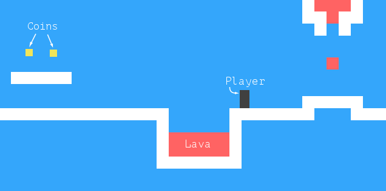
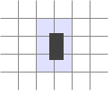

#Проект: игра-платформер

<i>Вся наша жизнь – игра.</i>

<i>Ийен Бэнкс, «Игрок»</i>

Впервые я увлёкся компьютерами, как и большинство детей, через компьютерные игры. Меня затянуло во вселенную симулированных миров, которыми можно было управлять, и в которых рассказывались истории – мне кажется больше потому, что в них был дан простор моему воображению, чем из-за реальных возможностей, которые они предоставляли.

Никому бы не пожелал карьеру игрового программиста. Как и в музыкальной индустрии, несоответствие между количеством молодых людей, желающих попасть туда и реальным спросом на них, создаёт нездоровую среду. Но написание игр для развлечения – это очень здорово.

В этой главе мы изучим реализацию простого платформера. В платформерах (или «прыгай и беги») от игрока требуется двигать фигурку по (обычно) двумерному миру, который мы видим сбоку, и часто перепрыгивать через разные штуки.

##Игра
Наша игра будет примерно базироваться на игре Dark Blue от Томаса Палефа. Я выбрал её, потому что она как развлекательная, так и минималистичная, и её можно сделать минимумом кода. Выглядит она так:



Чёрный прямоугольник представляет игрока, чья задача – собирать жёлтые квадраты (монеты), избегая красных участков (лава?). Уровень заканчивается, когда игрок собрал все монеты.

Игрок может ходить клавишами влево и вправо, и прыгать клавишей вверх. Прыжки – это специальность нашего персонажа. Он может прыгать в несколько раз выше своего роста и менять направление движения в воздухе. Это не очень-то реалистично, но помогает игроку почувствовать полный контроль над его экранным аватаром.

У игры фиксированный фон в виде решётки, где движущиеся элементы накладываются на фон. Каждая ячейка решётки либо пустая, либо является стеной, либо лавой. Движущиеся элементы – игрок, монеты и некоторые кусочки лавы. В отличие от симуляции жизни из главы 7, позиции этих элементов не привязаны к решётке. Их координаты могут быть дробными, обеспечивая плавное движение.

##Технология
Мы используем DOM браузера для графики, и читаем ввод пользователя, обслуживая события клавиатуры.

Код, относящийся к экрану и клавиатуре – небольшая часть работы, которую нам надо проделать для создания игры. Так как всё состоит из цветных квадратиков, рисовать это просто: мы создаём элементы DOM и используем стили, чтобы задать им цвет фона, размер и расположение.

Мы представляем фон как таблицу, поскольку это – неизменная решётка из квадратов. Свободно двигающиеся элементы можно накладывать сверху, используя абсолютное позиционирование.

В играх и других интерактивных программах с графической анимацией, которые должны реагировать на действия пользователя без задержки, очень важна эффективность. Хотя DOM не был задуман для вывода высокоскоростной графики, он справляется с этим лучше, чем можно ожидать. В главе 13 вы видели немножко анимации. На современном компьютере такая простая игра идёт неплохо, даже если не сильно мучиться с оптимизацией.

В следующей главе мы изучим другую технологию браузера, тег `<canvas>`, который предоставляет более традиционный способ для рисования, и работает с формами и пикселями вместо элементов DOM.

##Уровни

В главе 7 мы использовали массивы строк для описания двумерной решётки. Мы можем сделать то же и здесь. Это позволит нам разрабатывать уровни без того, чтобы сначала писать редактор уровней.

Простой уровень может выглядеть так:

```js
var simpleLevelPlan = [
  "                      ",
  "                      ",
  "  x              = x  ",
  "  x         o o    x  ",
  "  x @      xxxxx   x  ",
  "  xxxxx            x  ",
  "      x!!!!!!!!!!!!x  ",
  "      xxxxxxxxxxxxxx  ",
  "                      "
];
```

Фиксированная решётка и движущиеся элементы включены. Символы x обозначают стены, пробелы – пустое место, а восклицательные знаки – фиксированная лава.

@ отмечает место, где игрок начинает. o – монетки, знак равенства = означает блок движущейся лавы, который двигается по горизонтали туда и сюда. Заметьте, что решётка на этих позициях будет содержать пустое пространство, и для отслеживания позиции этих подвижных элементов используется ещё одна структура данных.

Мы будем поддерживать ещё два вида лавы: вертикальная черта | — для кусочков, двигающихся по вертикали, и v для капающей лавы. Она будет двигаться вниз, но не отскакивать обратно, а просто перепрыгивать на начальную позицию по достижению пола.

Игра состоит из нескольких уровней, которые надо закончить. Уровень закончен, когда собраны все монетки. Если игрок касается лавы, текущий уровень возвращается к исходному состоянию, и игрок начинает заново.

Чтение уровня

Следующий конструктор создаёт объект уровня. Аргументом должен быть массив строк, задающих уровень.

```js
function Level(plan) {
  this.width = plan[0].length;
  this.height = plan.length;
  this.grid = [];
  this.actors = [];

  for (var y = 0; y < this.height; y++) {
    var line = plan[y], gridLine = [];
    for (var x = 0; x < this.width; x++) {
      var ch = line[x], fieldType = null;
      var Actor = actorChars[ch];
      if (Actor)
        this.actors.push(new Actor(new Vector(x, y), ch));
      else if (ch == "x")
        fieldType = "wall";
      else if (ch == "!")
        fieldType = "lava";
      gridLine.push(fieldType);
    }
    this.grid.push(gridLine);
  }

  this.player = this.actors.filter(function(actor) {
    return actor.type == "player";
  })[0];
  this.status = this.finishDelay = null;
}
```

Для краткости код не проверяет входящие данные. Он предполагает, что план уровня допустимый, что там есть стартовая позиция игрока и другие необходимые вещи.

Уровень сохраняет свои ширину и высоту и ещё два массива – один для решётки, и один для движущихся частей. Решётку представляет массив массивов, где каждый вложенный массив представляет горизонтальную линию, а каждый квадрат содержит либо null для пустых квадратов, либо строку, отражающую тип квадрата – “wall” или “lava”.

Массив actors содержит объекты, отслеживающие положения и состояния динамических элементов. У каждого из них должно быть свойство pos, содержащее позицию (координаты верхнего левого угла), свойство size с размером, и свойство type со строчкой, описывающей его тип («lava», «coin» или «player»).

После построения решётки мы используем метод filter, чтобы найти объект игрока, хранящийся в свойстве уровня. Свойство status отслеживает, выиграл игрок или проиграл. Когда это случается, используется finishDelay, которое держит уровень активным некоторое время для показа простой анимации. (Просто сразу восстанавливать состояние уровня или начинать следующий – это выглядит некрасиво). Этот метод можно использовать, чтобы узнать, закончен ли уровень:

```js
Level.prototype.isFinished = function() {
  return this.status != null && this.finishDelay < 0;
};
```

##Действующие лица (актёры)
Для хранения позиции и размера наших актёров мы вернёмся к нашему верному типу Vector, который группирует координаты x и y в объект.

```js
function Vector(x, y) {
  this.x = x; this.y = y;
}
Vector.prototype.plus = function(other) {
  return new Vector(this.x + other.x, this.y + other.y);
};
Vector.prototype.times = function(factor) {
  return new Vector(this.x * factor, this.y * factor);
};
```

Метод times масштабирует вектор, умножая на заданную величину. Это будет удобно, когда нам надо будет умножать вектор скорости на временной интервал, чтобы узнать пройденный путь за это время.

В предыдущей секции конструктором Level был использован объект actorChars, чтобы связать символы с функциями конструктора. Объект выглядит так:

```js
var actorChars = {
  "@": Player,
  "o": Coin,
  "=": Lava, "|": Lava, "v": Lava
};
```

Три символа ссылаются на Lava. Конструктор Level передаёт исходный символ актёра в качестве второго аргумента конструктора, и конструктор Lava использует его для корректировки своего поведения (прыгать по горизонтали, прыгать по вертикали, капать).

Тип player построен следующим конструктором. У него есть свойство speed, хранящее его текущую скорость, что поможет нам симулировать импульс и гравитацию.

```js
function Player(pos) {
  this.pos = pos.plus(new Vector(0, -0.5));
  this.size = new Vector(0.8, 1.5);
  this.speed = new Vector(0, 0);
}
Player.prototype.type = "player";
```

Поскольку высотой игрок в полтора квадратика, его начальная позиция задаётся на полквадрата выше позиции, где расположен символ “@”. Таким образом его низ совпадает с низом квадрата, в котором он появляется.

При создании динамического объекта Lava, нам надо проинициализировать объект в зависимости от символа. Динамическая лава двигается с заданной скоростью, пока не встретит препятствие. Затем, если у неё есть свойство repeatPos, она отпрыгнет назад на стартовую позицию (капающая). Если нет, она инвертирует скорость и продолжает двигаться в обратном направлении (отскакивает). Конструктор задаёт только необходимые свойства. Позже мы напишем метод, который занимается самим движением.

```js
function Lava(pos, ch) {
  this.pos = pos;
  this.size = new Vector(1, 1);
  if (ch == "=") {
    this.speed = new Vector(2, 0);
  } else if (ch == "|") {
    this.speed = new Vector(0, 2);
  } else if (ch == "v") {
    this.speed = new Vector(0, 3);
    this.repeatPos = pos;
  }
}
Lava.prototype.type = "lava";
```

Монеты просты в реализации. Они просто сидят на месте. Но для оживления игры они будут подрагивать, слегка двигаясь по вертикали туда-сюда. Для отслеживания этого, объект coin хранит основную позицию вместе со свойством wobble, которое отслеживает фазу движения. Вместе они определяют положение монеты (хранящееся в свойстве pos).

```js
function Coin(pos) {
  this.basePos = this.pos = pos.plus(new Vector(0.2, 0.1));
  this.size = new Vector(0.6, 0.6);
  this.wobble = Math.random() * Math.PI * 2;
}
Coin.prototype.type = "coin";
```

В главе 13 мы видели, что Math.sin даёт координату y точки на круге. Она движется туда и обратно в виде плавной волны, пока мы движемся по кругу, что делает функцию синуса пригодной для моделирования волнового движения.

Чтобы избежать случая, когда все монетки двигаются синхронно, начальная фаза каждой будет случайной. Фаза волны Math.sin и ширина волны — 2π. Мы умножаем значение, возвращаемое Math.random, на этот номер, чтобы задать монете случайное начальное положение в волне.

Теперь мы написали всё, что необходимо для представления состояния уровня.

```js
var simpleLevel = new Level(simpleLevelPlan);
console.log(simpleLevel.width, "by", simpleLevel.height);
// → 22 by 9
```

Нам предстоит выводить эти уровни на экран и моделировать время и движение внутри них.

##Бремя инкапсуляции
В большинстве случаев код данной главы не заботится об инкапсуляции. Во-первых, инкапсуляция требует дополнительных усилий. Программы становятся больше, требуют больше концепций и интерфейсов. А так как от слишком большого объёма кода глаза читателя стекленеют, я постарался сохранить программу небольшой.

Во-вторых, различные элементы игры так связаны вместе, что если бы менялось поведение одного из них, вряд ли оставшийся код оставался бы неизменным. Создание интерфейсов между элементами привело бы к использованию слишком большого количества предположений по поводу того, как работает игра. И тогда они были бы неэффективными – меняя одну часть системы, вам приходилось бы думать, как это влияет на другие части, потому что их интерфейсы не охватывали бы новую ситуацию.

Некоторые части системы хорошо поддаются разделению на кусочки со строго прописанными интерфейсами, а другие – нет. В попытках инкапсулировать нечто, не имеющее чётких границ, вы гарантированно потратите много сил. Совершив такую ошибку, вы увидите, что интерфейсы становятся чересчур большими и детальными, и что их надо часто менять в процессе эволюции программы.

Одну вещь мы всё-таки инкапсулируем – подсистему рисования. Это сделано специально для того, чтобы в следующей главе мы могли выводить на экран ту же игру другим способом. Спрятав рисование за интерфейс, мы можем просто загрузить ту же программу и подключить к ней новый модуль вывода на экран.

##Рисование
Инкапсулировать код для рисования мы будем, введя объект display, который выводит уровень на экран. Тип экрана, который мы определяем, зовётся DOMDisplay, потому что он использует элементы DOM для показа уровня.

Мы используем таблицу стилей для задания цветов и других фиксированных свойств элементов, составляющих игру. Было бы возможно непосредственно назначать стиль элементу через свойство style при его создании, но программа в этом случае стала бы излишне многословной.

Следующая вспомогательная функция даёт простой способ создания элемента с назначением класса.

```js
function elt(name, className) {
  var elt = document.createElement(name);
  if (className) elt.className = className;
  return elt;
}
```

Экран создаём, передавая ему родительский элемент, к которому необходимо подсоединиться, и объект уровня.

```js
function DOMDisplay(parent, level) {
  this.wrap = parent.appendChild(elt("div", "game"));
  this.level = level;

  this.wrap.appendChild(this.drawBackground());
  this.actorLayer = null;
  this.drawFrame();
}
```

Используя тот факт, что appendChild возвращает добавленный элемент, мы создаём окружающий элемент wrapper и сохраняем его в свойстве wrap.

Неизменный фон уровня рисуется единожды. Актёры перерисовываются каждый раз при обновлении экрана. Свойство actorLayer используется в drawFrame для отслеживания элемента, содержащего актёра – чтобы их было легко удалять и заменять.

Координаты и размеры измеряются в единицах, относительных к размеру решётки так, что дистанция в единицу означает один элемент решётки. Когда мы задаём размеры в пикселях, нам нужно будет масштабировать координаты – игра была бы очень мелкой, если б один квадратик задавался одним пикселем. Переменная scale даёт количество пикселей, которое занимает один элемент решётки.

```js
var scale = 20;

DOMDisplay.prototype.drawBackground = function() {
  var table = elt("table", "background");
  table.style.width = this.level.width * scale + "px";
  this.level.grid.forEach(function(row) {
    var rowElt = table.appendChild(elt("tr"));
    rowElt.style.height = scale + "px";
    row.forEach(function(type) {
      rowElt.appendChild(elt("td", type));
    });
  });
  return table;
};
```

Как мы уже упоминали, фон рисуется через элемент `<table>`. Это удобно соответствует тому факту, что уровень задан в виде решётки – каждый ряд решётки превращается в ряд таблицы (элемент `<tr>`). Строки решётки используются как имена классов ячеек таблицы (`<td>`). Следующий CSS приводит фон к необходимому нам внешнему виду:

```css
.background    { background: rgb(52, 166, 251);
                 table-layout: fixed;
                 border-spacing: 0;              }
.background td { padding: 0;                     }
.lava          { background: rgb(255, 100, 100); }
.wall          { background: white;              }
```

Некоторые из настроек (table-layout, border-spacing и padding) используются для подавления нежелательного поведения по умолчанию. Не нужно, чтобы вид таблицы зависел от содержимого ячеек, и не нужны пробелы между ячейками или отступы внутри них.

Правило background задаёт цвет фона. CSS разрешает задавать цвета словами (white) и в формате rgb(R, G, B), где красная, зелёная и синяя компоненты разделены на три числа от 0 до 255. То есть, в записи rgb(52, 166, 251) красный компонент равен 52, зелёный 166 и синий 251. Поскольку синий компонент самый большой, результирующий цвет будет синеватым. Вы можете видеть, что самый большой компонент в правиле .lava – красный.

Каждый актёр рисуется созданием элемента DOM и заданием позиции и размера, основываясь на свойства актёра. Значения надо умножать на масштаб scale, чтобы переходить от единиц игры к пикселям.

```js
DOMDisplay.prototype.drawActors = function() {
  var wrap = elt("div");
  this.level.actors.forEach(function(actor) {
    var rect = wrap.appendChild(elt("div",
                                    "actor " + actor.type));
    rect.style.width = actor.size.x * scale + "px";
    rect.style.height = actor.size.y * scale + "px";
    rect.style.left = actor.pos.x * scale + "px";
    rect.style.top = actor.pos.y * scale + "px";
  });
  return wrap;
};
```

Чтобы задать элементу больше одного класса, мы разделяем их имена пробелами. В коде CSS класс actor задаёт позицию absolute. Имя типа используется в дополнительном классе для задания цвета. Нам не надо заново определять класс lava, потому что мы повторно используем класс для лавы из решётки, который мы определили ранее.

```css
.actor  { position: absolute;            }
.coin   { background: rgb(241, 229, 89); }
.player { background: rgb(64, 64, 64);   }
```

При обновлении экрана метод drawFrame удаляет старое изображение актёра, если оно было, и затем перерисовывает его на новой позиции. Напрашивается использование элементов DOM в качестве актёров, но для этого нам потребовалось бы передавать слишком много дополнительной информации между кодом дисплея и кодом симуляции. Надо было бы связать актёров с элементами DOM, и код рисования должен был бы удалять элементы при исчезновении актёров. Так как обычно в игре актёров совсем немного, их перерисовка отнимает немного ресурсов.

```js
DOMDisplay.prototype.drawFrame = function() {
  if (this.actorLayer)
    this.wrap.removeChild(this.actorLayer);
  this.actorLayer = this.wrap.appendChild(this.drawActors());
  this.wrap.className = "game " + (this.level.status || "");
  this.scrollPlayerIntoView();
};
```

Добавив в обёртку wrapper текущий статус уровня в виде класса, мы можем стилизовать персонажа по-разному в зависимости от того, выиграна игра или проиграна. Мы добавим правило CSS, которое работает, только когда у игрока есть потомок с заданным классом.

```css
.lost .player {
  background: rgb(160, 64, 64);
}
.won .player {
  box-shadow: -4px -7px 8px white, 4px -7px 8px white;
}
```

После прикосновения к лаве цвета игрока становятся тёмно-красными, будто он сгорел. Когда последняя монетка собрана, мы используем размытые тени для создания эффекта сияния.

Нельзя предполагать, что уровни всегда вмещаются в окно просмотра. Поэтому нам нужен scrollPlayerIntoView – он нужен для гарантии того, что если уровень не влезает в окно, он будет прокручен, чтобы игрок всегда был близко к центру. Следующий CSS задаёт обёртке максимальный размер, и гарантирует, что всё вылезающее за него не видно. Также мы задаём элементу позицию relative, чтобы актёры внутри него располагались относительно его левого верхнего угла.

```css
.game {
  overflow: hidden;
  max-width: 600px;
  max-height: 450px;
  position: relative;
}
```

В методе scrollPlayerIntoView мы находим положение игрока и обновляем позицию прокрутки обёртывающего элемента. Мы меняем позицию, работая со свойствами scrollLeft и scrollTop, когда игрок подходит близко к краю.

```js
DOMDisplay.prototype.scrollPlayerIntoView = function() {
  var width = this.wrap.clientWidth;
  var height = this.wrap.clientHeight;
  var margin = width / 3;

  // The viewport
  var left = this.wrap.scrollLeft, right = left + width;
  var top = this.wrap.scrollTop, bottom = top + height;

  var player = this.level.player;
  var center = player.pos.plus(player.size.times(0.5))
                 .times(scale);

  if (center.x < left + margin)
    this.wrap.scrollLeft = center.x - margin;
  else if (center.x > right - margin)
    this.wrap.scrollLeft = center.x + margin - width;
  if (center.y < top + margin)
    this.wrap.scrollTop = center.y - margin;
  else if (center.y > bottom - margin)
    this.wrap.scrollTop = center.y + margin - height;
};
```

Метод нахождения центра игрока показывает, как методы наших типов Vector позволяют записывать расчёты, производимые с объектами, наглядно. Чтобы найти центр актёра, мы добавляем его позицию (его левый верхний угол) и половину высоты. Это центр в координатах уровня, но нам он нужен в координатах пикселей, поэтому мы умножаем результирующий вектор на наш масштаб.

Затем серия проверок подтверждает, что игрок не находится вне доступного пространства. Иногда в результате будут заданы неправильные координаты прокрутки, ниже нуля или больше, чем размер прокручиваемого элемента. Но это не страшно – DOM автоматически ограничит их допустимыми значениями. Если назначить scrollLeft значение -10, он будет равен 0.

Было бы немного проще пробовать прокручивать позицию игрока в центр окна просмотра – но это создаёт неприятный дрожащий эффект. Во время прыжков вид будет постоянно двигаться вверх и вниз. Гораздо приятнее иметь «нейтральную» зону в середине экрана, где можно двигаться, не вызывая прокрутки.

Ещё нам необходимо очищать уровень, когда мы переходим на следующий или начинаем заново.

```js
DOMDisplay.prototype.clear = function() {
  this.wrap.parentNode.removeChild(this.wrap);
};
```

Теперь мы можем показать наш уровень.

```html
<link rel="stylesheet" href="css/game.css">

<script>
  var simpleLevel = new Level(simpleLevelPlan);
  var display = new DOMDisplay(document.body, simpleLevel);
</script>
```

Тэг `<link>` при использовании с `rel="stylesheet"` позволяет загружать файл с CSS. Файл game.css содержит необходимые для игры стили.

##Движение и столкновение
Теперь нам надо добавить обработку движений – самое интересное в игре. Простой подход, который используют большинство игр – разделить время на небольшие отрезки, и на каждом шаге сдвигать актёров на дистанцию, соответствующую их скорости (расстояние в секунду), умноженное на длительность временного отрезка (в секундах).

Это просто. Сложность в том, что надо обрабатывать взаимодействие предметов. Когда игрок касается пола или стены, он не должен проходить насквозь. Игра должна замечать, когда движение одного объекта приводит к столкновению с другим и реагировать соответственно. Стены останавливают движение, монеты собираются, и так далее.

В общем случае эта задача не такая простая. Можно найти библиотеки, обычно называющиеся «физическими движками», симулирующие взаимодействия между физическими объектами в двух или трёх измерениях. В этой главе мы поступим проще, так как нам нужно обрабатывать столкновения только прямоугольных объектов.

Перед тем, как сдвинуть игрока или блок лавы, мы проверяем, не приведёт ли нас движение внутрь непустой части фона. Если да – мы отменяем движение. Реакция на это будет зависеть от типа актёра – игрок останавливается, лава отскакивает.

Подход требует использования небольших отрезков времени, чтобы объекты останавливались до соприкосновения. Если взять слишком большие отрезки, игрок будет зависать над землёй. Можно было бы использовать более сложный вариант – вычислить место непосредственного соприкосновения и подвинуть актёра туда. Мы поступим проще, и скроем его проблемы, выбрав небольшие временные отрезки.

Метод сообщает, не пересекается ли прямоугольник (заданный позицией и размером) с каким-либо непустым пространством фоновой решётки.

```js
Level.prototype.obstacleAt = function(pos, size) {
  var xStart = Math.floor(pos.x);
  var xEnd = Math.ceil(pos.x + size.x);
  var yStart = Math.floor(pos.y);
  var yEnd = Math.ceil(pos.y + size.y);

  if (xStart < 0 || xEnd > this.width || yStart < 0)
    return "wall";
  if (yEnd > this.height)
    return "lava";
  for (var y = yStart; y < yEnd; y++) {
    for (var x = xStart; x < xEnd; x++) {
      var fieldType = this.grid[y][x];
      if (fieldType) return fieldType;
    }
  }
};
```

Метод вычисляет занимаемые телом ячейки решётки, применяя Math.floor и Math.ceil на координатах тела. Помните, что размеры ячеек – 1х1 единиц. Округляя границы тела вверх и вниз, мы получаем промежуток из ячеек фона, которых касается тело.



##Поиск столкновений на решётке
Если тело высовывается из уровня, мы всегда возвращаем “wall” для двух сторон и верха и “lava” для низа. Это обеспечит гибель игрока при выходе за пределы уровня. Когда тело внутри решётки, мы в цикле проходим блок квадратов решётки, найденный округлением координат, и возвращаем содержимое первого непустого квадратика.

Столкновения игрока с другими актёрами (монеты, движущаяся лава) обрабатываются после сдвига игрока. Когда движение приводит его к другому актёру, срабатывает соответствующий эффект (сбор монет или гибель).

Этот метод сканирует массив актёров, в поисках того, который накладывается на заданный аргумент:

```js
Level.prototype.actorAt = function(actor) {
  for (var i = 0; i < this.actors.length; i++) {
    var other = this.actors[i];
    if (other != actor &&
        actor.pos.x + actor.size.x > other.pos.x &&
        actor.pos.x < other.pos.x + other.size.x &&
        actor.pos.y + actor.size.y > other.pos.y &&
        actor.pos.y < other.pos.y + other.size.y)
      return other;
  }
};
```

##Актёры и действия
Метод animate типа Level даёт возможность всем актёрам уровня сдвинуться. Аргумент step задаёт временной промежуток. Объект keys содержит информацию про стрелки клавиатуры, нажатые игроком.

```js
var maxStep = 0.05;

Level.prototype.animate = function(step, keys) {
  if (this.status != null)
    this.finishDelay -= step;

  while (step > 0) {
    var thisStep = Math.min(step, maxStep);
    this.actors.forEach(function(actor) {
      actor.act(thisStep, this, keys);
    }, this);
    step -= thisStep;
  }
};
```

Когда у свойства уровня status есть значение, отличное от null (а это бывает, когда игрок выиграл или проиграл), мы уменьшаем до нуля счётчик finishDelay, считающий время между моментом, когда произошёл выигрыш или проигрыш и моментом, когда надо заканчивать показ уровня.

Цикл while делит временной интервал на удобные мелкие куски. Он следит, чтобы промежутки были не больше maxStep. К примеру, шаг в 0.12 секунды будет нарезан на два шага по 0.05 и остаток в 0.02

У объектов актёров есть метод act, который принимает временной шаг, объект level и объект keys. Вот он для типа Lava, который игнорирует объект key:

```js
Lava.prototype.act = function(step, level) {
  var newPos = this.pos.plus(this.speed.times(step));
  if (!level.obstacleAt(newPos, this.size))
    this.pos = newPos;
  else if (this.repeatPos)
    this.pos = this.repeatPos;
  else
    this.speed = this.speed.times(-1);
};
```

Он считает новую позицию, добавляя результат умножения временного промежутка и текущей скорости к старой позиции. Если новую позицию не занимает препятствие, происходит перемещение. Если препятствие существует, поведение зависит от типа блока лавы. У капающей лавы есть свойство repeatPos, и она при встрече с препятствием отражается в обратную сторону. Прыгающая лава просто инвертирует скорость (умножает на -1), чтобы продолжить движение в обратном направлении.

Монеты используют метод act, чтобы дрожать. Столкновения они игнорируют, поскольку они просто подрагивают внутри своего квадрата, а столкновения с игроком будут обрабатываться методом act игрока.

```js
var wobbleSpeed = 8, wobbleDist = 0.07;

Coin.prototype.act = function(step) {
  this.wobble += step * wobbleSpeed;
  var wobblePos = Math.sin(this.wobble) * wobbleDist;
  this.pos = this.basePos.plus(new Vector(0, wobblePos));
};
```

Свойство wobble обновляется, чтобы следить за временем, и потом используется как аргумент Math.sin для создания волны, которая используется для подсчёта новой позиции.

Остаётся игрок. Движение игрока обрабатывается по разным осям отдельно, потому что встреча с полом не должна мешать горизонтальному перемещению, а встреча со стеной – падению или прыжку. Этот метод работает с горизонтальным перемещением.

```js
var playerXSpeed = 7;

Player.prototype.moveX = function(step, level, keys) {
  this.speed.x = 0;
  if (keys.left) this.speed.x -= playerXSpeed;
  if (keys.right) this.speed.x += playerXSpeed;

  var motion = new Vector(this.speed.x * step, 0);
  var newPos = this.pos.plus(motion);
  var obstacle = level.obstacleAt(newPos, this.size);
  if (obstacle)
    level.playerTouched(obstacle);
  else
    this.pos = newPos;
};
```

Перемещение подсчитывается на основе состояния клавиш «направо» и «налево». Когда перемещение приводит к встрече с препятствием, вызывается метод уровня playerTouched, который обрабатывает гибель в лаве и сбор монеток. В ином случае объект обновляет свою позицию.

Движение по вертикали работает сходным образом, но симулирует прыжки и гравитацию.

```js
var gravity = 30;
var jumpSpeed = 17;

Player.prototype.moveY = function(step, level, keys) {
  this.speed.y += step * gravity;
  var motion = new Vector(0, this.speed.y * step);
  var newPos = this.pos.plus(motion);
  var obstacle = level.obstacleAt(newPos, this.size);
  if (obstacle) {
    level.playerTouched(obstacle);
    if (keys.up && this.speed.y > 0)
      this.speed.y = -jumpSpeed;
    else
      this.speed.y = 0;
  } else {
    this.pos = newPos;
  }
};
```

В начале метода игрок ускоряется по вертикали, чтобы обеспечить гравитацию. Гравитация, скорость прыжка и все остальные константы в игре были подобраны методом проб и ошибок. Я проверял разные значения, пока меня не удовлетворил результат.

Затем мы снова проверяем препятствия. Если мы его встретили, возможны два варианта. Когда нажата клавиша «вверх», и мы двигаемся вниз (то есть, мы встретились с чем-то, что находится под нами), скорости присваивается довольно большое отрицательное значение. В результате игрок прыгает. В ином случае, мы просто во что-то врезались и скорость обнуляется.

Сам метод act следующий:

```js
Player.prototype.act = function(step, level, keys) {
  this.moveX(step, level, keys);
  this.moveY(step, level, keys);

  var otherActor = level.actorAt(this);
  if (otherActor)
    level.playerTouched(otherActor.type, otherActor);

  // Losing animation
  if (level.status == "lost") {
    this.pos.y += step;
    this.size.y -= step;
  }
};
```

После движения метод проверяет других актёров, с которыми игрок сталкивается, и опять вызывает playerTouched, если таковой нашёлся. В этот раз он передаёт вторым аргументом объект actor, так как если другим актёром была монетка, метод playerTouched должен знать, какую именно монетку мы собрали.

В финале, когда игрок погибает (дотронувшись до лавы), мы делаем небольшую анимацию, из-за которой персонаж сжимается (или тонет), уменьшая высоту объекта player.

Вот метод, обрабатывающий столкновения между игроком и другими объектами:

```js
Level.prototype.playerTouched = function(type, actor) {
  if (type == "lava" && this.status == null) {
    this.status = "lost";
    this.finishDelay = 1;
  } else if (type == "coin") {
    this.actors = this.actors.filter(function(other) {
      return other != actor;
    });
    if (!this.actors.some(function(actor) {
      return actor.type == "coin";
    })) {
      this.status = "won";
      this.finishDelay = 1;
    }
  }
};
```

Когда мы тронули лаву, статус игры устанавливается в “lost”. Когда собрана монетка, она удаляется из массива актёров, а если это была последняя – статус игры меняется на “won”. Всё это даёт нам уровень, пригодный для анимации. Не хватает только кода, её обрабатывающего.

##Отслеживание клавиш
Для такой игры нам не нужны клавиши, эффект которых работает однократно после keypress. Нам нужен эффект, продолжающийся всё время, пока клавиша нажата (движущаяся фигурка)

Нам надо сделать обработчик клавиш, хранящий текущее состояние кнопок влево, вправо вверх и вниз. Также нам надо вызывать для них preventDefault, чтобы они не прокручивали страницу.

Следующая функция, когда ей дают объект с кодами клавиш в виде имён свойств и названиями клавиш в виде значений, возвращает другой объект, который отслеживает текущее состояние кнопок. Он регистрирует обработчики событий для событий «keydown» и «keyup», и когда код клавиши события совпадает с отслеживаемым кодом, обновляет объект.

```js
var arrowCodes = {37: "left", 38: "up", 39: "right"};

function trackKeys(codes) {
  var pressed = Object.create(null);
  function handler(event) {
    if (codes.hasOwnProperty(event.keyCode)) {
      var down = event.type == "keydown";
      pressed[codes[event.keyCode]] = down;
      event.preventDefault();
    }
  }
  addEventListener("keydown", handler);
  addEventListener("keyup", handler);
  return pressed;
}
```

Обратите внимание, как одна функция обработчика используется для событий обоих типов. Она проверяет свойство type объекта события, определяя, надо ли обновлять состояние кнопки на true («keydown») или false («keyup»).

##Запуск игры
Функция requestAnimationFrame, которую мы видели в главе 13, предоставляет хороший способ анимировать игру. Но интерфейс её примитивен – его использование заставляет нас отслеживать момент времени, в который она была вызвана в прошлый раз, и вызывать requestAnimationFrame каждый раз после каждого кадра.

Давайте определим вспомогательную функцию, оборачивающую эти скучные операции в удобный интерфейс, и позволяющую нам просто вызвать runAnimation, задавая ей функцию, которая принимает разницу во времени и рисует один кадр. Когда функция frame возвращает false, анимация останавливается.

```js
function runAnimation(frameFunc) {
  var lastTime = null;
  function frame(time) {
    var stop = false;
    if (lastTime != null) {
      var timeStep = Math.min(time - lastTime, 100) / 1000;
      stop = frameFunc(timeStep) === false;
    }
    lastTime = time;
    if (!stop)
      requestAnimationFrame(frame);
  }
  requestAnimationFrame(frame);
}
```

Я назначил максимальное время для кадра в 100 миллисекунд (1/10 секунды). Когда закладка или окно браузера спрятано, вызовы requestAnimationFrame прекратятся, пока закладка или окно не станут снова активны. В этом случае, разница между lastTime и текущим временем будет равна тому времени, в течение которого страница была спрятана. Продвигать игру на всё это время было бы глупо и затратно (вспомните разделение времени в методе animate).

Эта функция также преобразовывает временные отрезки в секунды, которыми проще оперировать, чем миллисекундами.

Функция runLevel принимает объект Level, конструктор для display, и, необязательным параметром – функцию. Она выводит уровень в document.body и позволяет пользователю играть на нём. Когда уровень закончен (победа или поражение), runLevel очищает экран, останавливает анимацию, а если задана функция andThen, вызывает её со статусом уровня.

```js
var arrows = trackKeys(arrowCodes);

function runLevel(level, Display, andThen) {
  var display = new Display(document.body, level);
  runAnimation(function(step) {
    level.animate(step, arrows);
    display.drawFrame(step);
    if (level.isFinished()) {
      display.clear();
      if (andThen)
        andThen(level.status);
      return false;
    }
  });
}
```

Игра – это последовательность уровней. Когда игрок погибает, уровень начинается заново. Когда уровень закончен, мы переходим на следующий. Это можно выразить следующей функцией, принимающей массив планов уровней (массив строк) и конструктор display

```js
function runGame(plans, Display) {
  function startLevel(n) {
    runLevel(new Level(plans[n]), Display, function(status) {
      if (status == "lost")
        startLevel(n);
      else if (n < plans.length - 1)
        startLevel(n + 1);
      else
        console.log("You win!");
    });
  }
  startLevel(0);
}
```

Эти функции демонстрируют необычный стиль программирования. Обе функции runAnimation и runLevel – функции высшего порядка, но не в том стиле, что мы видели в главе 5. Аргумент функций используется, чтобы подготовить вещи, которые произойдут когда-либо в будущем, и функции не возвращают ничего полезного. Их задача – запланировать действия. Оборачивая эти действия в функции, мы сохраняем их как значения, чтобы их можно было вызвать в нужный момент.

Такой стиль программирования обычно называют асинхронным. Обработка событий – тоже пример такого стиля, и мы с ним встретимся ещё не раз, когда будем работать с задачами, которые могут занять произвольные промежутки времени – например, сетевые запросы в главе 17, или ввод и вывод общего назначения в главе 20.

В переменной <a href="http://eloquentjavascript.net/code/game_levels.js" download="game_levels">GAME_LEVELS</a> хранится набор планов уровней. Такая страница скармливает их в runGame, которая запускает саму игру.

```html
<link rel="stylesheet" href="css/game.css">

<body>
  <script>
    runGame(GAME_LEVELS, DOMDisplay);
  </script>
</body>
```

Попробуйте выиграть. Я здорово повеселился, сочиняя их.

##Упражнения
###Конец игры
По традиции, платформеры дают игроку ограниченное количество жизней, и вычитают по одной каждый раз при гибели игрока. Когда жизни кончаются, игра начинается заново.

Подредактируйте runGame, чтобы она поддерживала жизни. Пусть игрок начинает с трёх.

```html
<link rel="stylesheet" href="css/game.css">

<body>
<script>
  // Старая функция runGame – поменяйте её...
  function runGame(plans, Display) {
    function startLevel(n) {
      runLevel(new Level(plans[n]), Display, function(status) {
        if (status == "lost")
          startLevel(n);
        else if (n < plans.length - 1)
          startLevel(n + 1);
        else
          console.log("You win!");
      });
    }
    startLevel(0);
  }
  runGame(GAME_LEVELS, DOMDisplay);
</script>
</body>
```

###Пауза
Сделайте возможным ставить и снимать игру с паузы по нажатию клавиши Esc.

Этого можно достичь, поменяв функцию runLevel, чтобы она использовала другой обработчик событий клавиатуры, и прерывала и возобновляла анимацию по нажатию Esc.

На первый взгляд может показаться, что интерфейс runAnimation не предназначен для этого – но если вы поменяете его вызов из runLevel, всё получится.

Когда получится, можете попробовать ещё кое-что. Мы регистрируем события с клавиатуры не самым лучшим способом. Объект arrows – глобальная переменная, и его обработчики событий находятся в памяти, даже если игра не запущена. Можно сказать, они утекают из системы. Расширьте trackKeys, чтоб можно было разрегистрировать обработчики и затем поменяйте runLevel, чтоб она регистрировала их на старте, и разрегистрировала на финише.

```html
<link rel="stylesheet" href="css/game.css">

<body>
<script>
  // Старая функция runLevel – поменяйте её...
  function runLevel(level, Display, andThen) {
    var display = new Display(document.body, level);
    runAnimation(function(step) {
      level.animate(step, arrows);
      display.drawFrame(step);
      if (level.isFinished()) {
        display.clear();
        if (andThen)
          andThen(level.status);
        return false;
      }
    });
  }
  runGame(GAME_LEVELS, DOMDisplay);
</script>
</body>
```
