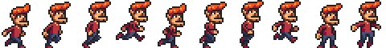
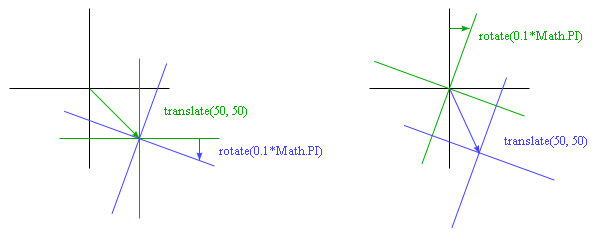
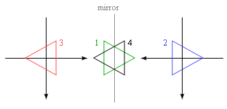
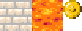
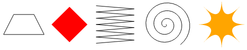

#Рисование на холсте

<i>Рисование — это обман.</i>

<i>М.К.Эшер</i>

Браузеры позволяют нам рисовать графику разными способами. Проще всего использовать стили для расположения и расцветки стандартных элементов DOM. Так можно добиться многого, как показал пример игры из предыдущей главы. Добавляя частично прозрачные картинки узлам, мы можем придать им любой нужный вид. Возможно даже поворачивать или искажать узлы через стиль transform.

Но такое использование DOM – не то, для чего он создавался. Некоторые задачи, типа рисования линии между двумя произвольными точками, крайне неудобно выполнять при помощи обычных элементов HTML.

Есть две альтернативы. Первая – SVG, масштабируемая векторная графика, также основанная на DOM, но без участия HTML. SVG – диалект для описания документов, который концентрируется на формах, а не тексте. SVG можно встроить в HTML, или включить через тег ``.

Вторая альтернатива – холст (canvas). Холст – это один элемент DOM, в котором находится картинка. Он предоставляет API для рисования форм на том месте, которое занимает элемент. Разница между холстом и SVG в том, что в SVG хранится начальное описание форм – их можно в любой момент сдвигать или менять размер. Холст же преобразовывает формы в пиксели (цветные точки растра), как только нарисует их, и не запоминает, что эти пиксели из себя представляют. Единственным способом сдвинуть форму на холсте является очистить холст (или ту часть, которая окружает форму) и перерисовать её на другом месте.

##SVG
Эта книга не углубляется детально в SVG, но кратко я поясню её работу. В конце главы я вернусь к сравнительным недостаткам методов, которые нужно принять во внимание, выбирая механизм рисования для конкретного применения.

Вот документ HTML, содержащий простую SVG-картинку:

```html
<p>Normal HTML here.</p>
<svg xmlns="http://www.w3.org/2000/svg">
  <circle r="50" cx="50" cy="50" fill="red"/>
  <rect x="120" y="5" width="90" height="90"
        stroke="blue" fill="none"/>
</svg>
```

Атрибут xmlns меняет пространство имён элемента по умолчанию. Это пространство задаётся через URL и обозначает диалект, на котором мы сейчас говорим. Тэги `<circle>` и `<rect>`, не существующие в HTML, имеют смысл в SVG – они рисуют формы, используя стиль и позицию, заданные их атрибутами.

Они создают элементы DOM так же, как тэги HTML. К примеру, такой код меняет цвет элемента  на cyan:

```js
var circle = document.querySelector(«circle»);
circle.setAttribute(«fill», «cyan»);
```

##Элемент холста canvas
Графику холста можно рисовать на элементе `<canvas>`. Ему можно задать ширину и высоту, таким образом определяя его размер в пикселях.

Новый холст пуст, то есть он полностью прозрачен и показывает нам пустое пространство документа.

Тэг `<canvas>` поддерживает разные стили рисования. Чтобы получить доступ к интерфейсу рисования, сначала нужно создать context – объект, чьи методы предоставляют этот интерфейс. Сейчас есть два широко распространённых стиля рисования: “2d” для двумерной графики и “webgl” для трёхмерной графики при помощи интерфейса OpenGL.

WebGL мы обсуждать не будем, остановимся на двух измерениях. Если вам интересны три измерения, я советую вам окунуться в мир WebGL. Он предоставляет непосредственный доступ к современному графическому железу, поэтому с его помощью можно создавать довольно сложную и эффективную графику прямо из JavaScript.

Context создаётся методом getContext элемента `<canvas>`.

```html
<p>Before canvas.</p>
<canvas width="120" height="60"></canvas>
<p>After canvas.</p>
<script>
  var canvas = document.querySelector("canvas");
  var context = canvas.getContext("2d");
  context.fillStyle = "red";
  context.fillRect(10, 10, 100, 50);
</script>
```

После создания объекта context пример рисует прямоугольник шириной в 100 пикселей и высотой в 50, с координатами левого верхнего угла (10, 10).

Точно как в HTML (и SVG), используемая холстом система координат помещает точку (0, 0) в левый верхний угол, и положительная часть оси Y идёт оттуда вниз. То есть, точка (10,10) на 10 пикселей ниже и правее верхнего левого угла.

##Заливка и обводка
В интерфейсе холста форму можно залить, что означает, что занимаемая ею область будет закрашена нужным цветом или шаблоном, или же можно сделать stroke – обвести область линией по краю. Та же терминология используется в SVG.

Метод fillRect заливает прямоугольник. Он принимает координаты левого верхнего угла x,y, затем ширину и высоту. Схожий метод strokeRect рисует периметр прямоугольника.

Больше у методов параметров нет. Цвет заливки, толщина обводки и другие параметры определяются не аргументами метода (как можно было бы ожидать), а свойствами объекта context.

Задав fillStyle, вы меняете способ, которым заливаются формы. Его можно установить в строку, обозначающую цвет, и в любой цвет, который понимает CSS.

Свойство strokeStyle работает так же, но определяет цвет, которым будет нарисована обводка. Толщина линии определяется свойством lineWidth, которое может содержать любое положительное число.

```html
<canvas></canvas>
<script>
  var cx = document.querySelector("canvas").getContext("2d");
  cx.strokeStyle = "blue";
  cx.strokeRect(5, 5, 50, 50);
  cx.lineWidth = 5;
  cx.strokeRect(135, 5, 50, 50);
</script>
```

Когда не заданы атрибуты width или height, им назначаются значения по умолчанию – 300 для ширины и 150 для высоты.

##Пути
Путь – последовательность линий. Двумерный холст имеет странный подход к описанию путей. Всё делается через побочные эффекты. Пути – не значения, которые можно хранить или передавать. Вместо этого, если вам что-то надо сделать с путём, вы создаёте последовательность вызовов метода для описания его формы.

```html
<canvas></canvas>
<script>
  var cx = document.querySelector("canvas").getContext("2d");
  cx.beginPath();
  for (var y = 10; y < 100; y += 10) {
    cx.moveTo(10, y);
    cx.lineTo(90, y);
  }
  cx.stroke();
</script>
```

Пример создаёт путь из нескольких горизонтальных отрезков, и затем обводит их методом stroke. Каждый сегмент, созданный через lineTo, начинается с текущей позиции пути. Эта позиция – обычно конец предыдущего сегмента, если только не было вызова moveTo. В последнем случае следующий сегмент начнётся с позиции, заданной в moveTo.

При заливке пути каждая из форм заливается отдельно. Путь может содержать несколько форм – каждое движение moveTo начинает новую. Но путь должен быть закрытым (начало и конец находятся на одном месте), прежде чем его можно будет закрасить. Если путь не закрыт, от его конца до начала добавляется линия, и заливается форма, очерченная закрытым путём.

```html
<canvas></canvas>
<script>
  var cx = document.querySelector("canvas").getContext("2d");
  cx.beginPath();
  cx.moveTo(50, 10);
  cx.lineTo(10, 70);
  cx.lineTo(90, 70);
  cx.fill();
</script>
```

Пример рисует закрашенный треугольник. Заметьте, что непосредственно были нарисованы только две стороны. Третья, от правого нижнего угла обратно к вершине, подразумевается – она не будет закрашена вызовом stroke.

Также можно использовать метод closePath, чтобы принудительно закрыть путь, добавив реальный сегмент до начала пути. Этот сегмент будет закрашен вызовом stroke.

##Кривые
Путь может состоять из кривых. Их рисовать посложнее, нежели прямые.

Метод quadraticCurveTo рисует кривую до нужной точки. Для определения кривизны методу даётся контрольная точка вместе с точкой назначения. Представьте, что контрольная точка как бы притягивает линию, задавая кривой кривизну. Линия не проходит через контрольную точку. Вместо этого направления линии в её начальной и конечной точках будут стремиться к контрольной точке. Следующий пример иллюстрирует это:

```html
<canvas></canvas>
<script>
  var cx = document.querySelector("canvas").getContext("2d");
  cx.beginPath();
  cx.moveTo(10, 90);
  // control=(60,10) goal=(90,90)
  cx.quadraticCurveTo(60, 10, 90, 90);
  cx.lineTo(60, 10);
  cx.closePath();
  cx.stroke();
</script>
```

Рисуем слева направо квадратичную кривую, у которой контрольная точка задана как (60,10), а затем рисуем два сегмента, проходящие обратно через контрольную точку и начало линии. Результат напоминает эмблему Звёздного пути. Можно увидеть действие контрольной точки: линия, выходящая из начальной и конечной точек, начинается по направлению к контрольной точке, а затем загибается.

Метод bezierCurve рисует схожую кривую. Вместо одной контрольной точки у неё есть две – по одной на каждый из концов кривой. Вот похожий рисунок для иллюстрации поведения такой кривой:

```html
<canvas></canvas>
<script>
  var cx = document.querySelector("canvas").getContext("2d");
  cx.beginPath();
  cx.moveTo(10, 90);
  // control1=(10,10) control2=(90,10) goal=(50,90)
  cx.bezierCurveTo(10, 10, 90, 10, 50, 90);
  cx.lineTo(90, 10);
  cx.lineTo(10, 10);
  cx.closePath();
  cx.stroke();
</script>
```

Две контрольные точки задают направления обоих концов кривой. Чем они дальше от начала или конца, тем сильнее кривая будет выпучиваться в их направлении.

С этими кривыми сложновато работать – не всегда понятно, как искать контрольные точки, которые приведут к нужной вам форме. Иногда их можно вычислить, иногда приходится подбирать методом проб и ошибок.

Дуги, фрагменты кругов, легче в обращении. Метод arcTo принимает целых пять аргументов. Первые четыре – похожи на аргументы quadraticCurveTo. Первая пара задаёт что-то вроде контрольной точки, вторая – место назначения кривой. Пятый задаёт радиус дуги. Метод создаёт скруглённый угол – линию, идущую к контрольной точке, а затем к точке назначения – и скругляет угол заданным радиусом. Метод arcTo рисует круглую часть, а также линию от точки старта до начала закруглённой части.

```html
<canvas></canvas>
<script>
  var cx = document.querySelector("canvas").getContext("2d");
  cx.beginPath();
  cx.moveTo(10, 10);
  // control=(90,10) goal=(90,90) radius=20
  cx.arcTo(90, 10, 90, 90, 20);
  cx.moveTo(10, 10);
  // control=(90,10) goal=(90,90) radius=80
  cx.arcTo(90, 10, 90, 90, 80);
  cx.stroke();
</script>
```

arcTo не рисует линию от конца закруглённой части до точки назначения, несмотря на своё название. Её можно закончить через lineTo с такими же координатами.

Чтобы нарисовать круг, можно сделать четыре вызова arcTo, где каждый повёрнут относительно другого на 90 градусов. Но метод arc предоставляет способ проще. Он принимает пару координат центра арки, радиус и начальный и конечный углы.

Два последних параметра могут помочь в рисовании части круга. Углы измеряются в радианах, а не градусах. Это значит, что полный круг имеет угол в 2π, или 2 * Math.PI, что примерно равно 6.28. Угол начинает отсчёт от точки справа от центра, и идёт против часовой стрелки. Чтобы нарисовать полный круг, можно задать начало в 0, а конец больше 2π (к примеру, 7).

```html
<canvas></canvas>
<script>
  var cx = document.querySelector("canvas").getContext("2d");
  cx.beginPath();
  // center=(50,50) radius=40 angle=0 to 7
  cx.arc(50, 50, 40, 0, 7);
  // center=(150,50) radius=40 angle=0 to ½π
  cx.arc(150, 50, 40, 0, 0.5 * Math.PI);
  cx.stroke();
</script>
```

На картинке в результате будет линия слева от круга (первый вызов arc), до левой части четверти круга (второй вызов). Как и другие методы рисования путей, линия дуги соединена с предыдущим сегментом пути. Для начала рисования нового пути надо вызвать moveTo.

Рисуем круговую диаграмму

Представьте, что вы получили работу в ООО «Экономика для всех», и вашим первым заданием будет нарисовать круговую диаграмму удовлетворённости клиентов согласно результатам опроса.

Переменная result содержит массив объектов, представляющих результаты.

```js
var results = [
  {name: "Удовлетворён", count: 1043, color: "lightblue"},
  {name: "Нейтральное", count: 563, color: "lightgreen"},
  {name: "Не удовлетворён", count: 510, color: "pink"},
  {name: "Без комментариев", count: 175, color: "silver"}
];
```

Чтобы нарисовать диаграмму, мы рисуем несколько секторов, каждый из которых делается из арки и пары линий от центра. Угол мы вычисляем, деля полный круг (2π) на общее количество отзывов, и умножая на количество людей, выбравших данный вариант ответа.

```html
<canvas width="200" height="200"></canvas>
<script>
  var cx = document.querySelector("canvas").getContext("2d");
  var total = results.reduce(function(sum, choice) {
    return sum + choice.count;
  }, 0);
  // Start at the top
  var currentAngle = -0.5 * Math.PI;
  results.forEach(function(result) {
    var sliceAngle = (result.count / total) * 2 * Math.PI;
    cx.beginPath();
    // center=100,100, radius=100
    // from current angle, clockwise by slice's angle
    cx.arc(100, 100, 100,
           currentAngle, currentAngle + sliceAngle);
    currentAngle += sliceAngle;
    cx.lineTo(100, 100);
    cx.fillStyle = result.color;
    cx.fill();
  });
</script>
```

Но диаграмма не расшифровывает значения секторов – это неудобно. Нам надо как-то нарисовать на холсте текст.

##Текст
У контекста двумерного холста есть методы fillText и strokeText. Последний можно использовать для обведённых букв, но обычно используется fillText. Он заполняет заданный текст цветом fillColor.

```html
<canvas></canvas>
<script>
  var cx = document.querySelector("canvas").getContext("2d");
  cx.font = "28px Georgia";
  cx.fillStyle = "fuchsia";
  cx.fillText("Я и текст могу рисовать!", 10, 50);
</script>
```

Можно задать размер, стиль и шрифт текста через свойство font. В примере задаётся только размер и шрифт. Можно добавить наклон и жирность в начале строки.

Два последних аргумента fillText (и strokeText) задают позицию, с которой начинается текст. По умолчанию это начало линии, на которой «стоят» буквы – не считая свисающих частей букв типа р и у. Можно менять позицию по горизонтали, задавая свойству textAlign значения «end» или «center», а по вертикали – задавая textBaseline «top», «middle», или «bottom».

В конце главы мы вернёмся к нашей диаграмме.

##Изображения
В компьютерной графике проводится различие между векторной и растровой графикой. Первая – то, чем мы занимались в этой главе, рисование при помощи логических описаний форм. Вторая – не задаёт формы, а работает на уровне пикселей.

Метод drawImage позволяет выводить на холст пиксельные данные. Они могут быть взяты из элемента `` или с другого холста, которые не обязательно видны в самом документе. Следующий пример создаёт элемент `` и загружает в него файл изображения. Но он не может сразу начать рисовать при помощи этой картинки, потому что браузер мог не успеть её подгрузить. Для этого мы регистрируем обработчик события “load” и рисуем после загрузки.

```html
<canvas></canvas>
<script>
  var cx = document.querySelector("canvas").getContext("2d");
  var img = document.createElement("img");
  img.src = "img/hat.png";
  img.addEventListener("load", function() {
    for (var x = 10; x < 200; x += 30)
      cx.drawImage(img, x, 10);
  });
</script>
```

По умолчанию drawImage нарисует картинку оригинального размера. Ему можно задать два дополнительных параметра для изменения ширины и высоты.

Когда drawImage задано девять аргументов, её можно использовать для рисования части изображения. Со второго по пятый аргументы обозначают прямоугольник (x, y, ширина и высота) в исходной картинке, который надо скопировать. С шестого по девятый – прямоугольник на холсте, куда его надо скопировать.

Это можно использовать, чтобы упаковывать несколько спрайтов (элементов картинки или кадров анимации) в один файл изображения, и рисовать только нужные его части. К примеру, есть у нас картинка игрового персонажа в разных позах:



Перебирая позы, мы можем вывести анимацию идущего персонажа.

Для анимации на холсте пригодится метод clearRect. Он напоминает fillRect, но вместо окраски прямоугольника он делает его прозрачным, удаляя предыдущие пиксели.

Мы знаем, что каждый спрайт шириной 24 и высотой 30 пикселей. Следующий код загружает картинку и задаёт интервал для рисования следующих кадров:

```html
<canvas></canvas>
<script>
  var cx = document.querySelector("canvas").getContext("2d");
  var img = document.createElement("img");
  img.src = "img/player.png";
  var spriteW = 24, spriteH = 30;
  img.addEventListener("load", function() {
    var cycle = 0;
    setInterval(function() {
      cx.clearRect(0, 0, spriteW, spriteH);
      cx.drawImage(img,
                   // source rectangle
                   cycle * spriteW, 0, spriteW, spriteH,
                   // destination rectangle
                   0,               0, spriteW, spriteH);
      cycle = (cycle + 1) % 8;
    }, 120);
  });
</script>
```

Переменная cycle отслеживает позицию в анимации. Каждый кадр она увеличивается и по достижению 7 начинает сначала, используя оператор деления с остатком. Она используется для подсчёта координаты x, на которой в изображении находится спрайт с нужной позой.

##Преобразования
А что, если нам надо, чтобы персонаж шёл влево, а не вправо? Мы могли бы добавить ещё один набор спрайтов. Но мы также можем сказать холсту, чтоб он рисовал картинку зеркально.

Вызов метода scale приведёт к тому, что все последующие рисунки будут масштабированы. Он принимает два параметра – масштаб по горизонтали и по вертикали.

```html
<canvas></canvas>
<script>
  var cx = document.querySelector("canvas").getContext("2d");
  cx.scale(3, .5);
  cx.beginPath();
  cx.arc(50, 50, 40, 0, 7);
  cx.lineWidth = 3;
  cx.stroke();
</script>
```

Масштабирование растягивает или сжимает все параметры картинки, включая ширину линии по заданным параметрам. Масштабирование с отрицательным параметром переворачивает картинку зеркально. Переворот происходит вокруг точки (0, 0), что означает, что направление системы координат тоже поменяется. При применении горизонтального масштаба -1, форма, нарисованная на позиции x = 100, будет нарисована там, где раньше была позиция -100.

Значит, для отзеркаливания картинки мы не можем просто добавить cx.scale(-1, 1) перед вызовом drawImage – наша картинка уедет с холста и не будет видна. Можно было бы подправить координаты, передаваемые в drawImage, чтобы компенсировать этот сдвиг. Другой вариант действий, когда код рисования ничего не знает про масштабирование, заключается в изменении направления оси.

Есть несколько других методов кроме масштабирования, влияющих на координатную систему холста. Нарисованные формы можно поворачивать методом rotate и сдвигать методом translate. Интересно, что все трансформации накапливаются, то есть каждая последующая происходит относительно предыдущих.

Значит, если мы дважды сдвинем изображение на 10 пикселей по горизонтали, то всё будет нарисовано на 20 пикселей правее. Если мы сначала сдвинем начало отсчёта на (50, 50), а затем повернём всё на 20 градусов (0.1π радиан), поворот произойдёт вокруг точки (50, 50).



А если мы сначала повернём всё на 20 градусов, а уже затем сдвинем на (50, 50), то преобразование случится в повёрнутой системе координат, что приведёт к иному результату. Порядок преобразований имеет значение.

Чтобы отзеркалить картинку относительно вертикали на заданной позиции x, мы делаем следующее:

```js
function flipHorizontally(context, around) {
  context.translate(around, 0);
  context.scale(-1, 1);
  context.translate(-around, 0);
}
```

Мы сдвигаем ось Y туда, где нам нужно расположить наше зеркало, проводим отзеркаливание, и сдвигаем ось Y обратно на полагающееся место в зеркальной вселенной. Следующий рисунок объясняет, как это работает:



Тут показаны системы координат до и после отзеркаливания относительно центральной линии. Если мы нарисуем треугольник в положительной полуплоскости относительно Y, он будет находиться на месте треугольника 1. Вызов flipHorizontally сначала сдвигает его вправо, на место треугольника 2. Затем происходит масштабирование, и треугольник оказывается на месте 3. Он должен быть не там, если нам надо отзеркалить его относительно заданной линии. Второй вызов translate исправляет это – он «отменяет» изначальный сдвиг и помещает треугольник на позицию 4.

Теперь можно нарисовать отзеркаленного персонажа на позиции (100, 0), перевернув мир относительно вертикали изображения персонажа.

```html
<canvas></canvas>
<script>
  var cx = document.querySelector("canvas").getContext("2d");
  var img = document.createElement("img");
  img.src = "img/player.png";
  var spriteW = 24, spriteH = 30;
  img.addEventListener("load", function() {
    flipHorizontally(cx, 100 + spriteW / 2);
    cx.drawImage(img, 0, 0, spriteW, spriteH,
                 100, 0, spriteW, spriteH);
  });
</script>
```

##Хранение и очистка преобразований
Преобразования накапливаются. Всё, что мы рисуем после рисования отзеркаленного персонажа, также будет зеркальным. Это может стать проблемой.

Возможно сохранить текущее преобразование, порисовать что-то, а затем вернуть старое состояние. Так должна поступать функция, делающая временное преобразование системы координат. Сначала мы сохраняем то преобразование, которое использовал код, вызвавший эту функцию. Затем функция отрабатывает на основе преобразований, проведённых на этот момент, и, возможно, добавляет новые. И в конце мы возвращаем преобразования к началу.

Этим занимаются методы save и restore двумерного холста. По сути, они хранят стек состояний преобразований. При вызове save в стек добавляется текущее состояние, а при restore берётся состояние сверху стека и применяется в качестве текущего контекста всех преобразований.

Функция branch в примере показывает, что можно сделать с функцией, которая выполняет преобразования и вызывает другую функцию (в данном случае, саму себя), которая продолжает рисовать с заданными преобразованиями.

Функция рисует древовидную структуру, рисуя линию, потом передвигая центр координат на конец линии, и вызывая себя затем дважды – сначала, повернув влево, а затем вправо. Каждый вызов уменьшает длину ветви, и рекурсия останавливается, когда длина падает меньше 8.

```html
<canvas width="600" height="300"></canvas>
<script>
  var cx = document.querySelector("canvas").getContext("2d");
  function branch(length, angle, scale) {
    cx.fillRect(0, 0, 1, length);
    if (length < 8) return;
    cx.save();
    cx.translate(0, length);
    cx.rotate(-angle);
    branch(length * scale, angle, scale);
    cx.rotate(2 * angle);
    branch(length * scale, angle, scale);
    cx.restore();
  }
  cx.translate(300, 0);
  branch(60, 0.5, 0.8);
</script>
```

Если бы не было вызовов save и restore, второй рекурсивный вызов branch начинал бы с позиции и поворота, созданных первым. Он был бы соединён не с текущей веткой, а внутренней правой веткой, нарисованной первым вызовом. В результате получается тоже интересная форма, но уже не древовидная.

##Назад к игре
Теперь мы знаем о холсте достаточно, чтобы начать разработку графической системы для игры из предыдущей главы. Новая система не будет показывать только цветные квадратики. Мы будем использовать drawImage для рисования картинок, представляющих элементы игры.

Мы определим тип объекта CanvasDisplay, который будет поддерживать тот же интерфейс, что и DOMDisplay из главы 15, а именно, методы drawFrame and clear.

Объект хранит больше информации, чем DOMDisplay. Вместо использования позиции прокрутки элемента DOM, он отслеживает окно просмотра, которое сообщает, какую часть уровня мы сейчас видим. Также он отслеживает время и использует это, чтобы решить, какой кадр анимации показывать. И ещё он хранит свойство flipPlayer, чтобы даже когда игрок стоял на месте, он был повёрнут в ту сторону, в которую шёл в последний раз.

```js
function CanvasDisplay(parent, level) {
  this.canvas = document.createElement("canvas");
  this.canvas.width = Math.min(600, level.width * scale);
  this.canvas.height = Math.min(450, level.height * scale);
  parent.appendChild(this.canvas);
  this.cx = this.canvas.getContext("2d");

  this.level = level;
  this.animationTime = 0;
  this.flipPlayer = false;

  this.viewport = {
    left: 0,
    top: 0,
    width: this.canvas.width / scale,
    height: this.canvas.height / scale
  };

  this.drawFrame(0);
}

CanvasDisplay.prototype.clear = function() {
  this.canvas.parentNode.removeChild(this.canvas);
};
```

В 15 главе мы передавали размер шага в drawFrame из-за счётчика animationTime, несмотря на то, что DOMDisplay его не использовал. Наша новая функция drawFrame использует его для отсчёта времени, чтобы переключаться между кадрами анимации в зависимости от текущего времени.

```js
CanvasDisplay.prototype.drawFrame = function(step) {
  this.animationTime += step;

  this.updateViewport();
  this.clearDisplay();
  this.drawBackground();
  this.drawActors();
};
```

Кроме отслеживания времени, метод обновляет окно просмотра текущей позиции игрока, заполняет холст цветом фона, и рисует фон и актёров. Заметьте, что всё происходит не так, как в главе 15, где мы рисовали фон один раз, а затем прокручивали оборачивающий элемент DOM для перемещения по нему.

Так как формы на холсте – всего лишь пиксели, после их отрисовки их нельзя сдвинуть (или убрать). Единственным способом обновить холст будет очистить его и перерисовать сцену.

Метод updateViewport похож на метод scrollPlayerIntoView из DOMDisplay. Он проверяет, не находится ли игрок слишком близко к краю экрана и двигает окно просмотра, если это случается.

```js
CanvasDisplay.prototype.updateViewport = function() {
  var view = this.viewport, margin = view.width / 3;
  var player = this.level.player;
  var center = player.pos.plus(player.size.times(0.5));

  if (center.x < view.left + margin)
    view.left = Math.max(center.x - margin, 0);
  else if (center.x > view.left + view.width - margin)
    view.left = Math.min(center.x + margin - view.width,
                         this.level.width - view.width);
  if (center.y < view.top + margin)
    view.top = Math.max(center.y - margin, 0);
  else if (center.y > view.top + view.height - margin)
    view.top = Math.min(center.y + margin - view.height,
                        this.level.height - view.height);
};
```

Вызовы Math.max и Math.min гарантируют, что окно просмотра не будет показывать пространство за пределами уровня. Math.max(x, 0) гарантирует, что итоговое число не меньше нуля. Сходным образом Math.min гарантирует, что значение не превысит заданную границу.

При очистке дисплея мы используем другой цвет, в зависимости от того, выиграна игра или проиграна.

```js
CanvasDisplay.prototype.clearDisplay = function() {
  if (this.level.status == "won")
    this.cx.fillStyle = "rgb(68, 191, 255)";
  else if (this.level.status == "lost")
    this.cx.fillStyle = "rgb(44, 136, 214)";
  else
    this.cx.fillStyle = "rgb(52, 166, 251)";
  this.cx.fillRect(0, 0,
                   this.canvas.width, this.canvas.height);
};
```

Для рисования фона мы пробегаемся по клеткам, видимым в текущем окне просмотра, используя тот же фокус, что и в obstacleAt в предыдущей главе.

```js
var otherSprites = document.createElement("img");
otherSprites.src = "img/sprites.png";

CanvasDisplay.prototype.drawBackground = function() {
  var view = this.viewport;
  var xStart = Math.floor(view.left);
  var xEnd = Math.ceil(view.left + view.width);
  var yStart = Math.floor(view.top);
  var yEnd = Math.ceil(view.top + view.height);

  for (var y = yStart; y < yEnd; y++) {
    for (var x = xStart; x < xEnd; x++) {
      var tile = this.level.grid[y][x];
      if (tile == null) continue;
      var screenX = (x - view.left) * scale;
      var screenY = (y - view.top) * scale;
      var tileX = tile == "lava" ? scale : 0;
      this.cx.drawImage(otherSprites,
                        tileX,         0, scale, scale,
                        screenX, screenY, scale, scale);
    }
  }
};
```

Непустые клетки (null) рисуются через drawImage. Изображение otherSprites содержит картинки для элементов, не относящихся к игроку. Слева направо — это стена, лава и монетка.



##Спрайты для нашей игры
Клетки фона 20х20 пикселей, так как мы используем ту же шкалу, что была в DOMDisplay. Значит, сдвиг клеток лавы 20 (значение переменной scale), а сдвиг стен 0.

Мы не ждём загрузки спрайта. Вызов drawImage с незагруженной пока картинкой ничего не сделает. Поэтому, на нескольких первых кадрах игра может быть отрисована неверно, но это не так уж критично. Так как мы обновляем экран, правильная сцена появится сразу после окончания загрузки.

Наш персонаж будет использован в качестве игрока. Код его отрисовки должен выбирать правильный спрайт и направление, зависящее от текущего движения игрока. Первые восемь спрайтов содержат анимацию ходьбы. Когда игрок передвигается по полу, мы перебираем их в зависимости от свойства animationTime объекта display. Оно измеряется в секундах, а нам надо менять кадры 12 раз в секунду, поэтому мы умножаем время на 12. Когда игрок стоит, мы рисуем девятый спрайт. В прыжках, которые мы распознаём по тому, что вертикальная скорость отлична от нуля, мы рисуем десятый, самый правый спрайт.

Поскольку спрайты чуть шире ширины объекта игрока – 24 пикселя вместо 16, чтобы было место для рук и ног, метод должен подправлять координату x и ширину на заданное число (playerXOverlap).

```js
var playerSprites = document.createElement("img");
playerSprites.src = "img/player.png";
var playerXOverlap = 4;

CanvasDisplay.prototype.drawPlayer = function(x, y, width,
                                              height) {
  var sprite = 8, player = this.level.player;
  width += playerXOverlap * 2;
  x -= playerXOverlap;
  if (player.speed.x != 0)
    this.flipPlayer = player.speed.x < 0;

  if (player.speed.y != 0)
    sprite = 9;
  else if (player.speed.x != 0)
    sprite = Math.floor(this.animationTime * 12) % 8;

  this.cx.save();
  if (this.flipPlayer)
    flipHorizontally(this.cx, x + width / 2);

  this.cx.drawImage(playerSprites,
                    sprite * width, 0, width, height,
                    x,              y, width, height);

  this.cx.restore();
};
```

Метод drawPlayer вызывается через drawActors, который рисует всех актёров в игре.

```js
CanvasDisplay.prototype.drawActors = function() {
  this.level.actors.forEach(function(actor) {
    var width = actor.size.x * scale;
    var height = actor.size.y * scale;
    var x = (actor.pos.x - this.viewport.left) * scale;
    var y = (actor.pos.y - this.viewport.top) * scale;
    if (actor.type == "player") {
      this.drawPlayer(x, y, width, height);
    } else {
      var tileX = (actor.type == "coin" ? 2 : 1) * scale;
      this.cx.drawImage(otherSprites,
                        tileX, 0, width, height,
                        x,     y, width, height);
    }
  }, this);
};
```

При отрисовке чего-либо кроме игрока мы смотрим на его тип, чтобы найти смещение для нужного спрайта. Лава находится по смещению 20, монета – 40.

Нужно вычитать позицию окна просмотра при подсчёте позиции актёра, так как точка (0, 0) нашего холста соответствует левой верхней точке окна просмотра, а не левой верхней точке уровня. Ещё мы могли бы использовать для этой цели translate.

Следующий маленький документ подключает новый display в runGame:

```html
<body>
  <script>
    runGame(GAME_LEVELS, CanvasDisplay);
  </script>
</body>
```

##Выбор графического интерфейса
Когда вам нужно создавать графику в браузере, у вас есть выбор – HTML, SVG и холст. Не существует идеального подхода для всех ситуаций. У каждого варианта есть плюсы и минусы.

Чистый HTML прост. Он хорошо сочетается с текстом. SVG и холст позволяют рисовать текст, но не помогают в его расположении и не делают переносов, когда он занимает более одной линии. В HTML просто включать блоки текста.

SVG можно использовать для создания чёткой графики, которая выглядит хорошо при любом увеличении. Он сложнее обычного HTML, но и гораздо мощнее.

SVG и HTML строят структуру данных (DOM), которая представляет картинку. Это позволяет изменять элементы после того, как они нарисованы. Если вам надо периодически менять небольшую часть большой картинки в ответ на действия пользователя или в качестве анимации, на холсте это будет делать очень затратно. DOM позволяет регистрировать обработчики событий мыши на любом элементе картинки (даже на формах, нарисованных через SVG). С холстом это не пройдёт.

Но пиксельный подход холста имеет преимущество при рисовании большого количества небольших элементов. Он не строит структуру данных, а просто рисует на той же самой поверхности пиксели, что снижает затратность в пересчёте на формы.

Есть ещё факторы, типа создания сцены попиксельно (например, при использовании трассировки лучей) или постобработка картинки в JavaScript (размытие или искажение), которые можно сделать только при помощи попиксельного рисования.

В некоторых случаях можно комбинировать эти техники. Например, можно нарисовать граф через SVG или холст, а текстовую информацию показывать, позиционируя элементы HTML поверх картинки.

Для непривередливых приложений неважно, какой вы используете интерфейс. Дисплей, построенный нами для нашей игры, можно сделать любым из трёх графических способов, так как он не выводит текст и не обрабатывает нажатия мыши, и не обслуживает огромное количество элементов.

##Итог
В этой главе мы обсудили техники рисования графики в браузере, сконцентрировавшись на элементе `<canvas>`.

Узел холста представляет область документа, где программа может рисовать. Это делается через объект context, создаваемый методом getContext. Интерфейс двумерного рисования позволяет закрашивать и обводить разные формы. Свойство fillStyle задаёт заливку форм. Свойства strokeStyle и lineWidth управляют тем, как рисуются линии.

Прямоугольники и куски текста можно рисовать одним вызовом метода. Методы fillRect и strokeRect рисуют прямоугольники, а fillText и strokeText выводят текст. Для создания произвольных форм нам нужно строить пути.

Вызов beginPath начинает путь. Несколько методов добавляют линии и кривые к текущему пути. Например, lineTo добавляет прямую. Когда путь закончен, его можно заполить методом fill или обвести методом stroke.

Перемещение пикселей с картинки или другого холста на наш делается методом drawImage. По умолчанию, он рисует всю исходную картинку, но с большим количеством параметров вы можете скопировать нужный участок изображения. В нашей игре мы использовали эту возможность, копируя разные позы игрового персонажа из частей картинки, содержавшей много поз.

Перемещения позволяют рисовать форму, ориентированную по-разному. Двумерный контекст хранит текущее преобразование, которое можно менять через методы translate, scale и rotate. Это повлияет на все остальные операции рисования. Текущее состояние преобразований можно сохранить методом save и восстановить методом restore.

При рисовании анимаций на холсте можно использовать метод clearRect для очистки частей холста перед перерисовкой.

##Упражнения
###Формы
Напишите программу, рисующую следующие фигуры:

1. трапецию
2. красный ромб
3. зигзаг
4. спираль из 100 отрезков
5. жёлтую звезду



Рисуя две последних, консультируйтесь с описаниями функций Math.cos и Math.sin из главы 13, которая описывает получение координат на круге с их использованием.

Рекомендую для каждой формы сделать функцию. Передавайте позицию и другие свойства, типа размера, количества точек. Вариант со вписыванием нужных чисел прямо в код обычно труднее читать и изменять.

```html
<canvas width="600" height="200"></canvas>
<script>
  var cx = document.querySelector("canvas").getContext("2d");

  // Ваш код
</script>
```

###Круговая диаграмма
Ранее мы видели пример программы для рисования круговой диаграммы. Поменяйте её, чтобы имя каждой категории было показано рядом с куском, который её представляет. Попробуйте отыскать симпатичный вариант автоматического позиционирования текста, который бы работал и на других наборах данных. Можно предположить, что нет категории меньше 5% (чтобы текст не громоздился друг на друга).

Вам снова могут понадобиться Math.sin и Math.cos.

```html
<canvas width="600" height="300"></canvas>
<script>
  var cx = document.querySelector("canvas").getContext("2d");
  var total = results.reduce(function(sum, choice) {
    return sum + choice.count;
  }, 0);

  var currentAngle = -0.5 * Math.PI;
  var centerX = 300, centerY = 150;
  // Добавьте код для вывода меток
  results.forEach(function(result) {
    var sliceAngle = (result.count / total) * 2 * Math.PI;
    cx.beginPath();
    cx.arc(centerX, centerY, 100,
           currentAngle, currentAngle + sliceAngle);
    currentAngle += sliceAngle;
    cx.lineTo(centerX, centerY);
    cx.fillStyle = result.color;
    cx.fill();
  });
</script>
```

###Прыгающий мячик
Используйте технику requestAnimationFrame из глав 13 и 15 для рисования прямоугольника с прыгающим внутри мячом. Мяч двигается с постоянной скоростью и отскакивает от сторон прямоугольника при соударении.

```html
<canvas width="400" height="400"></canvas>
<script>
  var cx = document.querySelector("canvas").getContext("2d");

  var lastTime = null;
  function frame(time) {
    if (lastTime != null)
      updateAnimation(Math.min(100, time - lastTime) / 1000);
    lastTime = time;
    requestAnimationFrame(frame);
  }
  requestAnimationFrame(frame);

  function updateAnimation(step) {
    // Ваш код
  }
</script>
```

###Предварительно рассчитанное отзеркаливание
Преобразования, к сожалению, замедляют рисование растровых изображений. Для векторной графики эффект не так заметен, потому что преобразованиям подвергаются всего лишь несколько точек, после чего рисование продолжается как обычно. Для растра позиция каждого пикселя должна быть преобразована, и хотя возможно, что браузеры в будущем будут делать это по-умному, это приводит к ненужному увеличению времени на отрисовку растра.

В нашей игре, где есть всего один преобразуемый спрайт, это не проблема. Но представьте, что вам надо рисовать сотни персонажей или тысячи вращающихся частиц от взрыва.

Подумайте, как можно было бы рисовать инвертированного персонажа без подгрузок дополнительных файлов и без постоянных преобразований вызовов drawImage.
