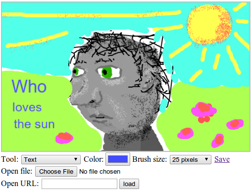

#Проект: Paint

<i>Я смотрю на многообразие цветов. Я смотрю на пустой холст. Затем я пытаюсь нанести цвета как слова, из которых возникают поэмы, как ноты, из которых возникает музыка.

Жоан Миро</i>

Материал предыдущих глав даёт вам всё необходимое для создания простого веб-приложения. Именно этим мы и займёмся.

Наше приложение будет программой для рисования в браузере, схожей с Microsoft Paint. С его помощью можно будет открывать файлы с изображениями, малевать на них мышкой и сохранять обратно. Вот, как это будет выглядеть:



##Простая программа рисования
Рисовать на компьютере клёво. Не надо волноваться насчёт материалов, умения, таланта. Просто берёшь, и начинаешь калякать.

##Реализация
Интерфейс программы выводит вверху большой элемент `<canvas>`, под которым есть несколько полей ввода. Пользователь рисует на картинке, выбирая инструмент из поля `<select>`, а затем нажимая на холсте мышь. Есть инструменты для рисования линий, стирания кусочков картинки, добавления текста и т.п.

Щелчок на холсте передаёт событие «mousedown» текущему инструменту, который обрабатывает его, как считает нужным. Рисование линий, например, будет слушать события «mousemove», пока кнопка мыши не будет отпущена, и нарисует линию по пути мыши текущим цветом и размером кисти.

Цвет и размер кисти выбираются в дополнительных полях ввода. Они выполняют обновление свойств контекста рисования на холсте fillStyle, strokeStyle, и lineWidth каждый раз при их изменении.

Загрузить картинку в программу можно двумя способами. Первый использует поле file, где пользователь выбирает файл со своего диска. Вторая запрашивает URL и скачивает картинку из интернета.

Картинки хранятся нестандартным способом. Ссылка save с правой стороны ведёт на текущую картинку. По ней можно проходить, делиться ей или сохранять файл через неё. Я скоро объясню, как это работает.

##Строим DOM
Интерфейс программы состоит из более чем 30 элементов DOM. Нужно их как-то собрать вместе.

Очевидным форматом для сложных структур DOM является HTML. Но разделять программу на HTML и скрипт неудобно – для элементов DOM понадобится множество обработчиков событий или других необходимых вещей, которые надо будет как-то обрабатывать из скрипта. Для этого придётся делать много вызовов querySelector и им подобных, чтобы найти нужный элемент DOM для работы.

Было бы удобно определять части DOM рядом с теми частями кода JavaScript, которые ими управляют. Поэтому я решил создавать всю конструкцию DOM прямо в JavaScript. Как мы видели в главе 13, встроенный интерфейс для создания структур DOM ужасно многословен. Поскольку нам придётся создать много конструкций, нам понадобится вспомогательная функция.

Эта функция – расширенная версия функции elt из главы 13. Она создаёт элемент с заданным именем и атрибутами, и добавляет все остальные аргументы, которые получает, в качестве дочерних узлов, автоматически преобразовывая строки в текстовые узлы.

```js
function elt(name, attributes) {
  var node = document.createElement(name);
  if (attributes) {
    for (var attr in attributes)
      if (attributes.hasOwnProperty(attr))
        node.setAttribute(attr, attributes[attr]);
  }
  for (var i = 2; i < arguments.length; i++) {
    var child = arguments[i];
    if (typeof child == "string")
      child = document.createTextNode(child);
    node.appendChild(child);
  }
  return node;
}
```

Так мы легко и просто создаём элементы, не раздувая код до размеров лицензионного соглашения.

##Основание
Ядро нашей программы – функция createPaint, добавляющая интерфейс рисования к элементу DOM, который передаётся в качестве аргумента. Так как мы создаём программу последовательно, мы определяем объект controls, который будет содержать функции для инициализации разных элементов управления под картинкой.

```js
var controls = Object.create(null);

function createPaint(parent) {
  var canvas = elt("canvas", {width: 500, height: 300});
  var cx = canvas.getContext("2d");
  var toolbar = elt("div", {class: "toolbar"});
  for (var name in controls)
    toolbar.appendChild(controls[name](cx));

  var panel = elt("div", {class: "picturepanel"}, canvas);
  parent.appendChild(elt("div", null, panel, toolbar));
}
```

У каждого элемента управления есть доступ к контексту рисования на холсте, а через него – к элементу `<canvas>`. Основное состояние программы хранится в этом холсте – он содержит текущую картинку, выбранный цвет (в свойстве fillStyle) и размер кисти (в свойстве lineWidth).

Мы обернём холст и элементы управления в элементы `<div>` с классами, чтобы можно было добавить им стили, например серую рамку вокруг картинки.

##Выбор инструмента
Первый элемент управления, который мы добавим – элемент `<select> `, позволяющий выбирать инструмент рисования. Как и в случае с controls, мы будем использовать объект для сбора необходимых инструментов, чтобы не надо было описывать их работу в коде по отдельности, и чтобы можно было легко добавлять новые. Этот объект связывает названия инструментов с функцией, которая вызывается при их выборе и при клике на холсте.

```js
var tools = Object.create(null);

controls.tool = function(cx) {
  var select = elt("select");
  for (var name in tools)
    select.appendChild(elt("option", null, name));

  cx.canvas.addEventListener("mousedown", function(event) {
    if (event.which == 1) {
      tools[select.value](event, cx);
      event.preventDefault();
    }
  });

  return elt("span", null, "Tool: ", select);
};
```

В поле tool есть элементы `<option>` для всех определённых нами инструментов, а обработчик события «mousedown» на холсте берёт на себя обязанность вызывать функцию текущего инструмента, передавая ей объекты event и context. Также он вызывает preventDefault, чтобы зажатие и перетаскивание мыши не вызывало выделения участков страницы.

Самый простой инструмент – линия, который рисует линии за мышью. Чтобы рисовать линию, нам надо сопоставить координаты курсора мыши с координатами точек на холсте. Вскользь упомянутый в 13 главе метод getBoundingClientRect может нам в этом помочь. Он говорит, где показывается элемент, относительно левого верхнего угла экрана. Свойства события мыши clientX и clientY также содержат координаты относительно этого угла, поэтому мы можем вычесть верхний левый угол холста из них и получить позицию относительно этого угла.

```js
function relativePos(event, element) {
  var rect = element.getBoundingClientRect();
  return {x: Math.floor(event.clientX - rect.left),
          y: Math.floor(event.clientY - rect.top)};
}
```

Несколько инструментов рисования должны слушать событие «mousemove», пока кнопка мыши нажата. Функция trackDrag регистрирует и убирает событие для данных ситуаций.

```js
function trackDrag(onMove, onEnd) {
  function end(event) {
    removeEventListener("mousemove", onMove);
    removeEventListener("mouseup", end);
    if (onEnd)
      onEnd(event);
  }
  addEventListener("mousemove", onMove);
  addEventListener("mouseup", end);
}
```

У неё два аргумента. Один – функция, которая вызывается при каждом событии «mousemove», а другая – функция, которая вызывается при отпускании кнопки. Каждый аргумент может быть не задан.

Инструмент для рисования линий использует две вспомогательные функции для самого рисования.

```js
tools.Line = function(event, cx, onEnd) {
  cx.lineCap = "round";

  var pos = relativePos(event, cx.canvas);
  trackDrag(function(event) {
    cx.beginPath();
    cx.moveTo(pos.x, pos.y);
    pos = relativePos(event, cx.canvas);
    cx.lineTo(pos.x, pos.y);
    cx.stroke();
  }, onEnd);
};
```

Функция сначала устанавливает свойство контекста lineCap в “round”, из-за чего концы нарисованного пути становятся закруглёнными, а не квадратными, как это происходит по умолчанию. Этот трюк обеспечивает непрерывность линий, когда они нарисованы в несколько приёмов. Если рисовать линии большой ширины, вы увидите разрывы в углах линий, если будете использовать установку lineCap по умолчанию.

Затем, по каждому событию «mousemove», которое случается, пока кнопка нажата, рисуется простая линия между старой и новой позициями мыши, с использованием тех значений параметров strokeStyle и lineWidth, которые заданы в данный момент.

Аргумент onEnd просто передаётся дальше, в trackDrag. При обычном вызове третий аргумент передаваться не будет, и при использовании функции он будет содержать undefined, поэтому в конце перетаскивания ничего не произойдёт. Но он поможет нам организовать ещё один инструмент, ластик erase, используя очень небольшое дополнение к коду.

```js
tools.Erase = function(event, cx) {
  cx.globalCompositeOperation = "destination-out";
  tools.Line(event, cx, function() {
    cx.globalCompositeOperation = "source-over";
  });
};
```

Свойство globalCompositeOperation влияет на то, как операции рисования на холсте меняют цвет пикселей. По умолчанию, значение свойства «source-over», что означает, что цвет, которым рисуют, накладывается поверх существующего. Если цвет непрозрачный, он просто заменит существующий, но если он частично прозрачный, они будут смешаны.

Инструмент “erase” устанавливает globalCompositeOperation в «destination-out», что имеет эффект ластика, и делает пиксели снова прозрачными.

Вот у нас уже есть два инструмента для рисования. Мы можем рисовать чёрные линии в один пиксель шириной (это задано значениями свойств холста strokeStyle и lineWidth по умолчанию), и стирать их. Работающий, хотя и примитивный, прототип программы.

##Цвет и размер кисти
Предполагая, что пользователи захотят рисовать не только чёрным цветом и не только одним размером кисти, добавим элементы управления для этих настроек.

В главе 18 я обсуждал разные варианты полей формы. Среди них не было полей для выбора цвета. По традиции у браузеров нет встроенных полей для выбора цвета, но за последнее время в стандарт включили несколько новых типов полей форм. Один из них — `<input type="color">`. Среди других — «date», «email», «url» и «number». Пока ещё их поддерживают не все. Для тега `<input>` тип по умолчанию – “text”, и при использовании нового тега, который ещё не поддерживается браузером, браузеры будут обрабатывать его как текстовое поле. Значит, пользователям с браузерами, которые не поддерживают инструмент для выбора цвета, необходимо будет вписывать название цвета вместо того, чтобы выбирать его через удобный элемент управления.

```js
controls.color = function(cx) {
  var input = elt("input", {type: "color"});
  input.addEventListener("change", function() {
    cx.fillStyle = input.value;
    cx.strokeStyle = input.value;
  });
  return elt("span", null, "Color: ", input);
};
```

При смене значения поля color значения свойств контекста холста fillStyle и strokeStyle заменяются на новое значение.

Настройка размера кисти работает сходным образом.

```js
controls.brushSize = function(cx) {
  var select = elt("select");
  var sizes = [1, 2, 3, 5, 8, 12, 25, 35, 50, 75, 100];
  sizes.forEach(function(size) {
    select.appendChild(elt("option", {value: size},
                           size + " pixels"));
  });
  select.addEventListener("change", function() {
    cx.lineWidth = select.value;
  });
  return elt("span", null, "Brush size: ", select);
};
```

Код создаёт варианты размеров кистей из массива, и убеждается в том, что свойство холста lineWidth обновлено при выборе кисти.

##Сохранение
Чтобы объяснить, как работает ссылка на сохранение, сначала мне нужно рассказать про URL с данными. В отличие от обычных http: и https:, URL с данными не указывают на ресурс, а содержат весь ресурс в себе. Это URL с данными, содержащий простой HTML документ:

```
data:text/html,<h1 style="color:red">Hello!</h1>
```

Такие URL полезны для разных вещей, как, например, включение небольших картинок прямо в файл стилей. Они также позволяют нам ссылаться на создаваемые файлы на стороне клиента, в браузере, не перемещая их сперва на какой-либо сервер.

У элемента холста есть удобный метод toDataURL, который возвращает URL с данными, содержащий картинку на холсте в виде графического файла. Но нам не следует обновлять ссылку для сохранения при каждом изменении картинки. В случае больших картинок перемещение данных в URL занимает много времени. Вместо этого мы подключаем обновление к ссылке, чтоб она обновляла свой атрибут href каждый раз, когда она получает фокус с клавиатуры или над ней появляется курсор мыши.

```js
controls.save = function(cx) {
  var link = elt("a", {href: "/"}, "Save");
  function update() {
    try {
      link.href = cx.canvas.toDataURL();
    } catch (e) {
      if (e instanceof SecurityError)
        link.href = "javascript:alert(" +
          JSON.stringify("Can't save: " + e.toString()) + ")";
      else
        throw e;
    }
  }
  link.addEventListener("mouseover", update);
  link.addEventListener("focus", update);
  return link;
};
```

Таким образом, линк просто сидит себе тихонечко и указывает на неправильные данные, но как только пользователь приблизится к нему, он волшебным образом обновляет себя так, чтобы указывать на текущую картинку.

Если вы загрузите большую картинку, некоторые браузеры поперхнутся слишком большим URL с данными, который получится в результате. Для маленьких картинок система работает без проблем.

Но здесь мы опять сталкиваемся с деталями реализации песочницы в браузере. Когда картинка грузится с URL с другого домена, если ответ сервера не содержит заголовок, разрешающий использование ресурса с других доменов (см. главу 17), холст будет содержать информацию, которая будет видна пользователю, но не видна скрипту.

Мы могли запросить картинку с приватной информацией (график изменений банковского счёта). Если бы скрипт мог получить к ней доступ, он мог бы шпионить за пользователем.

Для предотвращения таких утечек информации, когда картинка, невидимая скрипту, будет загружена на холст, браузеры пометят его как «испорчен». Пиксельные данные, включая URL с данными, нельзя будет получить с «испорченного» холста. На него можно писать, но с него нельзя читать.

Поэтому нам нужна обработка try/catch в функции update для ссылки сохранения. Когда холст «портится», вызов toDataURL выбросит исключение, являющееся экземпляром SecurityError. В этом случае мы перенаправляем ссылку на ещё один вид URL с протоколом javascript:. Такие ссылки просто выполняют скрипт, стоящий после двоеточия, и наша ссылка покажет предупреждение, сообщающее о проблеме.

##Загрузка картинок
Последние два элемента управления используются для загрузки картинок с локального диска и с URL. Нам потребуется вспомогательная функция, которая пробует загрузить картинку с URL и заменить ею содержимое холста.

```js
function loadImageURL(cx, url) {
  var image = document.createElement("img");
  image.addEventListener("load", function() {
    var color = cx.fillStyle, size = cx.lineWidth;
    cx.canvas.width = image.width;
    cx.canvas.height = image.height;
    cx.drawImage(image, 0, 0);
    cx.fillStyle = color;
    cx.strokeStyle = color;
    cx.lineWidth = size;
  });
  image.src = url;
}
```

Нам надо поменять размер холста, чтобы он соответствовал картинке. Почему-то при смене размера холста его контекст забывает все настройки (fillStyle и lineWidth), в связи с чем функция сохраняет их и загружает обратно после обновления размера холста.

Элемент управления для загрузки локального файла использует технику FileReader из главы 18. Кроме используемого здесь метода readAsText у таких объектов есть метод под названием readAsDataURL – а это то, что нам нужно. Мы загружаем файл, который пользователь выбирает, как URL с данными, и передаём его в loadImageURL для вывода на холст.

```js
controls.openFile = function(cx) {
  var input = elt("input", {type: "file"});
  input.addEventListener("change", function() {
    if (input.files.length == 0) return;
    var reader = new FileReader();
    reader.addEventListener("load", function() {
      loadImageURL(cx, reader.result);
    });
    reader.readAsDataURL(input.files[0]);
  });
  return elt("div", null, "Open file: ", input);
};
```

Загружать файл с URL ещё проще. Но с текстовым полем мы не знаем, закончил ли пользователь набирать в нём URL, поэтому мы не можем просто слушать события “change”. Вместо этого мы обернём поле в форму и среагируем, когда она будет отправлена – либо по нажатию Enter, либо по нажатию кнопку load.

```js
controls.openURL = function(cx) {
  var input = elt("input", {type: "text"});
  var form = elt("form", null,
                 "Open URL: ", input,
                 elt("button", {type: "submit"}, "load"));
  form.addEventListener("submit", function(event) {
    event.preventDefault();
    loadImageURL(cx, form.querySelector("input").value);
  });
  return form;
};
```

Теперь мы определили все элементы управления, требующиеся нашей программе, но нужно добавить ещё несколько инструментов.

##Закругляемся
Очень просто можно добавить инструмент для вывода текста, который выводит запрос пользователю, куда он должен ввести текст.

```js
tools.Text = function(event, cx) {
  var text = prompt("Text:", "");
  if (text) {
    var pos = relativePos(event, cx.canvas);
    cx.font = Math.max(7, cx.lineWidth) + "px sans-serif";
    cx.fillText(text, pos.x, pos.y);
  }
};
```

Можно было бы добавить полей для размера текста и шрифта, но для простоты мы всегда используем шрифт sans-serif и размер шрифта, как у текущей кисти. Минимальный размер – 7 пикселей, потому что меньше текст будет нечитаемый.

Ещё один необходимый инструмент для каляк-маляк – “аэрозоль”. Она рисует случайные точки под кистью, пока нажата кнопка мыши, создавая более или менее густые точки в зависимости от скорости движения курсора.

```js
tools.Spray = function(event, cx) {
  var radius = cx.lineWidth / 2;
  var area = radius * radius * Math.PI;
  var dotsPerTick = Math.ceil(area / 30);

  var currentPos = relativePos(event, cx.canvas);
  var spray = setInterval(function() {
    for (var i = 0; i < dotsPerTick; i++) {
      var offset = randomPointInRadius(radius);
      cx.fillRect(currentPos.x + offset.x,
                  currentPos.y + offset.y, 1, 1);
    }
  }, 25);
  trackDrag(function(event) {
    currentPos = relativePos(event, cx.canvas);
  }, function() {
    clearInterval(spray);
  });
};
```

Аэрозоль использует setInterval для выплёвывания цветных точек каждые 25 миллисекунд, пока нажата кнопка мыши. Функция trackDrag используется для того, чтобы currentPos указывала на текущее положение курсора, и для выключения интервала при отпускании кнопки.

Чтобы посчитать, сколько точек нужно нарисовать каждый раз по окончанию интервала, функция подсчитывает размер области текущей кисти и делит его на 30. Для поиска случайного положения под кистью используется функция randomPointInRadius.

```js
function randomPointInRadius(radius) {
  for (;;) {
    var x = Math.random() * 2 - 1;
    var y = Math.random() * 2 - 1;
    if (x * x + y * y <= 1)
      return {x: x * radius, y: y * radius};
  }
}
```

Эта функция создаёт точки в квадрате между (-1,-1) и (1,1). Используя теорему Пифагора, она проверяет, лежит ли созданная точка внутри круга с радиусом 1. Когда такая точка находится, она возвращает её координаты, умноженные на радиус.

Цикл нужен для равномерного распределения точек. Проще было бы создавать точки в круге, взяв случайный угол и радиус и вызвав Math.sin и Math.cos для создания точки. Но тогда точки с большей вероятностью появлялись бы ближе к центру круга. Это ограничение можно обойти, но результат будет сложнее, чем предыдущий цикл.

Теперь наша программа для рисования готова. Запустите код и попробуйте.

```
<link rel="stylesheet" href="css/paint.css">
<body>
  <script>createPaint(document.body);</script>
</body>
```

##Упражнения
В программе ещё очень много чего можно улучшить. Давайте добавим ей возможностей.

###Прямоугольники
Определите инструмент Rectangle, заполняющий прямоугольник (см. метод fillRect из главы 16) текущим цветом. Прямоугольник должен появляться из той точки, где пользователь нажал кнопку мыши, и до той точки, где он отпустил кнопку. Заметьте, что последнее действие может произойти левее или выше первого.

Когда это заработает, вы заметите, что изображение прямоугольника дрожит и его плохо видно. Можете ли вы придумать способ показа прямоугольника во время движения мыши, но чтобы он не выводился на холст, пока кнопка не отпущена?

Если не придумаете, вспомните о стиле position: absolute, который мы обсуждали в главе 13. который можно использовать, чтобы выводить узел поверх остального документа. Свойства pageX и pageY событий мыши можно использовать для точного расположения элемента под мышью, записывая нужные значения в стили left, top, width и height.

```
<script>
  tools.Rectangle = function(event, cx) {
    // Ваш код
  };
</script>

<link rel="stylesheet" href="css/paint.css">
<body>
  <script>createPaint(document.body);</script>
</body>
```

###Выбор цвета
Ещё один часто встречающийся инструмент – выбор цвета, который позволяет щелчком мыши на картинке выбрать цвет, который находится под курсором. Сделайте такой инструмент.

Для его изготовления понадобится доступ к содержимому холста. Метод toDataURL примерно это и делал, но получить информацию о пикселе из URL с данными сложно. Вместо этого мы возьмём метод контекста getImageData, возвращающий прямоугольный кусок картинки в виде объекта со свойствами width, height и data. В свойстве data содержится массив чисел от 0 до 255, и для каждого пикселя хранится четыре номера — red, green, blue и alpha (прозрачность).

Этот пример получает числа из одного пикселя холста, один раз, когда тот пуст (все пиксели – прозрачные чёрные), и один раз, когда пиксель окрашен в красный цвет.

```js
function pixelAt(cx, x, y) {
  var data = cx.getImageData(x, y, 1, 1);
  console.log(data.data);
}

var canvas = document.createElement("canvas");
var cx = canvas.getContext("2d");
pixelAt(cx, 10, 10);
// → [0, 0, 0, 0]

cx.fillStyle = "red";
cx.fillRect(10, 10, 1, 1);
pixelAt(cx, 10, 10);
// → [255, 0, 0, 255]
```

Аргументы getImageData показывают начальные координаты прямоугольника x и y, которые нам надо получить, за которыми идут ширина и высота.

Игнорируйте прозрачность в этом упражнении, работайте только с первыми тремя цифрами для заданного пикселя. Также не волнуйтесь по поводу обновления поля color при выборе цвета. Просто убедитесь, что fillStyle и strokeStyle контекста установлены в цвет, оказавшийся под курсором.

Помните, что эти свойства принимают любой цвет, который понимает CSS, включая запись вида rgb(R, G, B), которую вы видели в главе 15.

Метод getImageData имеет те же ограничения, что и toDataURL – он выдаст ошибку, когда на холсте содержатся пиксели картинки, скачанной с другого домена. Используйте запись try/catch для сообщения об этих ошибках через окно alert.

```js
<script>
  tools["Pick color"] = function(event, cx) {
    // Your code here.
  };
</script>

<link rel="stylesheet" href="css/paint.css">
<body>
  <script>createPaint(document.body);</script>
</body>
```

###Заливка
Это упражнение более сложное, чем предыдущие, и оно потребует разработки нетривиального решения хитрой задачи. Убедитесь, что у вас есть свободное время и терпение перед началом работы, и не отчаивайтесь, если сразу у вас что-то не будет получаться.

Инструмент заливки окрашивает пиксель под курсором мыши и под целой группой пикселей вокруг него, имеющих тот же цвет. Для целей нашего упражнения мы будем считать, что эта группа включает все пиксели, до которых можно добраться от начального, двигаясь по одному пикселю по горизонтали и вертикали (но не по диагонали), не прикасаясь к пикселям, чей цвет отличается от исходного.

Следующая картинка демонстрирует набор пикселей, окрашиваемых, когда инструмент заливки применяется к помеченному пикселю:


Заливка не протекает через диагональные разрывы и не касается пикселей, которых нельзя достичь, даже если они того же цвета, что и исходный.

Вам вновь понадобится getImageData для выяснения цвета пикселя. Скорее всего, удобнее будет получить всю картинку за раз, а потом уже получать данные по пикселям из получившегося массива. Пиксели в массиве организованы схожим образом с решёткой из главы 7, по рядам, только каждый пиксель описывается четырьмя значениями. Первое значение для пикселя с координатами (x,y) находится на позиции (x + y × width) × 4

Включайте в рассмотрение четвёртое число (альфа), потому что нам нужно будет различать чёрные и пустые (прозрачные) пиксели.

Поиск соседних пикселей того же цвета требует пройти по поверхности пикселей вверх, вниз, влево и вправо, пока там находятся пиксели того же цвета. За первый проход всю группу пикселей найти не получится. Вместо этого нужно будет сделать что-то похожее на отслеживание в регулярных выражениях, описанное в главе 9. Когда у вас есть больше одного возможного направления, нужно сохранить все те, по которым вы прямо сейчас не идёте, и просмотреть их позже, по окончанию текущего шага.

У картинки среднего размера много пикселей. Постарайтесь свести работу программы к минимуму, или же она будет работать слишком долго. К примеру, игнорируйте пиксели, которые вы уже обрабатывали.

Рекомендую для окраски отдельных пикселей вызывать fillRect, и хранить какую-то структуру данных, где записано, какие пиксели вы уже обошли.

```js
<script>
  tools["Flood fill"] = function(event, cx) {
    // Ваш код
  };
</script>

<link rel="stylesheet" href="css/paint.css">
<body>
  <script>createPaint(document.body);</script>
</body>
```
