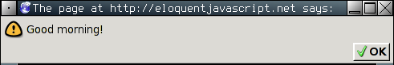
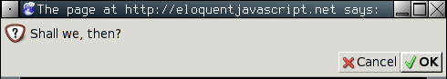
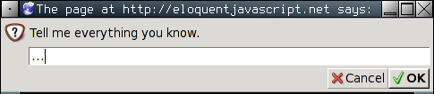
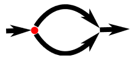
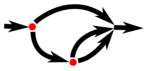
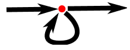

#Структура программ

<i>Сердце моё сияет ярко-красным светом под моей тонкой, прозрачной кожей, и им приходится вколоть мне десять кубиков JavaScript, чтобы вернуть меня к жизни (я хорошо реагирую на токсины в крови). От этой фигни у вас враз жабры побледнеют!

_why, Why's (Poignant) Guide to Ruby</i>

В этой главе мы начнём заниматься тем, что уже можно назвать программированием. Мы расширим использование языка JavaScript за пределы существительных и фрагментов предложений к более-менее осмысленной прозе.

##Выражения и инструкции
В первой главе мы создавали величины и применяли к ним операторы, получая новые величины. Это важная часть каждой программы, но только лишь часть.

Фрагмент кода, результатом работы которого является некая величина, называется выражением. Каждая величина, записанная буквально (например, 22 или “психоанализ”) тоже является выражением. Выражение, записанное в скобках, также является выражением, как и бинарный оператор, применяемый к двум выражениям или унарный – к одному.

Это часть красоты языкового интерфейса. Выражения могут включать другие выражения так же, как сложноподчинённое предложение состоит из простых. Это позволяет нам комбинировать выражения для создания вычислений любой сложности.

Если выражение – это фрагмент предложения, то инструкция – это предложение полностью. Программа – это просто список инструкций.

Простейшая инструкция – это выражение с точкой с запятой после него. Это — программа:

```js
1;
!false;
```

Правда, это бесполезная программа. Выражение можно использовать только для получения величины, которая может быть использована в другом выражении, охватывающем это. Инструкция стоит сама по себе и её применение изменяет что-то в мире программы. Она может выводить что-то на экран (изменение в мире), или менять внутреннее состояние машины таким образом, что это повлияет на следующие за ним инструкции. Эти изменения называются побочными эффектами. Инструкции в предыдущем примере просто выдают величины 1 и true, и сразу их выбрасывают. Они не оказывают никакого влияния на мир программы. При выполнении программы ничего заметного не происходит.

В некоторых случаях JavaScript позволяет опускать точку с запятой в конце инструкции. В других случаях она обязательно, или следующая строка будет расцениваться как часть той же инструкции. Правила, согласно которым можно или нельзя опускать точку с запятой, довольно сложны и увеличивают вероятность ошибиться. В этой книге мы не будем опускать точку с запятой, и я рекомендую делать так же в своих программах, пока вы не накопите опыт.

##Переменные
Как же программа хранит внутреннее состояние? Как она его запоминает? Мы получали новые величины из старых, но старые величины это не меняло, а новые нужно было использовать сразу, или же они исчезали. Чтобы захватить и хранить их, JavaScript предлагает нечто под названием «переменная».

```js
var caught = 5 * 5;
```

И это даёт нам второй вид инструкций. Специальное ключевое слово (keyword) `var` показывает, что в этой инструкции мы объявляем переменную. За ним идёт имя переменной, и, если мы сразу хотим назначить ей значение – оператор = и выражение.

Пример создаёт переменную под именем caught и использует её для захвата числа, которое получается в результате перемножения 5 и 5.

После определения переменной её имя можно использовать в выражениях. Величина переменной будет такой, какое значение в ней сейчас содержится. Пример:

```js
var ten = 10;
console.log(ten * ten);
// → 100
```

Переменные можно называть любым словом, которое не является ключевым (типа var). Нельзя использовать пробелы. Цифры тоже можно использовать, но не первым символом в названии. Нельзя использовать знаки пунктуации, кроме символов $ и _.

Переменной присваивают значение не навсегда. Оператор = можно использовать на существующих переменных в любое время, чтобы присвоить им новое значение.

```js
var mood = "лёгкое";
console.log(mood);
// → лёгкое
mood = "тяжёлое";
console.log(mood);
// → тяжёлое
```

Представляйте себе переменные не в виде коробочек, а в виде щупалец. Они не содержат значения – они хватают их. Две переменные могут ссылаться на одно значение. Программа имеет доступ только к значениям, которые они содержат. Когда вам нужно что-то запомнить, вы отращиваете щупальце и держитесь за это, или вы используете существующее щупальце, чтобы удержать это.


##Переменные как щупальца
Пример. Для запоминания количества денег, которые вам должен Василий, вы создаёте переменную. Затем, когда он выплачивает часть долга, вы даёте ей новое значение.

```js
var vasyaDebt = 140;
vasyaDebt = vasyaDebt  - 35;
console.log(vasyaDebt);
// → 105
```

Когда вы определяете переменную без присваивания ей значения, щупальцу не за что держаться, оно висит в воздухе. Если вы запросите значение пустой переменной, вы получите undefined.

Одна инструкция var может содержать несколько переменных. Определения нужно разделять запятыми.

```js
var one = 1, two = 2;
console.log(one + two);
// → 3
```

##Ключевые и зарезервированные слова
Слова со специальным смыслом, типа var – ключевые. Их нельзя использовать как имена переменных. Также есть несколько слов, «зарезервированных для использования» в будуших версиях JavaScript. Их тоже нельзя использовать, хотя в некоторых средах исполнения это возможно. Полный их список достаточно большой.

```
break case catch continue debugger default delete do else false finally
for function if implements in instanceof interface let new null package
private protected public return static switch throw true try typeof var
void while with yield this
```

Не нужно их запоминать, но имейте в виду, что ошибка может крыться здесь, если ваши определения переменных не работают, как надо.

##Окружение
Коллекция переменных и их значений, которая существует в определённый момент, называется окружением. Когда программа запускается, окружение не пустое. Там всегда есть переменные, являющиеся частью программного стандарта, и большую часть времени там есть переменные, помогающие взаимодействовать с окружающей системой. К примеру, в браузере есть переменные и функции для изучения состояния загруженной веб-страницы и влияния на неё, для чтения ввода с мыши и клавиатуры.

##Функции
Многие величины из стандартного окружения имеют тип `function` (функция). Функция – отдельный кусочек программы, который можно использовать вместе с другими величинами. К примеру, в браузере переменная alert содержит функцию, которая показывает небольшое окно с сообщением. Используют его так:

```js
alert("С добрым утром!");
```



##Диалог alert
Выполнение функции называют вызовом. Вы можете вызвать функцию, записав скобки после выражения, которое возвращает значение функции. Обычно вы напрямую используете имя функции в качестве выражения. Величины, которые можно написать внутри скобок, передаются программному коду внутри функции. В примере, функция alert использует данную ей строку для показа в диалоговом окне. Величины, передаваемые функциям, называются аргументами функций. Функция alert требует один аргумент, но другие могут требовать разное количество аргументов разных типов.

##Функция console.log
Функция alert может использоваться как средство вывода при экспериментах, но закрывать каждый раз это окно вам скоро надоест. В прошлых примерах мы использовали функцию console.log для вывода значений. Большинство систем JavaScript (включая все современные браузеры и Node.js) предоставляют функцию console.log, которая выводит величины на какое-либо устройство вывода. В браузерах это консоль JavaScript. Эта часть браузера обычно скрыта – большинство браузеров показывают её по нажатию F12, или Command-Option-I на Маке. Если это не сработало, поищите в меню “web console” или “developer tools”.

В примерах этой книги результаты вывода показаны в комментариях:

```js
var x = 30;
console.log("the value of x is", x);
// → the value of x is 30
```

Хотя в именах переменных нельзя использовать точку – она, очевидно, содержится в названии console.log. Это оттого, что console.log – не простая переменная. Это выражение, возвращающее свойство log переменной console. Мы поговорим об этом в главе 4.

##Возвращаемые значения
Показ диалогового окна или вывод текста на экран – это побочный эффект. Множество функций полезны оттого, что они производят эти эффекты. Функции также могут производить значения, и в этом случае им не нужен побочный эффект для того, чтобы быть полезной. К примеру, функция Math.max принимает любое количество переменных и возвращает значение самой большой:

```js
console.log(Math.max(2, 4));
// → 4
```

Когда функция производит значение, говорят, что она возвращает значение. Всё, что производит значение – это выражение, то есть вызовы функций можно использовать внутри сложных выражений. К примеру, возвращаемое функцией Math.min (противоположность Math.max) значение используется как один из аргументов оператора сложения:

```js
console.log(Math.min(2, 4) + 100);
// → 102
```

В следующей главе описано, как писать собственные функции.

##prompt и confirm
Окружение браузера содержит другие функции, кроме alert, которые показывают всплывающие окна. Можно вызвать окно с вопросом и кнопками OK/Cancel при помощи функции `confirm`. Она возвращает булевское значение – true, если нажато OK, и false, если нажато Cancel.

```js
confirm("Ну что, поехали?");
```



Функцию `prompt` можно использовать, чтобы задать открытый вопрос. Первый аргумент – вопрос, второй – текст, с которого пользователь начинает. В диалоговое окно можно вписать строку текста, и функция вернёт его в виде строки.

```js
prompt("Расскажи мне всё, что знаешь.", "...");
```



Эти функции нечасто используют, потому что нельзя изменять внешний вид этих окон — но они могут пригодиться для экспериментальных программ.

##Управление порядком выполнения программы
Когда в программе больше одной инструкции, они выполняются сверху вниз. В этом примере у программы две инструкции. Первая спрашивает число, вторая, выполняемая следом, показывает его квадрат.

```js
var theNumber = Number(prompt("Выбери число", ""));
alert("Твоё число – квадратный корень из " +  theNumber * theNumber);
```

Функция Number преобразовывает величину в число. Нам это нужно, потому что prompt возвращает строку. Есть сходные функции String и Boolean, преобразующие величины в соответствующие типы.

Простая схема прямого порядка исполнения программы:


Условное выполнение

Выполнять инструкции по порядку – не единственная возможность. В качестве альтернативы существует условное выполнение, где мы выбираем из двух возможных путей, основываясь на булевской величине:



Условное выполнение записывается при помощи ключевого слова if. В простом случае нам нужно, чтобы некий код был выполнен, только если выполняется некое условие. К примеру, в предыдущей программе мы можем считать квадрат, только если было введено именно число.

```js
var theNumber = prompt("Выбери число ", "");
if (!isNaN(theNumber))
  alert("Твоё число – квадратный корень из " +  theNumber * theNumber);
```

Теперь, введя «сыр», вы не получите вывод.

Ключевое слово if выполняет или пропускает инструкцию, в зависимости от значения булевого выражения. Это выражение записывается после if в скобках, и за ним идёт нужная инструкция.

Функция `isNaN` – стандартная функция JavaScript, которая возвращает true, только если её аргумент – NaN (не число). Функция Number возвращает NaN, если задать ей строку, которая не представляет собой допустимое число. В результате, условие звучит так: «выполнить, если только theNumber не является не-числом».

Часто нужно написать код не только для случая, когда выражение истинно, но и для случая, когда оно ложно. Путь с вариантами – это вторая стрелочка диаграммы. Ключевое слово else используется вместе с if для создания двух раздельных путей выполнения.

```js
var theNumber = Number(prompt("Выбери число", ""));
if (!isNaN(theNumber))
  alert("Твоё число – квадратный корень из " + theNumber * theNumber);
else
  alert("Ну ты что число-то не ввёл?");
```

Если вам нужно больше разных путей, можно использовать несколько пар if/else по цепочке.

```js
var num = Number(prompt("Выбери число", "0"));

if (num < 10)
  alert("Маловато");
else if (num < 100)
  alert("Нормально");
else
  alert("Многовато");
```

Программа проверяет, действительно ли num меньше 10. Если да – выбирает эту ветку, и показывает «Маловато». Если нет, выбирает другую – на которой ещё один if. Если следующее условие выполняется, значит номер будет между 10 и 100, и выводится «Нормально». Если нет – значит, выполняется последняя ветка.

Последовательность выполнения примерно такая:



##Циклы while и do
Представьте программу, выводящую все чётные числа от 0 до 12. Можно записать её так:

```js
console.log(0);
console.log(2);
console.log(4);
console.log(6);
console.log(8);
console.log(10);
console.log(12);
```

Это работает – но смысл программирования в том, чтобы работать меньше, чем компьютер, а не наоборот. Если б нам понадобились все числа до 1000, это решение было бы неприемлемым. Нам нужна возможность повторения. Этот вид контроля над порядком выполнения называется циклом.



Зацикливание даёт возможность вернуться назад к какой-то инструкции и повторить всё заново с новым состоянием программы. Если скомбинировать это с переменной для подсчёта, можно сделать следующее:

```js
var number = 0;
while (number <= 12) {
  console.log(number);
  number = number + 2;
}
// → 0
// → 2
//   … и т.д.
```

Инструкция, начинающаяся с ключевого слова `while` – это цикл. За while следует выражение в скобках, и затем инструкция (тело цикла) – так же, как у if. Цикл выполняет инструкцию, пока выражение выдаёт истинный результат.

В цикле нам нужно выводить значение и прибавлять к нему. Если нам нужно выполнять в цикле несколько инструкций, мы заключаем его в фигурные скобки { }. Фигурные скобки для инструкций – как круглые скобки для выражений. Они группируют их и превращают в единое. Последовательность инструкций, заключённая в фигурные скобки, называется блоком.

Много программистов заключают любое тело цикла в скобки. Они делают это для единообразия, и для того, чтобы не нужно было добавлять и убирать скобки, если приходится изменять количество инструкций в цикле. В книге я не буду писать скобки вокруг единичных инструкций в цикле, так как люблю краткость. Вы можете делать, как угодно.

Переменная number показывает, как переменная может отслеживать прогресс программы. При каждом повторении цикла number увеличивается на 2. Перед каждым повторением оно сравнивается с 12, чтобы понять, сделала ли программа всё, что требовалось.

Для примера более полезной работы мы можем написать программу вычисления 2 в 10 степени. Мы используем две переменные: одну для слежения за результатом, а вторую – для подсчёта количества умножений. Цикл проверяет, достигла ли вторая переменная 10, и затем обновляет обе.

```js
var result = 1;
var counter = 0;
while (counter < 10) {
  result = result * 2;
  counter = counter + 1;
}
console.log(result);
// → 1024
```

Можно начинать counter с 1 и проверять его на <=10, но по причинам, которые станут ясны далее, всегда лучше начинать счётчики с 0.

Цикл do похож на цикл while. Отличается только в одном: цикл do всегда выполняет тело хотя бы один раз, а проверяет условие после первого выполнения. Поэтому и тестируемое выражение записывают после тела цикла:

```js
do {
  var name = prompt("Who are you?");
} while (!name);
console.log(name);
```

Эта программа заставляет ввести имя. Она спрашивает его снова и снова, пока не получит что-то кроме пустой строки. Добавление "!" превращает значение в булевское и затем применяет логическое отрицание, а все строки, кроме пустой, преобразуются в булевское true.

Вы, наверно, заметили пробелы перед некоторыми инструкциями. В JavaScript это не обязательно – программа отработает и без них. Даже переводы строк не обязательно делать. Можно написать программу в одну строку. Роль пробелов в блоках – отделять их от остальной программы. В сложном коде, где в блоках встречаются другие блоки, может быть сложно разглядеть, где кончается один и начинается другой. Правильно отделяя их пробелами вы приводите в соответствие внешний вид кода и его блоки. Я люблю отделять каждый блок двумя пробелами, но вкусы различаются – некоторые используют четыре, некоторые – табуляцию. Чем больше пробелов использовать, тем заметнее отступ, но тем быстрее вложенные блоки убегают за правый край экрана.

##Циклы for
Много циклов строятся по такому шаблону, как в примере. Создаётся переменная-счётчик, потом идёт цикл while, где проверочное выражение обычно проверяет, не достигли ли мы какой-нибудь границы. В конце тела цикла счётчик обновляется.

Поскольку это такой частый случай, в JavaScript есть вариант покороче, цикл `for`.

```js
for (var number = 0; number <= 12; number = number + 2)
  console.log(number);
// → 0
// → 2
//   … и т.д.
```

Эта программа эквивалентна предыдущей. Только теперь все инструкции, относящиеся к отслеживанию состояния цикла, сгруппированы.

Скобки после for содержат две точки с запятой, разделяя инструкцию на три части. Первая инициализирует цикл, обычно задавая начальное значение переменной. Вторая – выражение проверки необходимости продолжения цикла. Третья – обновляет состояние после каждого прохода. В большинстве случаев такая запись более короткая и понятная, чем while.

Вычисляем 2^10 при помощи for:

```js
var result = 1;
for (var counter = 0; counter < 10; counter = counter + 1)
  result = result * 2;
console.log(result);
// → 1024
```

Хотя я не писал фигурных скобок, я отделяю тело цикла пробелами.

##Выход из цикла

Дождаться, пока условие цикла не станет ложным – не единственный способ закончить цикл. Специальная инструкция `break` приводит к немедленному выходу из цикла.

В следующем примере мы покидаем цикл, когда находим число, большее 20 и делящееся на 7 без остатка.

```js
for (var current = 20; ; current++) {
  if (current % 7 == 0)
    break;
}
console.log(current);
// → 21
```

Конструкция for не имеет проверочной части – поэтому цикл не остановится, пока не сработает инструкция break.

Если вы не укажете эту инструкцию, или случайно напишете условие, которое всегда выполняется, программа зависнет в бесконечном цикле и никогда не закончит работу – обычно это плохо.

Если вы сделаете бесконечный цикл, обычно через несколько секунд среда исполнения предложит вам прервать его. Если нет, вам придётся закрыть закладку, или даже весь браузер.

Ключевое слово `continue` также влияет на исполнение цикла. Когда это слово встречается в цикле, он немедленно переходит на следующую итерацию.

##Короткое обновление переменных
Особенно часто в циклах программе нужно обновить переменную, основываясь на её предыдущем состоянии.

```js
counter = counter + 1;
```

В JavaScript есть для этого короткая запись:

```js
counter += 1;
```

Подобные записи работают для многих других операторов, к примеру result *= 2 для удвоения, или counter -= 1 для обратного отсчёта.

Это позволяет нам сократить программу вывода чётных чисел:

```js
for (var number = 0; number <= 12; number += 2)
  console.log(number);
```

Для counter += 1 и counter -= 1 есть ещё более короткие записи: counter++ and counter--.

##Работаем с переменными при помощи switch

Часто код выглядит так:

```js
if (variable == "value1") action1();
else if (variable == "value2") action2();
else if (variable == "value3") action3();
else defaultAction();
```

Существует конструкция под названием `switch`, которая упрощает подобную запись. К сожалению, синтаксис JavaScript в этом случае довольно странный – часто цепочка if/else выглядит лучше. Пример:

```js
switch (prompt("Как погодка?")) {
  case "дождь":
    console.log("Не забудь зонт.");
    break;
  case "снег":
    console.log("Блин, мы в России!");
    break;
  case "солнечно":
    console.log("Оденься полегче.");
  case "облачно":
    console.log("Иди гуляй.");
    break;
  default:
    console.log("Непонятная погода!");
    break;
}
```

В блок switch можно поместить любое количество меток `case`. Программа перепрыгивает на метку, соответствующую значению переменной в switch, или на метку `default`, если подходящих меток не найдено. После этого инструкции исполняются до первой инструкции `break` – даже если мы уже прошли другую метку. Иногда это можно использовать для исполнения одного и того же кода в разных случаях (в обоих случаях «солнечно» и «облачно» программа порекомендует пойти погулять). Однако, очень легко забыть запись break, что приведёт к выполнению нежелательного участка кода.

##Регистр имён
Имена переменных не могут содержать пробелы, однако часто удобно использовать несколько слов для понятного описания переменной. Вы можете выбирать из нескольких вариантов:

```
fuzzylittleturtle
fuzzy_little_turtle
FuzzyLittleTurtle
fuzzyLittleTurtle
```

Первый довольно сложно читать. Мне нравятся подчёркивания, хотя их не очень удобно печатать. Стандартные функции JavaScript и большинство программистов используют последний вариант – каждое слово с большой буквы, кроме первого.

В некоторых случаях, например в случае функции Number, первую букву тоже пишут большой – когда нужно выделить функцию как конструктор. О конструкторах мы поговорим в главе 6. Сейчас просто не обращайте на это внимания.

##Комментарии
Часто код не содержит всю информацию, которую хотелось бы передать читателям-людям, или доносит её в непонятном виде. Иногда вы чувствуете поэтическое вдохновение, или просто хотите поделиться мыслями в своей программе. Для этого служат комментарии.

Комментарий – это текст, который записан в программе, но игнорируется компьютером. В JavaScript комментарии можно писать двумя способами. Для однострочного комментария можно использовать два слеша:

```js
var accountBalance = calculateBalance(account);
// Издалека долго
accountBalance.adjust();
// Течёт река Волга
var report = new Report();
// Течёт река Волга
addToReport(accountBalance, report);
// Конца и края нет
```

Комментарий продолжается только до конца строки. Код между символами /* и */ будет игнорироваться вместе с возможными переводами строки. Это подходит для включения целых информационных блоков в программу:

```js
/*
Этот город – самый лучший
Город на Земле.
Он как будто нарисован
Мелом на стене.
*/
var myCity = ‘Челябинск’;
```

##Итог
Теперь вы знаете, что программа состоит из инструкций, которые сами могут содержать инструкции. В инструкциях содержатся выражения, которые могут состоять из выражений.

Записывая инструкции подряд, мы получаем программу, которая выполняется сверху вниз. Вы можете изменять этот поток выполнения, используя условные (if, else, и switch) операторы и операторы цикла (while, do, и for).

Переменные можно использовать для хранения кусочков данных под определённым названием и для отслеживания состояния программы. Окружение – набор определённых переменных. Системы, исполняющие JavaScript, всегда добавляют несколько стандартных переменных в ваше окружение.

Функции – особые переменные, включающие части программы. Их можно вызвать командой functionName(argument1, argument2). Такой вызов – это выражение, и может выдавать значение.

##Упражнения
Каждое упражнение начинается с описания задачи. Прочтите и постарайтесь выполнить. В сложных ситуациях обращайтесь к подсказкам. Готовые решения задач можно найти на сайте книги <a href="http://eloquentjavascript.net/code/">eloquentjavascript.net/code/</a>. Чтобы обучение было эффективным, не заглядывайте в ответы, пока не решите задачу сами, или хотя бы не попытаетесь её решить достаточно долго для того, чтобы у вас слегка заболела голова. Там же можно писать код прямо в браузере и выполнять его.

###Треугольник в цикле
Напишите цикл, который за 7 вызовов console.log выводит такой треугольник:

```
#
##
###
####
#####
######
#######
```

Будет полезно знать, что длину строки можно узнать, приписав к переменной .length.

```js
var abc = "abc";
console.log(abc.length);
// → 3
```

###FizzBuzz
Напишите программу, которая выводит через console.log все числа от 1 до 100, с двумя исключениями. Для чисел, нацело делящихся на 3, она должна выводить ‘Fizz’, а для чисел, делящихся на 5 (но не на 3) – ‘Buzz’.

Когда сумеете – исправьте её так, чтобы она выводила «FizzBuzz» для всех чисел, которые делятся и на 3 и на 5.

(На самом деле, этот вопрос подходит для собеседований, и говорят, он позволяет отсеивать довольно большое число кандидатов. Поэтому, когда вы решите эту задачу, можете себя похвалить)

###Шахматная доска
Напишите программу, создающую строку, содержащую решётку 8х8, в которой линии разделяются символами новой строки. На каждой позиции либо пробел, либо #. В результате должна получиться шахматная доска.

```
# # # #
 # # # #
# # # #
 # # # #
# # # #
 # # # #
# # # #
 # # # #
```

Когда справитесь, сделайте размер доски переменным, чтобы можно было создавать доски любого размера.
