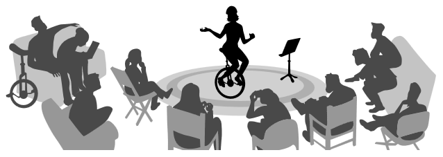
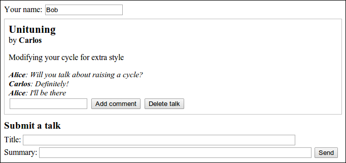

#Проект: веб-сайт по обмену опытом

На встречах по обмену опытом люди с общими интересами встречаются и делают небольшие неформальные презентации на тему своих знаний. На встрече по обмену опытом среди фермеров кто-нибудь может рассказать о выращивании сельдерея. На встрече программистов вы можете выступить с рассказом про Node.js

Такие встречи – отличный способ расширить свой кругозор, узнать о новинках области, или просто пообщаться с людьми со схожими интересами. Во многих городах есть встречи любителей JavaScript. Обычно их посещение бесплатное, и я нашёл те, которые посещал, дружелюбными и гостеприимными.



В последней главе-проекте мы устроим веб-сайт по обслуживанию выступлений, которые делаются на таких встречах. Представьте себе группу людей, которые регулярно встречаются в офисе одного из участников, чтобы поговорить о моноциклах. Проблема в том, что когда предыдущий организатор встреч переехал в другой город, никто не занял его место. Нам нужна система, которая позволит участникам предлагать и обсуждать темы друг с другом, без участия организатора.

##Встречи моноциклистов
Как и в предыдущей главе, код написан для Node.js и запустить его в браузере не получится. Полный код доступен <a href="http://eloquentjavascript.net/code/skillsharing.zip">по ссылке</a>.

##Дизайн
У проекта есть серверная часть, написанная для Node.js, и клиентская, написанная для браузера. Серверная хранит системные данные и передаёт их клиенту. Также она отдаёт файлы HTML и JavaScript, которые создают систему на стороне клиента.

На сервере есть список тем для следующего собрания, и клиент их показывает. У каждой темы есть имя выступающего, название, описание и список комментариев. Клиент позволяет предлагать новые темы (добавлять их в список), удалять темы и комментировать существующие. Когда пользователь вносит это изменение, клиент делает HTTP-запрос, чтобы сообщить об этом серверу.



Будет создано приложение для показа текущих предложений тем и комментарии по ним. Когда кто-то где-то добавляет новую тему или оставляет комментарий, у всех людей, открывших страницу в браузере, изменения должны происходить мгновенно. Это непростая задача, потому что веб-сервер не может открывать соединение с клиентом, и потому что нет годного способа узнать, кто из клиентов сейчас просматривает данный веб-сайт.

Общепринятым решением проблемы являются длинные запросы (long polling), которые послужили одной из мотиваций к разработке Node.

##Длинные запросы
Чтобы мгновенно оповестить клиента об изменениях, нам нужно соединение с клиентом. Браузеры традиционно не принимают запросов на соединения, и клиенты всё равно скрыты за устройствами, которые эти соединения не приняли бы, поэтому начинать соединение с сервера смысла не имеет.

Можно сделать так, чтобы клиент открывал соединение и держал его, чтобы сервер имел возможность отправлять через него информацию по необходимости.

Но запрос HTTP разрешает только простой обмен информацией – клиент отправляет запрос, сервер возвращает ответ, и всё. Есть технология под названием web sockets, которая поддерживается современными браузерами, позволяющая открывать соединения для обмена произвольными данными. Но их довольно сложно использовать.

В этой главе мы обратимся к относительно простой технологии, длинным запросам, когда клиенты постоянно запрашивают сервер о новой информации через обычные HTTP-запросы, а сервер просто медлит с ответом, когда ему нечего сообщить.

Пока клиент постоянно держит открытый запрос, он будет получать информацию с сервера немедленно. К примеру, если у Алисы в браузере открыто приложение для обмена опытом, браузер сделает запрос на обновления и будет ожидать ответа. Когда Боб из своего браузера отправит тему «Экстремальный спуск на моноцикле с горы», сервер заметит, что Алиса ждёт обновлений, и отправит информацию по новой теме в ответ на её ждущий запрос. Браузер Алисы получит данные и обновит страницу, показав новую тему.

Для предотвращения завершения соединений по таймауту (по истечению времени неактивные соединения обрываются), технология длинных запросов обычно устанавливает максимальное время для каждого запроса, по прошествии которого сервер в любом случае ответит, даже если ему нечего сообщить, а затем клиент запустит новый запрос. Периодическое обновление запроса делает технику более надёжной, позволяя клиентам восстанавливаться после временных обрывов или проблем на сервере.

У занятого сервера, использующего длинные запросы, могут висеть открытыми тысячи запросов, а, следовательно, и TCP соединений. Node хорошо подходит для такой системы, потому, что он позволяет с лёгкостью управлять многими соединениями без создания отдельных потоков.

##Интерфейс HTTP
Перед тем, как мы начнём делать сервер или клиент, подумаем об их точке соприкосновения: интерфейсе HTTP, через который они взаимодействуют.

Интерфейс будет основан на JSON, и, как и в файловом сервере в главе 20, мы будем с выгодой использовать методы HTTP. Интерфейс сосредоточен вокруг пути /talks. Пути, которые не начинаются с /talks, будут использоваться для отдачи статичных файлов – HTML и JavaScript, определяющих клиентскую часть.

Запрос GET к /talks возвращает документ JSON типа этого:

```
{"serverTime": 1405438911833,
 "talks": [{"title": "Unituning ",
            "presenter": "Васисуалий",
            "summary": "Украшаем свой моноцикл",
            "comment": []}]}
```

Поле serverTime используется для надёжности длинных запросов. Вернёмся к нему позже.

Создание новой темы происходит через запрос PUT к URL вида /talks/Unituning, где часть после второго слеша – название темы. Тело запрос PUT должно содержать объект JSON, в котором описаны свойства presenter и summary.

Поскольку заголовки тем могут содержать пробелы и другие символы, которые нельзя вставлять в URL, при создании URL их надо закодировать при помощи функции encodeURIComponent.

```
console.log("/talks/" + encodeURIComponent("How to Idle"));
// → /talks/How%20to%20Idle
```

Запрос на создание темы может выглядеть так:

PUT /talks/How%20to%20Idle HTTP/1.1
Content-Type: application/json
Content-Length: 92

{«presenter»: «Даша»,
 «summary»: «Неподвижно стоим на моноцикле»}

Такие URL поддерживают запросы GET для получения JSON-представления темы и DELETE для удаления темы.

Добавление комментария происходит через POST запрос к URL вида /talks/Unituning/comments, с объектом JSON, содержащим свойства author и message в теле запроса.

POST /talks/Unituning/comments HTTP/1.1
Content-Type: application/json
Content-Length: 72

{«author»: «Alice»,
 «message»: «Will you talk about raising a cycle?»}

Для поддержки длинных запросов, запросы GET к /talks могут включать параметр под именем changesSince, показывающий, что клиенту нужны обновления, случившиеся после заданной точки во времени. Когда обновления появляются, они сразу же возвращаются. Когда их нет, запрос задерживается, пока что-нибудь не случится, или пока не пройдёт заданный период времени (мы зададим 90 секунд).

Время используется в формате количества миллисекунд с начала 1970 года, в том же формате, что возвращает Date.now(). Чтобы удостовериться, что клиент получает все обновления, и не получает одно и то же обновление дважды, клиент должен передать время, в которое он в последний раз получил информацию с сервера. Часы сервера могут не совпадать с клиентом, и даже если б они совпадали, клиент не мог бы знать точное время, в которое сервер отправлял ответ, потому что передача данных по сети занимает время.

Поэтому в ответах на запросы GET к /talks и существует свойство serverTime. Оно сообщает клиенту точное время по часам сервера, когда были созданы передаваемые данные. Клиент просто сохраняет время и передаёт его вместе со следующим запросом, чтобы убедиться, что он получает только те обновления, которых ещё не получал.

GET /talks?changesSince=1405438911833 HTTP/1.1

(прошло время)

HTTP/1.1 200 OK
Content-Type: application/json
Content-Length: 95

{«serverTime»: 1405438913401,
 «talks»: [{«title»: «Unituning»,
 «deleted»: true}]}

Когда тема меняется, создаётся или комментируется, в ответ на следующий запрос включается полная информация о теме. Когда тема удаляется, включаются только название и свойство deleted. Клиент может добавлять темы с заголовками, которые он ещё не видел, к странице, обновлять темы, которые он уже показывает, и удалять темы, которые были удалены.

Протокол, описываемый в этой главе, не осуществляет контроль доступа. Каждый может комментировать, менять и удалять темы. Так как интернет полон хулиганов, размещение такой системы в онлайне без защиты, скорее всего, закончится плохо.

Простым решением было бы разместить систему за обратным прокси – это HTTP-сервер, которая принимает соединения снаружи системы и перенаправляет их на сервера HTTP, работающие локально. Такой proxy можно настроить, чтобы он спрашивал имя и пароль пользователя, и вы могли бы устроить так, чтобы пароль был только у членов вашей группы.

##Сервер
Начнём с написания серверной части программы. Код работает на Node.js

##Роутинг
Для запуска сервера будет использоваться http.createServer. В функции, обрабатывающей новый запрос, мы должны различать запросы (определяемые методом и путём), которые мы поддерживаем. Это можно сделать через длинную цепочку if / else, но можно и красивее.

Роутер – компонент, помогающий распределить запрос к функции, которая может его обработать. Можно сказать роутеру, что запросы PUT с путём, совпадающим с регуляркой /^\/talks\/([^\/]+)$/ (что совпадает с /talks/, за которым идёт название темы), могут быть обработаны заданной функцией. Кроме того, он может помочь извлечь осмысленные части пути, в нашем случае – название темы, заключённое в кавычки, и передать их вспомогательной функции.

В NPM есть много хороших модулей роутинга, но тут мы сами себе такой напишем, чтобы продемонстрировать принцип его работы.

Вот файл router.js, который будет запрашиваться через require из модуля сервера:

```
var Router = module.exports = function() {
  this.routes = [];
};

Router.prototype.add = function(method, url, handler) {
  this.routes.push({method: method,
                    url: url,
                    handler: handler});
};

Router.prototype.resolve = function(request, response) {
  var path = require("url").parse(request.url).pathname;

  return this.routes.some(function(route) {
    var match = route.url.exec(path);
    if (!match || route.method != request.method)
      return false;

    var urlParts = match.slice(1).map(decodeURIComponent);
    route.handler.apply(null, [request, response]
                                .concat(urlParts));
    return true;
  });
};
```

Модуль экспортирует конструктор Router. Объект router позволяет регистрировать новые обработчики с методом add, и распределять запросы методом resolve.

Последний вернёт булевское значение, показывающее, был ли найден обработчик. Метод some массива путей будет пробовать их по очереди (в порядке, в каком они были заданы), и остановится с возвратом true, если путь найден.

Функции обработчиков вызываются с объектами request и response. Когда регулярка, проверяющая URL, возвращает группы, то представляющие их строки передаются в обработчик в качестве дополнительных аргументов. Эти строчки надо декодировать из URL-стиля %20.

##Выдача файлов
Когда тип запроса не совпадает ни с одним из типов, которые обрабатывает роутер, сервер должен интерпретировать его как запрос файла из общей директории. Можно было бы использовать файловый сервер из главы 20 для выдачи этих файлов, но нам не нужна поддержка PUT и DELETE, зато нам нужны дополнительные функции типа поддержки кеширования. Поэтому, давайте использовать проверенный и протестированный файловый сервер из NPM.

Я выбрал ecstatic. Это не единственный сервер на NPM, но он хорошо работает и удовлетворяет нашим требованиям. Модуль ecstatic экспортирует функцию, которую можно вызвать с объектом конфигурации, чтобы она выдала функцию обработчика. Мы используем опцию root, чтобы сообщить серверу, где нужно искать файлы. Обработчик принимает параметры request и response, и его можно передать напрямую в createServer, чтобы создать сервер, который отдаёт только файлы. Но сначала нам нужно проверить те запросы, которые мы обрабатываем особо – поэтому мы обёртываем его в ещё одну функцию.

```
var http = require("http");
var Router = require("./router");
var ecstatic = require("ecstatic");

var fileServer = ecstatic({root: "./public"});
var router = new Router();

http.createServer(function(request, response) {
  if (!router.resolve(request, response))
    fileServer(request, response);
}).listen(8000);

Функции respond и respondJSON используются в коде сервера, чтобы можно было отправлять ответы одним вызовом функции.

function respond(response, status, data, type) {
  response.writeHead(status, {
    "Content-Type": type || "text/plain"
  });
  response.end(data);
}

function respondJSON(response, status, data) {
  respond(response, status, JSON.stringify(data),
          "application/json");
}
```

##Темы как ресурсы
Сервер хранит предложенные темы в объекте talks, у которого именами свойств являются названия тем. Они будут выглядеть как ресурсы HTTP по адресу /talks/[title], поэтому нам нужно добавить в роутер обработчиков, реализующих различные методы, которые клиенты могут использовать для работы с ними.

Обработчик для запросов GET одной темы должен найти её и либо вернуть данные в JSON, либо выдать ошибку 404.

```
var talks = Object.create(null);

router.add("GET", /^\/talks\/([^\/]+)$/,
           function(request, response, title) {
  if (title in talks)
    respondJSON(response, 200, talks[title]);
  else
    respond(response, 404, "No talk '" + title + "' found");
});

Удаление темы делается удалением из объекта talks.

router.add("DELETE", /^\/talks\/([^\/]+)$/,
           function(request, response, title) {
  if (title in talks) {
    delete talks[title];
    registerChange(title);
  }
  respond(response, 204, null);
});
```

Функция registerChange, которую мы определим позже, уведомляет длинные запросы об изменениях.

Чтобы было просто получать контент тел запросов, закодированных при помощи JSON, мы определяем функцию readStreamAsJSON, которая читает всё содержимое потока, разбирает его по правилам JSON и затем делает обратный вызов.

```
function readStreamAsJSON(stream, callback) {
  var data = "";
  stream.on("data", function(chunk) {
    data += chunk;
  });
  stream.on("end", function() {
    var result, error;
    try { result = JSON.parse(data); }
    catch (e) { error = e; }
    callback(error, result);
  });
  stream.on("error", function(error) {
    callback(error);
  });
}
```

Один из обработчиков, которому нужно читать ответы в JSON – это обработчик PUT, который используется для создания новых тем. Он должен проверить, есть ли у данных свойства presenter и summary, которые должны быть строками. Данные, приходящие снаружи, всегда могут оказаться мусором, и мы не хотим, чтобы из-за плохого запроса была сломана наша система.

Если данные выглядят приемлемо, обработчик сохраняет объект, представляющий новую тему, в объекте talks, при этом, возможно, перезаписывая существующую тему с таким же заголовком, и опять вызывает registerChange.

```
router.add("PUT", /^\/talks\/([^\/]+)$/,
           function(request, response, title) {
  readStreamAsJSON(request, function(error, talk) {
    if (error) {
      respond(response, 400, error.toString());
    } else if (!talk ||
               typeof talk.presenter != "string" ||
               typeof talk.summary != "string") {
      respond(response, 400, "Bad talk data");
    } else {
      talks[title] = {title: title,
                      presenter: talk.presenter,
                      summary: talk.summary,
                      comments: []};
      registerChange(title);
      respond(response, 204, null);
    }
  });
});
```

Добавление комментария к теме работает сходным образом. Мы используем readStreamAsJSON для получения содержимого сообщения, проверяем результирующие данные и сохраняем их как комментарий, если они приемлемы.

```
router.add("POST", /^\/talks\/([^\/]+)\/comments$/,
           function(request, response, title) {
  readStreamAsJSON(request, function(error, comment) {
    if (error) {
      respond(response, 400, error.toString());
    } else if (!comment ||
               typeof comment.author != "string" ||
               typeof comment.message != "string") {
      respond(response, 400, "Bad comment data");
    } else if (title in talks) {
      talks[title].comments.push(comment);
      registerChange(title);
      respond(response, 204, null);
    } else {
      respond(response, 404, "No talk '" + title + "' found");
    }
  });
});
```

Попытка добавить комментарий к несуществующей теме должна возвращать ошибку 404.

##Поддержка длинных запросов
Самый интересный аспект сервера – часть, которая поддерживает длинные запросы. Когда на адрес /talks поступает запрос GET, это может быть простой запрос всех тем, или запрос на обновления с параметром changesSince.

Есть много различных ситуаций, в которых нам нужно отправить клиенту список тем, поэтому мы сначала определим вспомогательную функцию, присоединяющую поле serverTime к таким ответам.

```
function sendTalks(talks, response) {
  respondJSON(response, 200, {
    serverTime: Date.now(),
    talks: talks
  });
}
```

Обработчик должен посмотреть на все параметры запроса в его URL, чтобы проверить, не задан ли параметр changesSince. Если дать функции parse модуля “url” второй аргумент значения true, он также распарсит вторую часть URL – query, часть запроса. У возвращаемого объекта будет свойство query, в котором будет ещё один объект, с именами и значениями параметров.

```
router.add("GET", /^\/talks$/, function(request, response) {
  var query = require("url").parse(request.url, true).query;
  if (query.changesSince == null) {
    var list = [];
    for (var title in talks)
      list.push(talks[title]);
    sendTalks(list, response);
  } else {
    var since = Number(query.changesSince);
    if (isNaN(since)) {
      respond(response, 400, "Invalid parameter");
    } else {
      var changed = getChangedTalks(since);
      if (changed.length > 0)
         sendTalks(changed, response);
      else
        waitForChanges(since, response);
    }
  }
});
```

При отсутствии параметра changesSince обработчик просто строит список всех тем и возвращает его.

Иначе, сперва надо проверить параметр changeSince на предмет того, что это число. Функция getChangedTalks, которую мы вскоре определим, возвращает массив изменённых тем с некоего заданного времени. Если она возвращает пустой массив, то серверу нечего возвращать клиенту, так что он сохраняет объект response (при помощи waitForChanges), чтобы ответить попозже.

```
var waiting = [];

function waitForChanges(since, response) {
  var waiter = {since: since, response: response};
  waiting.push(waiter);
  setTimeout(function() {
    var found = waiting.indexOf(waiter);
    if (found > -1) {
      waiting.splice(found, 1);
      sendTalks([], response);
    }
  }, 90 * 1000);
}
```

Метод splice используется для вырезания куска массива. Ему задаётся индекс и количество элементов, и он изменяет массив, удаляя это количество элементов после заданного индекса. В этом случае мы удаляем один элемент – объект, ждущий ответ, чей индекс мы узнали через indexOf. Если вы передадите дополнительные аргументы в splice, их значения будут вставлены в массив на заданной позиции, и заместят удалённые элементы.

Когда объект response сохранён в массиве waiting, задаётся таймаут. После 90 секунд он проверяет, ждёт ли ещё запрос, и если да – отправляет пустой ответ и удаляет его из массива waiting.

Чтобы найти именно те темы, которые сменились после заданного времени, нам надо отслеживать историю изменений. Регистрация изменения при помощи registerChange запомнит это изменение, вместе с текущим временем, в массиве changes. Когда случается изменение, это значит – есть новые данные, поэтому всем ждущим запросам можно немедленно ответить.

```
var changes = [];

function registerChange(title) {
  changes.push({title: title, time: Date.now()});
  waiting.forEach(function(waiter) {
    sendTalks(getChangedTalks(waiter.since), waiter.response);
  });
  waiting = [];
}
```

Наконец, getChangedTalks использует массив changes, чтобы построить массив изменившихся тем, включая объекты со свойством deleted для тем, которых уже не существует. При построении массива getChangedTalks должна убедиться, что одна и та же тема не включается дважды, так как тема могла измениться несколько раз с заданного момента времени.

```
function getChangedTalks(since) {
  var found = [];
  function alreadySeen(title) {
    return found.some(function(f) {return f.title == title;});
  }
  for (var i = changes.length - 1; i >= 0; i--) {
    var change = changes[i];
    if (change.time <= since)
      break;
    else if (alreadySeen(change.title))
      continue;
    else if (change.title in talks)
      found.push(talks[change.title]);
    else
      found.push({title: change.title, deleted: true});
  }
  return found;
}
```

Вот и всё с кодом сервера. Запуск написанного кода даст вам сервер, работающий на порту 8000, который выдаёт файлы из публичной поддиректории и управляет интерфейсом тем по адресу /talks.

##Клиент
Клиентская часть веб-сайта по управлению темами состоит из трёх файлов: HTML-страница, таблица стилей и файл JavaScript.

##HTML
Серверы по общепринятой схеме в случае запроса пути, соответствующего директории, отдают файл под именем index.html из этой директории. Модуль файлового сервера ecstatic поддерживает это соглашение. При запросе пути / сервер ищет файл ./public/index.html (где ./public – это корневая директория) и возвращает его, если он там есть.

Значит, если надо показать страницу, когда браузер будет запрашивать наш сервер, её надо положить в public/index.html. Вот начало файла index:

```
<!doctype html>

<title>Обмен опытом</title>
<link rel="stylesheet" href="skillsharing.css">

<h1>Обмен опытом</h1>

<p>Ваше имя: <input type="text" id="name"></p>

<div id="talks"></div>
```

Определяется заголовок и включается таблица стилей, где определяются стили – в числе прочего, рамочка вокруг тем. Затем добавлен заголовок и поле name. Пользователь должен вписать своё имя, чтобы оно было присоединено к его темам и комментариям.

Элемент `<div>` с ID “talks” будет содержать список тем. Скрипт заполняет список, когда он получает его с сервера.

Затем идёт форма для создания новой темы.

```
<form id="newtalk">
  <h3>Submit a talk</h3>
  Заголовок: <input type="text" style="width: 40em" name="title">
  <br>
  Summary: <input type="text" style="width: 40em" name="summary">
  <button type="submit">Отправить </button>
</form>
```

Скрипт добавит обработчик события “submit” в форму, из которого он сможет сделать HTTP-запрос, сообщающий серверу про тему.

Затем идёт загадочный блок, у которого стиль display установлен в none, и который поэтому не виден на странице. Догадаетесь, зачем он нужен?

```
<div id="template" style="display: none">
  <div>
    <h2>{{title}}</h2>
    <div>by <span>{{presenter}}</span></div>
    <p>{{summary}}</p>
    <div></div>
    <form>
      <input type="text" name="comment">
      <button type="submit">Добавить комментарий</button>
      <button type="button">Удалить тему</button>
    </form>
  </div>
  <div>
    <span>{{author}}</span>: {{message}}
  </div>
</div>
```

Создание сложных структур DOM через JavaScript приводит к уродливому коду. Можно сделать его покрасивее при помощи вспомогательных функций типа elt из главы 13, но результат всё равно будет выглядеть хуже, чем HTML, который в каком-то смысле является языком для построения DOM-структур.

Для создания DOM-структур для тем обсуждений, наша программа определит простую систему шаблонов, которая использует скрытые структуры, включаемые в документ, для создания новых структур – заменяя метки в файле между двойными фигурными кавычками на значения для конкретной темы.

И наконец, HTML включает файл скрипта, содержащего клиентский код.

```
<script src="skillsharing_client.js"></script>
```

##Запуск
Первое, что клиент должен сделать при загрузке страницы, это запросить с сервера текущий набор тем. Так как мы будем делать много HTTP-запросов, мы определим небольшую обёртку вокруг XMLHttpRequest, которая примет объект для настройки запроса и обратного вызова по окончанию запроса.

```
function request(options, callback) {
  var req = new XMLHttpRequest();
  req.open(options.method || "GET", options.pathname, true);
  req.addEventListener("load", function() {
    if (req.status < 400)
      callback(null, req.responseText);
    else
      callback(new Error("Request failed: " + req.statusText));
  });
  req.addEventListener("error", function() {
    callback(new Error("Network error"));
  });
  req.send(options.body || null);
}
```

Начальный запрос показывает полученные темы на экране и начинает процесс длинных запросов, вызывая waitForChanges.

```
var lastServerTime = 0;

request({pathname: "talks"}, function(error, response) {
  if (error) {
    reportError(error);
  } else {
    response = JSON.parse(response);
    displayTalks(response.talks);
    lastServerTime = response.serverTime;
    waitForChanges();
  }
});
```

Перменная lastServerTime используется для отслеживания времени последнего обновления, полученного с сервера. После начального запроса, вид тем у клиента соответствует виду тем сервера, которые был у него в момент запроса. Таким образом, свойство serverTime, включаемое в ответ, предоставляет правильное начальное значение lastServerTime.

Когда запрос не удался, нам не надо, чтобы страница просто сидела и ничего не делала. Мы определим простую функцию под названием reportError, которая хотя бы покажет пользователю диалог, сообщающий об ошибке.

```
function reportError(error) {
  if (error)
    alert(error.toString());
}
```

Функция проверяет, есть ли ошибка, и выводит сообщение только при её наличии. Таким образом, мы можем напрямую передавать эту функцию в запрос для тех запросов, ответ на которые можно игнорировать. Тогда если запрос завершится с ошибкой, то об ошибке будет сообщено пользователю.

##Показ тем
Чтобы иметь возможность обновлять список тем при поступлении изменений, клиент должен отслеживать темы, которые он показывает сейчас. Тогда, если поступает новая версия темы, которая уже есть на экране, её можно заменить прямо на месте обновлённой версией. Сходным образом, когда поступает информация об удалении темы, нужный элемент DOM можно удалить из документа.

Функция displayTalks используется как для построения начального экрана, так и для его обновления при изменениях. Она будет использовать объект shownTalks, связывающий заголовки тем с узлами DOM, чтобы запомнить темы, которые уже есть на экране.

```
var talkDiv = document.querySelector("#talks");
var shownTalks = Object.create(null);

function displayTalks(talks) {
  talks.forEach(function(talk) {
    var shown = shownTalks[talk.title];
    if (talk.deleted) {
      if (shown) {
        talkDiv.removeChild(shown);
        delete shownTalks[talk.title];
      }
    } else {
      var node = drawTalk(talk);
      if (shown)
        talkDiv.replaceChild(node, shown);
      else
        talkDiv.appendChild(node);
      shownTalks[talk.title] = node;
    }
  });
}
```

Структура DOM для тем строится по шаблону, включённому в HTML документ. Сначала нужно определить instantiateTemplate, который находит и заполняет шаблон.

Параметр name – имя шаблона. Чтобы найти элемент шаблона, мы ищем элементы, у которых имя класса совпадает с именем шаблона, который является дочерним у элемента с ID “template”. Метод querySelector облегчает этот процесс. На странице есть шаблоны “talk” и “comment”.

```
function instantiateTemplate(name, values) {
  function instantiateText(text) {
    return text.replace(/\{\{(\w+)\}\}/g, function(_, name) {
      return values[name];
    });
  }
  function instantiate(node) {
    if (node.nodeType == document.ELEMENT_NODE) {
      var copy = node.cloneNode();
      for (var i = 0; i < node.childNodes.length; i++)
        copy.appendChild(instantiate(node.childNodes[i]));
      return copy;
    } else if (node.nodeType == document.TEXT_NODE) {
      return document.createTextNode(
               instantiateText(node.nodeValue));
    }
  }

  var template = document.querySelector("#template ." + name);
  return instantiate(template);
}
```

Метод cloneNode, который есть у всех узлов DOM, создаёт копию узла. Он не скопирует дочерние узлы, если не передать ему первым аргументом true. Функция instantiate рекурсивно создаёт копию шаблона, заполняя его по ходу дела.

Второй аргумент instantiateTemplate должен быть объектом, чьи свойства содержат строки, которые надо ввести в шаблон. Метка вроде {{title}} будет заменена значением свойства “title”.

Этот подход к шаблонам довольно груб, но для создания drawTalk его будет достаточно.

```
function drawTalk(talk) {
  var node = instantiateTemplate("talk", talk);
  var comments = node.querySelector(".comments");
  talk.comments.forEach(function(comment) {
    comments.appendChild(
      instantiateTemplate("comment", comment));
  });

  node.querySelector("button.del").addEventListener(
    "click", deleteTalk.bind(null, talk.title));

  var form = node.querySelector("form");
  form.addEventListener("submit", function(event) {
    event.preventDefault();
    addComment(talk.title, form.elements.comment.value);
    form.reset();
  });
  return node;
}
```

После завершения обработки шаблона “talk” нужно много чего подлатать. Во-первых, нужно вывести комментарии, путём многократного добавления шаблона “comment” и добавления результатов к узлу класса «comments». Затем, обработчики событий нужно присоединить к кнопке, которая удаляет задачу и к форме, добавляющей комментарий.

##Обновление сервера
Обработчики событий, зарегистрированные в drawTalk, вызывают функции deleteTalk и addComment непосредственно для действий, необходимых для удаления темы или добавления комментария. Это будет нужно для построения URL, которые ссылаются на темы с заданным именем, для которых мы определяем вспомогательную функцию talkURL.

```
function talkURL(title) {
  return "talks/" + encodeURIComponent(title);
}
```

Функция deleteTalk запускает запрос DELETE и сообщает об ошибке в случае неудачи.

```
function deleteTalk(title) {
  request({pathname: talkURL(title), method: "DELETE"},
          reportError);
}
```

Для добавления комментария нужно построить его представление в формате JSON и отправить его как часть POST-запроса.

```
function addComment(title, comment) {
  var comment = {author: nameField.value, message: comment};
  request({pathname: talkURL(title) + "/comments",
           body: JSON.stringify(comment),
           method: "POST"},
          reportError);
}
```

Переменная nameField, используемая для установки свойства комментария author, ссылается на поле `<input>` вверху страницы, которое позволяет пользователю задать его имя. Мы также подключаем это поле к localStorage, чтобы его не приходилось заполнять каждый раз при перезагрузке страницы.

```
var nameField = document.querySelector("#name");

nameField.value = localStorage.getItem("name") || "";

nameField.addEventListener("change", function() {
  localStorage.setItem("name", nameField.value);
});

Форма внизу страницы для создания новой темы получает обработчик событий “submit”. Этот обработчик запрещает действие по умолчанию (что привело бы к перезагрузке страницы), очищает форму и запускает PUT-запрос для создания темы.

var talkForm = document.querySelector("#newtalk");

talkForm.addEventListener("submit", function(event) {
  event.preventDefault();
  request({pathname: talkURL(talkForm.elements.title.value),
           method: "PUT",
           body: JSON.stringify({
             presenter: nameField.value,
             summary: talkForm.elements.summary.value
           })}, reportError);
  talkForm.reset();
});
```

##Обнаружение изменений
Хочу отметить, что разные функции, изменяющие состояние приложения, создавая или удаляя темы, или добавляя к ним комментарии, абсолютно не заботятся о том, чтобы их деятельность была видна на экране. Они просто говорят что-то серверу и надеются на механизм длинных запросов, который должен вызывать соответствующие изменения.

Учитывая созданную на сервере систему и то, как мы определили displayTalks для обработки изменений тем, которые уже есть на странице, сам механизм длинных запросов оказывается неожиданно простым.

```
function waitForChanges() {
  request({pathname: "talks?changesSince=" + lastServerTime},
          function(error, response) {
    if (error) {
      setTimeout(waitForChanges, 2500);
      console.error(error.stack);
    } else {
      response = JSON.parse(response);
      displayTalks(response.talks);
      lastServerTime = response.serverTime;
      waitForChanges();
    }
  });
}
```

Эта функция вызывается однажды, когда программа запускается, и затем продолжает вызывать себя, чтобы убедиться, что запросы всегда работают. Когда запрос не удаётся, мы не вызываем reportError, чтобы не раздражать пользователя всплывающим окном каждый раз при проблеме соединения с сервером. Вместо этого ошибка выводится в консоль (для облегчения отладки), и делается следующая попытка через 2.5 секунды.

Когда запрос удаётся, на экран выводятся новые данные, и lastServerTime обновляется, чтобы отражать тот факт, что мы получили данные в соответствии с этим новым моментом времени. Запрос сразу стартует заново, и ждёт следующего обновления.

Если вы запустите сервер, и откроете два окна браузера с адресом localhost:8000, вы увидите, что действия, выполняемые вами в одном окне, моментально отображаются в другом.

##Упражнения
Следующие упражнения заключаются в изменении системы, описанной в этой главе. Для работы над ними, убедитесь, что вы <a href="http://eloquentjavascript.net/code/skillsharing.zip">скачали код</a> и установили <a href="http://nodejs.org">Node.js</a>.

###Сохранение состояния на диск
Сервер держит все данные в памяти. Если он упадёт или перезапустится, все темы и комментарии будут потеряны.

Расширьте его функциональность с тем, чтобы он сохранял данные на диске и автоматически загружал их при перезагрузке. Не волнуйтесь насчёт эффективности, сделайте самый простой вариант.

###Обнуление полей комментариев
Общая перерисовка всех тем работает неплохо, потому что нет различия между узлом DOM и его заменой, когда они одинаковые. Но есть исключения. Если вы начнётё печатать что-либо в поле комментария к теме в одном окне браузера, а затем в другом окне добавите комментарий к этой теме, поле в первом окне будет перерисовано, и будет потеряно и его содержимое, и фокус.

При горячем обсуждении, когда несколько человек добавляют комментарии к одной теме, это очень раздражало бы. Можете ли вы придумать, как избежать этого?

###Улучшенные шаблоны
Большинство шаблонизаторов делают больше, чем просто заполняют шаблоны строками. По меньшей мере они позволяют добавлять в шаблоны условия, аналогично оператору if, и повторения частей шаблона, аналогично циклам.

Если б мы могли повторять кусок шаблона для каждого элемента массива, второй шаблон («comment») был бы нам не нужен. Мы могли просто сказать шаблону “talk”, чтобы он повторялся для массива, содержащегося в свойстве comments, и создавал бы узлы, которые являются комментариями, для каждого элемента массива.

Это могло бы выглядеть так:

```
<div>
  <div template-repeat="comments">
    <span>{{author}}</span>: {{message}}
  </div>
</div>
```

Идея в следующем: когда при обработке шаблона встречается атрибут template-repeat, повторяющим шаблон, код проходит циклом по массиву, содержащемуся в свойстве, названном так же, как этот атрибут. Контекст шаблона (переменная values в instantiateTemplate) при работе цикла показывала бы на текущий элемент массива так, чтобы метку {{author}} искали бы в объекте comment, а не в теме.

Перепишите instantiateTemplate так, чтобы она это умела, и потом поменяйте шаблоны, чтоб они использовали эту возможность, и уберите лишние строки для создания комментариев из функции drawTalk.

Как бы вы организовали условное создание узлов, чтобы можно было опускать части шаблона, если определённое значение равно true или false?

###А кто без скрипта?
Если кто-нибудь зайдёт на наш сайт с отключенным JavaScript, они получат сломанную неработающую страницу. Это не очень-то хорошо.

Некоторые разновидности веб-приложений не получится сделать без JavaScript. Для других не хватает финансирования или терпения, чтобы заботиться о посетителях без скриптов. Но для посещаемых страниц считается вежливым поддержать таких пользователей.

Попробуйте придумать способ, которым бы веб-сайт по обмену опытом можно было бы сделать работающим без JavaScript. Придётся ввести автоматические обновления страниц, а перезагружать странички пользователям придётся по старинке. Но было бы неплохо уметь просматривать темы, создавать новые и отправлять комментарии.

Не заставляю вас его реализовывать. Достаточно описать возможное решение. Кажется ли вам такой вариант сайта более или менее элегантным, чем тот, что мы уже сделали?
