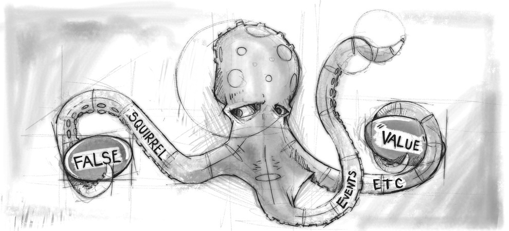
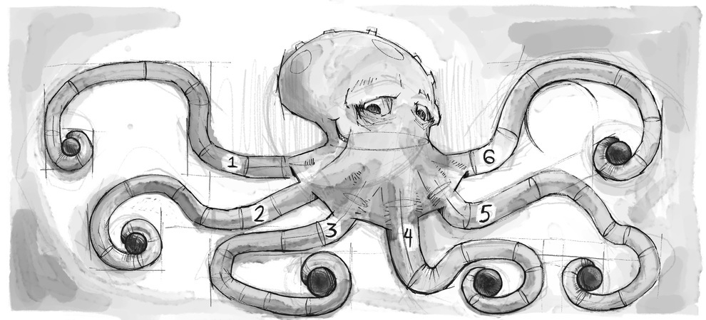
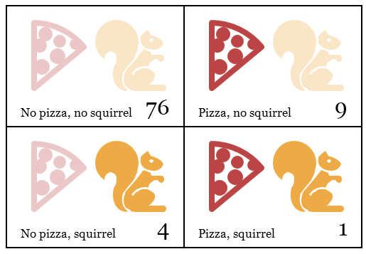
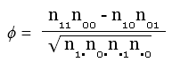
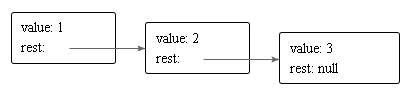

#Структуры данных: объекты и массивы

<i>Два раза меня спрашивали: «Скажите, м-р Бэббидж, а если вы введёте в машину неправильные данные, получится ли правильный ответ?». Непостижима та путаница в головах, которая приводит к таким вопросам.

Чарльз Бэббидж, «Отрывки из жизни философа» (1864)</i>

Числа, булевские значения и строки – кирпичики, из которых строятся структуры данных. Но нельзя сделать дом из одного кирпича. Объекты позволяют нам группировать значения (в том числе и другие объекты) вместе – и строить более сложные структуры.

Написание программ, которым мы до сего момента занимались, сильно затруднял тот факт, что они работали только с простыми данными. Эта глава добавит вам в инструментарий понимание структур данных. К её концу вы будете знать достаточно для того, чтобы начать писать полезные программы.

Глава пройдётся по более-менее реалистичному примеру программирования, вводя понятия по мере необходимости. Код примеров будет строиться из функций и переменных, которые мы определяли ранее.

##Белка-оборотень
Иногда, обычно между восемью и десятью часами вечера, Жак против своей воли превращается в небольшого грызуна с пушистым хвостом.

С одной стороны, Жак рад, что он не превращается в классического волка. Превращение в белку влечёт меньше проблем. Вместо того, чтобы волноваться о том, не съешь ли ты соседа (это было бы неловко), он волнуется, как бы его не съел соседский кот. После того, как он дважды просыпался на очень тонкой ветке в кроне дуба, голый и дезориентированный, он приучился запирать окна и двери в своей комнате на ночь, и класть несколько орешков на пол, чтобы чем-то занять себя.


Так решаются проблемы с котом и дубом. Но Жак всё ещё страдает от своего заболевания. Нерегулярные обращения наводят его на мысль, что они должны быть чем-то вызваны. Сначала он думал, что это происходит только в те дни, когда он прикасался к деревьям. Он перестал это делать, и даже стал избегать подходить к ним. Но проблема не исчезла.

Перейдя к более научному подходу, Жак решил вести ежедневный дневник всего, чем он занимался, записывая туда, обращался ли он в белку. Так он надеется сузить круг вещей, приводящих к трансформации.

Сперва он решил разработать структуру данных для хранения этой информации.

###Наборы данных
Для работы с куском данных нам вначале нужно найти способ представлять их в памяти машины. К примеру, нам нужно запомнить коллекцию чисел:

```js
2, 3, 5, 7, 11
```

Можно поиграть со строками – строки могут быть любой длины, в них можно поместить много данных, и использовать для представления этого набора «2 3 5 7 11». Но это неудобно. Нам нужно будет как-то вынимать оттуда числа или вставлять новые в строку.

К счастью, JavaScript предлагает тип данных специально для хранения последовательностей чисел. Он называется массивом (array), и записывается, как список значений в квадратных скобках, разделённых запятыми:

```js
var listOfNumbers = [2, 3, 5, 7, 11];
console.log(listOfNumbers[1]);
// → 3
console.log(listOfNumbers[1 - 1]);
// → 2
```

Запись для получения элемента из массива тоже использует квадратные скобки. Пара скобок после выражения, содержащая внутри ещё одно выражение, найдёт в массиве, который задан первым выражением, элемент, порядковый номер которого задан вторым выражением.

Номер первого элемента – ноль, а не один. Поэтому первый элемент можно получить так: listOfNumbers[0]. Если вы раньше не программировали, придётся привыкнуть к такой нумерации. Но она имеет давнюю традицию, и всё время, пока её последовательно соблюдают, она прекрасно работает.

###Свойства
Мы видели много подозрительных выражений вроде myString.length (получение длины строки) и Math.max (получение максимума) в ранних примерах. Эти выражения используют свойства величин. В первом случае, мы получаем доступ к свойству length (длина) переменной myString. Во втором — доступ к свойству max объекта Math (который является набором функций и переменных, связанных с математикой).

Почти у всех переменных в JavaScript есть свойства. Исключения — null и undefined. Если вы попробуете получить доступ к несуществующим свойствам этих не-величин, получите ошибку:

```js
null.length;
// → TypeError: Cannot read property 'length' of null
```

Два основных способа доступа к свойствам – точка и квадратные скобки. value.x и value[x] получают доступ к свойству value – но не обязательно к одному и тому же. Разница в том, как интерпретируется x. При использовании точки запись после точки должна быть именем существующей переменной, и она таким образом напрямую вызывает свойство по имени. При использовании квадратных скобок выражение в скобках вычисляется для получения имени свойства. value.x вызывает свойство под именем “x”, а value[x] вычисляет выражение x и использует результат в качестве имени свойства.

Если вы знаете, что интересующее вас свойство называется “length”, вы пишете value.length. Если вы хотите извлечь имя свойства из переменной i, вы пишете value[i]. А поскольку свойство может иметь любое имя, для доступа к свойству по имени “2” или “Jon Doe” вам придётся использовать квадратные скобки: value[2] или value[«John Doe»]. Это необходимо даже когда вы знаете точное имя свойства, потому что “2” или «John Doe» не являются допустимыми именами переменных, поэтому к ним нельзя обратиться при помощи записи через точку.

Элементы массива хранятся в свойствах. Так как имена этих свойств – числа, и нам часто приходится получать их имена из значений переменных, нужно использовать квадратные скобки для доступа к ним. Свойство length массива говорит о том, сколько в нём элементов. Имя этого свойства – допустимое имя переменной, и мы его знаем заранее, поэтому обычно мы пишем array.length, потому, что это проще, чем писать array[“length”].

###Методы
Объекты string и array содержат, в дополнение к свойству length, несколько свойств, ссылающихся на функции.

```js
var doh = "Дык";
console.log(typeof doh.toUpperCase);
// → function
console.log(doh.toUpperCase());
// → ДЫК
```

У каждой строки есть свойство toUpperCase. При вызове оно возвращает копию строки, в которой все буквы заменены на прописные. Есть также и toLowerCase – можете догадаться, что оно делает.

Что интересно, хотя вызов toUpperCase не передаёт никаких аргументов, функция каким-то образом получает доступ к строчке “Дык”, свойство которой мы вызывали. Как это работает, описано в главе 6.

Свойства, содержащие функции, обычно называют методами той переменной, которой они принадлежат. То есть, toUpperCase – это метод строки.

В следующем примере демонстрируются некоторые методы, имеющиеся у массивов:

```js
var mack = [];
mack.push("Трест,");
mack.push("который", "лопнул");
console.log(mack);
// → ["Трест,", "который", "лопнул"]
console.log(mack.join(" "));
// → Трест, который лопнул
console.log(mack.pop());
// → лопнул
console.log(mack);
// → ["Трест,", "который"]
```

Метод push используется для добавления значений в конец массива. pop делает обратное: удаляет значение из конца массива и возвращает его. Массив строк можно сплющить в одну строку при помощи метода join. В качестве аргумента join передают строку, которая будет вставлена между элементами массива.

###Объекты
Вернёмся к нашей белке. Набор журнальных записей можно представить в виде массива. Но записи не состоят только лишь из номеров или строк – каждая должна хранить список того, что сделал наш герой, и булевское значение, показывающее, превратился ли Жак в белку. В идеале нам бы хотелось группировать каждую из записей в какую-то одну переменную, и потом добавлять их в массив.

Переменные типа object (объект) – коллекции произвольных свойств, и мы можем добавлять и удалять свойства объекта по желанию. Один из способов создать объект – использовать фигурные скобки:

```js
var day1 = {
  squirrel: false,
  events: ["работа", "тронул дерево", "пицца", "пробежка", "телевизор"]
};
console.log(day1.squirrel);
// → false
console.log(day1.wolf);
// → undefined
day1.wolf = false;
console.log(day1.wolf);
// → false
```

В скобках мы можем задать список свойств, разделённых запятыми. Записывается каждое свойство как имя, после которого идёт двоеточие, затем идёт выражение, которое и является значением свойства. Пробелы и переносы строк не учитываются. Разбивая запись свойств объекта на несколько строк, вы улучшаете читаемость кода. Если имя свойства не является допустимым именем переменной, его нужно заключать в кавычки:

```js
var descriptions = {
  work: "Пошёл на работу",
  "тронул дерево": "Дотронулся до дерева"
};
```

Получается, у фигурных скобок в JavaScript два значения. Употреблённые в начале инструкции, они начинают новый блок инструкций. В любом другом месте они описывают объект. Обычно нет смысла начинать инструкцию с описания объекта, и поэтому в программах обычно нет двусмысленностей по поводу этих двух применений фигурных скобок.

Если вы попытаетесь прочесть значение несуществующего свойства, вы получите undefined – как в примере, когда мы первый раз попробовали прочесть свойство wolf.

Свойству можно назначать значение через оператор =. Если у него ранее было значение, оно будет заменено. Если свойство отсутствовало, оно будет создано.

Возвращаясь к нашей модели со щупальцами и переменными, мы видим, что свойства тоже похожи на них. Они хватают значения, но на эти же значения могут ссылаться другие переменные и свойства. Объекты – это осьминоги с произвольным количеством щупалец, на каждом из которых написано имя свойства.



Оператор delete отрезает щупальце. Это унарный оператор, применяемый к выражению доступа к свойству. Это делается редко, но вполне возможно.

```js
var anObject = {left: 1, right: 2};
console.log(anObject.left);
// → 1
delete anObject.left;
console.log(anObject.left);
// → undefined
console.log("left" in anObject);
// → false
console.log("right" in anObject);
// → true
```

Бинарный оператор in принимает строку и имя объекта, и возвращает булевское значение, показывающее, есть ли у объекта свойство с таким именем. Есть разница между установкой значения свойства в undefined и удалением свойства. В первом случае свойство сохраняется у объекта, просто оно пустое. Во втором – свойства больше нет, и тогда in возвращает false.

Получается, что массивы – это разновидность объектов, которые специализируются на хранении последовательностей. Выражение typeof [1, 2] вернёт “object”. Их можно рассматривать как длинных плоских осьминогов, у которых все щупальца расположены ровным рядом и размечены номерами.



Поэтому журнал Жака можно представить в виде массива объектов:

```js
var journal = [
  {events: ["работа", "тронул дерево", "пицца", "пробежка", "телевизор"],
   squirrel: false},
  {events: ["работа ", "мороженое", "цветная капуста", "лазанья", " тронул дерево ", "почистил зубы"],
   squirrel: false},
  {events: ["выходной", "велик", "перерыв", "арахис", "пивасик"],
   squirrel: true},
  /* и так далее... */
];
```

###Изменчивость (Mutability)

Скоро мы уже и до программирования доберёмся. А пока нам нужно понять последнюю часть теории.

Мы увидели, что значения объекта можно менять. Типы значений, которые мы рассматривали ранее,– числа, строки, булевские значения,- неизменяемы. Нельзя поменять существующее значение заданного типа. Их можно комбинировать и выводить из них новые значения, но когда вы работаете с некоторым значением строки, это значение остаётся постоянным. Текст внутри строки нельзя поменять. Если у вас есть ссылка на строку «кошка», в коде нельзя поменять в ней символ, чтобы получилось «мошка».

А вот у объектов содержимое можно менять, изменяя значения их свойств.

Если у нас есть два числа, 120 и 120, мы можем рассматривать их как одно и тоже, независимо от того, хранятся ли они в памяти в одном и том же месте. Но когда мы имеем дело с объектами, есть разница, есть ли у нас две ссылки на один объект или же у нас есть два разных объекта, содержащих одинаковые свойства. Рассмотрим пример:

```js
var object1 = {value: 10};
var object2 = object1;
var object3 = {value: 10};

console.log(object1 == object2);
// → true
console.log(object1 == object3);
// → false

object1.value = 15;
console.log(object2.value);
// → 15
console.log(object3.value);
// → 10
```

Переменные object1 и object2 держатся за один и тот же объект, поэтому изменения object1 приводят к изменениям в object2. Переменная object3 показывает на другой объект, который изначально содержит те же свойства, что и object1, но живёт своей собственной жизнью.

Оператор == при сравнении объектов возвращает true только, если сравниваемые объекты – это одна и та же переменная. Сравнение разных объектов вернёт false, даже если у них идентичное содержимое. Оператора «глубокого» сравнения, который бы сравнивал содержимое объектов, в JavaScript не предусмотрено, но его возможно сделать самостоятельно (это будет одним из упражнений в конце главы).

##Журнал оборотня
Итак, Жак запускает свой любимый интерпретатор JavaScript и создаёт окружение, необходимое для хранения журнала.

```js
var journal = [];

function addEntry(events, didITurnIntoASquirrel) {
  journal.push({
    events: events,
    squirrel: didITurnIntoASquirrel
  });
}
```

Каждый вечер, часов в десять,– а иногда и назавтра утром, спускаясь с верхней полки шкафа,- он записывает свой день.

```js
addEntry(["работа", "тронул дерево", "пицца", "пробежка", "телевизор"], false);
addEntry(["работа ", "мороженое", "цветная капуста", "лазанья", " тронул дерево ", "почистил зубы"], false);
addEntry(["выходной", "велик", "перерыв", "арахис", "пивасик"], true);
```

Как только у него будет достаточно данных, он собирается вычислить корреляцию между его оборачиваниями и событиями каждого из дней, и в идеале узнать из их корреляций что-то полезное.

Корреляция – это мера зависимости между переменными величинами (переменными в статистическом смысле, а не в смысле JavaScript). Она обычно выражается в виде коэффициента, принимающего значения от -1 до 1. Нулевая корреляция обозначает, что переменные вообще не связаны, а корреляция 1 означает, что они полностью связаны – если вы знаете одну, вы автоматически знаете другую. Минус один также означает прочную связь переменных, но и их противоположность – когда одна true, вторая всегда false.

Для измерения корреляции булевских переменных хорошо подходит коэффициент фи (ϕ), к тому же, его сравнительно легко подсчитать. Для этого нам нужна таблица, содержащая количество раз, когда наблюдались различные комбинации двух переменных. К примеру, мы можем взять события «поел пиццы» и «обращение» и представить их в следующей таблице:



ϕ можно вычислить по следующей формуле, где n относится к ячейкам таблицы:



n01 обозначает количество измерений, когда первое событие (пицца) false (0), а второе событие (обращение) true (1). В нашем примере n01 = 4.

Запись n1• обозначает сумму всех измерений, где первое событие было true, что для нашего примера равно 10. Соответственно, n•0 – сумма всех измерений, где событие «обращение» было false.

Значит, для таблицы с пиццей числитель формулы будет 1×76 — 9×4 = 40, а знаменатель – корень из 10×80×5×85, или √340000. Получается, что ϕ ≈ 0.069, что довольно мало. Непохоже, чтобы пицца влияла на обращения в белку.

###Вычисляем корреляцию
Таблицу 2х2 можно представить массивом из четырёх элементов ([76, 9, 4, 1]), массивом из двух элементов, каждый из которых является также двухэлементным массивом ([76, 9], [4, 1]]), или же объектом со свойствами под именами “11” или “01”. Но для нас одномерный массив проще и выражение для доступа к нему будет короче. Мы будем обрабатывать индексы массива как двузначные двоичные числа, где левый знак обозначает переменную оборачиваемости, а правый – события. К примеру, 10 обозначает случай, когда Жак обратился в белку, но событие (к примеру, «пицца») не имело места. Так случилось 4 раза. И поскольку двоичное 10 – это десятичное 2, мы будем хранить это в массиве по индексу 2.

Функция, вычисляющая коэффициент ϕ из такого массива:

```js
function phi(table) {
  return (table[3] * table[0] - table[2] * table[1]) /
    Math.sqrt((table[2] + table[3]) *
              (table[0] + table[1]) *
              (table[1] + table[3]) *
              (table[0] + table[2]));
}

console.log(phi([76, 9, 4, 1]));
// → 0.068599434
```

Это просто прямая реализация формулы ϕ на языке JavaScript. Math.sqrt – это функция извлечения квадратного корня объекта Math из стандартного окружения JavaScript. Нам нужно сложить два поля таблицы для получения полей типа n1•, потому что мы не храним в явном виде суммы столбцов или строк.

Жак вёл журнал три месяца. Результат доступен на сайте книги
<a href="http://eloquentjavascript.net/code/jacques_journal.js">eloquentjavascript.net/code/jacques_journal.js</a>

Чтобы извлечь переменную 2х2 для конкретного события, нам нужно в цикле пройтись по всем записям и посчитать, сколько раз оно случается по отношению к обращению в белку.

```js
function hasEvent(event, entry) {
  return entry.events.indexOf(event) != -1;
}

function tableFor(event, journal) {
  var table = [0, 0, 0, 0];
  for (var i = 0; i < journal.length; i++) {
    var entry = journal[i], index = 0;
    if (hasEvent(event, entry)) index += 1;
    if (entry.squirrel) index += 2;
    table[index] += 1;
  }
  return table;
}

console.log(tableFor("pizza", JOURNAL));
// → [76, 9, 4, 1]
```

Функция hasEvent проверяет, содержит ли запись нужный элемент. У массивов есть метод indexOf, который ищет заданное значение (в нашем случае – имя события) в массиве. и возвращает индекс его положения в массиве (-1, если его в массиве нет). Значит, если вызов indexOf не вернул -1, то событие в записи есть.

Тело цикла в tableFor рассчитывает, в какую ячейку таблицы попадает каждая из журнальных записей. Она смотрит, содержит ли запись нужное событие, и связано ли оно с обращением в белку. Затем цикл увеличивает на единицу элемент массива, соответствующий нужной ячейке.

Теперь у нас есть все инструменты для подсчёта корреляций. Осталось только подсчитать корреляции для каждого из событий, и посмотреть, не выдаётся ли что из списка. Но как хранить эти корреляции?

###Объекты как карты (map)
Один из способов – хранить корреляции в массиве, используя объекты со свойствами name и value. Однако поиск корреляций в массиве будет довольно громоздким: нужно будет пройтись по всему массиву, чтобы найти объект с нужным именем. Можно было бы обернуть этот процесс в функцию, но код пришлось бы писать всё равно, и компьютер выполнял бы больше работы, чем необходимо.

Способ лучше – использовать свойства объектов с именами событий. Мы можем использовать квадратные скобки для создания и чтения свойств и оператор in для проверки существования свойства.

```js
var map = {};
function storePhi(event, phi) {
  map[event] = phi;
}

storePhi("пицца", 0.069);
storePhi("тронул дерево", -0.081);
console.log("пицца" in map);
// → true
console.log(map["тронул дерево"]);
// → -0.081
```

Карта (map) – способ связать значения из одной области (в данном случае – названия событий) со значениями в другой (в нашем случае – коэффициенты ϕ).

С таким использованием объектов есть пара проблем – мы обсудим их в главе 6, но пока волноваться не будем.

Что, если нам надо собрать все события, для которых сохранены коэффициенты? Они не создают предсказуемую последовательность, как было бы в массиве, поэтому цикл for использовать не получится. JavaScript предлагает конструкцию цикла специально для обхода всех свойств объекта. Она похожа на цикл for, но использует команду in.

```js
for (var event in map)
  console.log("Кореляция для '" + event +
              "' получается " + map[event]);
// → Кореляция для 'пицца' получается 0.069
// → Кореляция для 'тронул дерево' получается -0.081
```

##Итоговый анализ
Чтобы найти все типы событий, представленных в наборе данных, мы обрабатываем каждое вхождение по очереди, и затем создаём цикл по всем событиям вхождения. Мы храним объект phis, в котором содержатся корреляционные коэффициенты для всех типов событий, которые мы уже нашли. Если мы встречаем новый тип, которого ещё не было в phis, мы подсчитываем его корреляцию и добавляем её в объект.

```js
function gatherCorrelations(journal) {
  var phis = {};
  for (var entry = 0; entry < journal.length; entry++) {
    var events = journal[entry].events;
    for (var i = 0; i < events.length; i++) {
      var event = events[i];
      if (!(event in phis))
        phis[event] = phi(tableFor(event, journal));
    }
  }
  return phis;
}

var correlations = gatherCorrelations(JOURNAL);
console.log(correlations.pizza);
// → 0.068599434
```

Смотрим. что получилось:

```js
for (var event in correlations)
  console.log(event + ": " + correlations[event]);
// → морковка:   0.0140970969
// → упражнения: 0.0685994341
// → выходной:  0.1371988681
// → хлеб:   -0.0757554019
// → пудинг: -0.0648203724
// и так далее...
```

Большинство корреляций лежат близко к нулю. Морковки, хлеб и пудинг, очевидно, не связаны с обращением в белку. Но оно вроде бы более часто происходит на выходных. Давайте отфильтруем результаты, чтобы выводить только корреляции больше 0.1 или меньше -0.1

```js
for (var event in correlations) {
  var correlation = correlations[event];
  if (correlation > 0.1 || correlation < -0.1)
    console.log(event + ": " + correlation);
}
// → выходной:        0.1371988681
// → чистил зубы: -0.3805211953
// → конфета:          0.1296407447
// → работа:          -0.1371988681
// → спагетти:      0.2425356250
// → читал:        0.1106828054
// → арахис:        0.5902679812
```

Ага! У двух факторов корреляции заметно больше остальных. Арахис сильно влияет на вероятность превращения в белку, тогда как чистка зубов наоборот, препятствует этому.

Интересно. Попробуем вот что:

```js
for (var i = 0; i < JOURNAL.length; i++) {
  var entry = JOURNAL[i];
  if (hasEvent("арахис", entry) &&
     !hasEvent("чистка зубов", entry))
    entry.events.push("арахис зубы");
}
console.log(phi(tableFor("арахис зубы ", JOURNAL)));
// → 1
```

Ошибки быть не может! Феномен случается именно тогда, когда Жак ест арахис и не чистит зубы. Если б он только не был таким неряхой относительно оральной гигиены, он бы вообще не заметил своего несчастья.

Зная это, Жак просто перестаёт есть арахис и обнаруживает, что трансформации прекратились.

У Жака какое-то время всё хорошо. Но через несколько лет он теряет работу, и в конце концов ему приходится наняться в цирк, где он выступает как Удивительный Человек-белка, набирая полный рот арахисового масла перед шоу. Однажды, устав от столь жалкого существования, Жак не обращается обратно в человека, пробирается через дыру в цирковом тенте и исчезает в лесу. Больше его никто не видел.

##Дальнейшая массивология
В конце главы хочу познакомить вас ещё с несколькими концепциями, относящимися к объектам. Начнём с полезных методов, имеющихся у массивов.

Мы видели методы push и pop, которые добавляют и отнимают элементы в конце массива. Соответствующие методы для начала массива называются unshift и shift

```js
var todoList = [];
function rememberTo(task) {
  todoList.push(task);
}
function whatIsNext() {
  return todoList.shift();
}
function urgentlyRememberTo(task) {
  todoList.unshift(task);
}
```

Данная программа управляет списком дел. Вы добавляете дела в конец списка, вызывая rememberTo(«поесть»), а когда вы готовы заняться чем-то, вызываете whatIsNext(), чтобы получить (и удалить) первый элемент списка. Функция urgentlyRememberTo тоже добавляет задачу, но только в начало списка.

У метода indexOf есть родственник по имени lastIndexOf, который начинает поиск элемента в массиве с конца:

```js
console.log([1, 2, 3, 2, 1].indexOf(2));
// → 1
console.log([1, 2, 3, 2, 1].lastIndexOf(2));
// → 3
```

Оба метода, indexOf и lastIndexOf, принимают необязательный второй аргумент, который задаёт начальную позицию поиска.

Ещё один важный метод – slice, который принимает номера начального (start) и конечного (end) элементов, и возвращает массив, состоящий только из элементов, попадающих в этот промежуток. Включая тот, что находится по индексу start, но исключая тот, что по индексу end.

```js
console.log([0, 1, 2, 3, 4].slice(2, 4));
// → [2, 3]
console.log([0, 1, 2, 3, 4].slice(2));
// → [2, 3, 4]
```

Когда индекс end не задан, slice выбирает все элементы после индекса start. У строк есть схожий метод, который работает так же.

Метод concat используется для склейки массивов, примерно как оператор + склеивает строки. В примере показаны методы concat и slice в деле. Функция принимает массив array и индекс index, и возвращает новый массив, который является копией предыдущего, за исключением удалённого элемента, находившегося по индексу index.

```js
function remove(array, index) {
  return array.slice(0, index).concat(array.slice(index + 1));
}
console.log(remove(["a", "b", "c", "d", "e"], 2));
// → ["a", "b", "d", "e"]
```

##Строки и их свойства
Мы можем получать значения свойств строк, например length и toUpperCase. Но попытка добавить новое свойство ни к чему не приведёт:

```js
var myString = "Шарик";
myString.myProperty = "значение";
console.log(myString.myProperty);
// → undefined
```

Величины типа строка, число и булевские – не объекты, и хотя язык не жалуется на попытки назначить им новые свойства, он на самом деле их не сохраняет. Величины неизменяемы.

Но у них есть свои встроенные свойства. У каждой строки есть набор методов. Самые полезные, пожалуй – slice и indexOf, напоминающие те же методы у массивов.

```js
console.log("кокосы".slice(3, 6));
// → осы
console.log("кокос".indexOf("с"));
// → 4
```

Разница в том, что у строки метод indexOf может принять строку, содержащую больше одного символа, а у массивов такой метод работает только с одним элементом.

```js
console.log("раз два три".indexOf("ва"));
// → 5
```

Метод trim удаляет пробелы (а также переводы строк, табуляцию и прочие подобные символы) с обоих концов строки.

```js
console.log("  ладно  \n ".trim());
// → ладно
```

Мы уже сталкивались со свойством строки length. Доступ к отдельным символам строчки можно получить через метод charAt, а также просто через нумерацию позиций, как в массиве:

```js
var string = "abc";
console.log(string.length);
// → 3
console.log(string.charAt(0));
// → a
console.log(string[1]);
// → b
```

##Объект arguments
Когда вызывается функция, к окружению исполняемого тела функции добавляется особая переменная под названием arguments. Она указывает на объект, содержащий все аргументы, переданные функции. Помните, что в JavaScript вы можете передавать функции больше или меньше аргументов, чем объявлено при помощи параметров.

```js
function noArguments() {}
noArguments(1, 2, 3); // Пойдёт
function threeArguments(a, b, c) {}
threeArguments(); // И так можно
```

У объекта arguments есть свойство length, которое содержит реальное количество переданных функции аргументов. Также у него есть свойства для каждого аргумента под именами 0, 1, 2 и т.д.

Если вам кажется, что это очень похоже на массив – вы правы. Это очень похоже на массив. К сожалению, у этого объекта нет методов типа slice или indexOf, что делает доступ к нему труднее.

```js
function argumentCounter() {
  console.log("Ты дал мне", arguments.length, "аргумента.");
}
argumentCounter("Дядя", "Стёпа", "Милиционер");
// → Ты дал мне 3 аргумента.
```

Некоторые функции рассчитаны на любое количество аргументов, как console.log. Они обычно проходят циклом по свойствам объекта arguments. Это можно использовать для создания удобных интерфейсов. К примеру, вспомните, как мы создавали записи для журнала Жака:

```js
addEntry(["работа", "тронул дерево", "пицца", "пробежка", "телевизор"], false);
```

Так как мы часто вызываем эту функцию, мы можем сделать альтернативу, которую проще вызывать:

```js
function addEntry(squirrel) {
  var entry = {events: [], squirrel: squirrel};
  for (var i = 1; i < arguments.length; i++)
    entry.events.push(arguments[i]);
  journal.push(entry);
}
addEntry(true, "работа", "тронул дерево", "пицца", "пробежка", "телевизор");
```

Эта версия читает первый аргумент как обычно, а по остальным проходит в цикле (начиная с индекса 1, пропуская первый аргумент) и собирает их в массив.

##Объект Math
Мы уже видели, что Math – набор инструментов для работы с числами, такими, как Math.max (максимум), Math.min (минимум), и Math.sqrt (квадратный корень).

Объект Math используется просто как контейнер для группировки связанных функций. Есть только один объект Math, и он почти не используется в виде значений. Он просто предоставляет пространство имён для всех этих функций и значений, чтоб не нужно было делать их глобальными.

Слишком большое число глобальных переменных «загрязняет» пространство имён. Чем больше имён занято, тем больше вероятность случайно использовать одно из них в качестве переменной. К примеру, весьма вероятно, что вы захотите использовать имя max для чего-то в своей программе. Поскольку встроенная в JavaScript функция max безопасно упакована в объект Math, нам не нужно волноваться по поводу того, что мы её перезапишем.

Многие языки остановят вас, или хотя бы предупредят, когда вы будете определять переменную с именем, которое уже занято. JavaScript не будет этого делать, поэтому будьте осторожны.

Возвращаясь к объекту Math. Если вам нужна тригонометрия, он вам поможет. У него есть cos (косинус), sin (синус), и tan (тангенс), их обратные функции — acos, asin, и atan. Число π (pi) – или, по крайней мере, его близкая аппроксимация, помещающаяся в число JavaScript,- также доступна как Math.PI. (Есть такая старая традиция в программировании — записывать имена констант в верхнем регистре).

```js
function randomPointOnCircle(radius) {
  var angle = Math.random() * 2 * Math.PI;
  return {x: radius * Math.cos(angle),
          y: radius * Math.sin(angle)};
}
console.log(randomPointOnCircle(2));
// → {x: 0.3667, y: 1.966}
```

Если вы незнакомы с синусами и косинусами – не отчаивайтесь. Мы их будем использовать в 13 главе, и тогда я их объясню.

В предыдущем примере используется Math.random. Это функция, возвращающая при каждом вызове новое псевдослучайное число между нулём и единицей (включая ноль).

```js
console.log(Math.random());
// → 0.36993729369714856
console.log(Math.random());
// → 0.727367032552138
console.log(Math.random());
// → 0.40180766698904335
```

Хотя компьютеры – машины детерминированные (они всегда реагируют одинаково на одни и те же входные данные), возможно заставить их выдавать кажущиеся случайными номера. Для этого машина хранит у себя во внутреннем состоянии несколько номеров. Каждый раз, когда идёт запрос на случайный номер, она выполняет разные сложные детерминированные вычисления и возвращает часть результата вычислений. Этот результат она использует для того, чтобы изменить своё внутреннее состояние, поэтому следующий «случайный» номер получается другим.

Если вам нужно целое случайное число, а не дробь, вы можете использовать Math.floor (округляет число вниз до ближайшего целого) на результате Math.random.

```js
console.log(Math.floor(Math.random() * 10));
// → 2
```

Умножая случайное число на 10, получаем номер от нуля до 10 (включая ноль). Так как Math.floor округляет вниз, мы получим число от 0 до 9 включительно.

Есть также функция Math.ceil («ceiling» – потолок), которая округляет вверх до ближайшего целого) и Math.round (округляет до ближайшего целого).

##Объект global
К глобальной области видимости, где живут глобальные переменные, можно получить доступ так же, как к объекту. Каждая глобальная переменная является свойством этого объекта. В браузерах глобальная область видимости хранится в переменной window.

```js
var myVar = 10;
console.log("myVar" in window);
// → true
console.log(window.myVar);
// → 10
```

##Итог
Объекты и массивы (которые представляют из себя подвид объектов) позволяют сгруппировать несколько величин в одну. В принципе, это позволяет нам засунуть несколько связанных между собой вещей в мешок и бегать с ним кругами, вместо того, чтобы пытаться сгребать все эти вещи руками и пытаться держать их каждую по отдельности.

У большинства величин в JavaScript есть свойства, за исключением null и undefined. Мы получаем доступ к ним через value.propName или value[«propName»]. Объекты используют имена для хранения свойств и хранят более-менее фиксированное их количество. Массивы обычно содержат переменное количество сходных по типу величин, и используют числа (начиная с нуля) в качестве имён этих величин.

Также в массивах есть именованные свойства, такие как length, и несколько методов. Методы – это функции, живущие среди свойств и (обычно) работающие над той величиной, чьим свойством они являются.

Объекты также могут работать как карты, ассоциируя значения с именами. Оператор in используется для выяснения того, содержит ли объект свойство с данным именем. Это же ключевое слово используется в цикле for (for (var name in object)) для перебора всех свойств объекта.

##Упражнения
###Сумма диапазона
Во введении был упомянут удобный способ подсчёта сумм диапазонов чисел:

```js
console.log(sum(range(1, 10)));
```

Напишите функцию range, принимающую два аргумента, начало и конец диапазона, и возвращающую массив, который содержит все числа из него, включая начальное и конечное.

Затем напишите функцию sum, принимающую массив чисел и возвращающую их сумму. Запустите указанную выше инструкцию и убедитесь, что она возвращает 55.

В качестве бонуса дополните функцию range, чтобы она могла принимать необязательный третий аргумент – шаг для построения массива. Если он не задан, шаг равен единице. Вызов функции range(1, 10, 2) должен будет вернуть [1, 3, 5, 7, 9]. Убедитесь, что она работает с отрицательным шагом так, что вызов range(5, 2, -1) возвращает [5, 4, 3, 2].

```js
console.log(sum(range(1, 10)));
// → 55
console.log(range(5, 2, -1));
// → [5, 4, 3, 2]
```

###Обращаем вспять массив
У массивов есть метод reverse, меняющий порядок элементов в массиве на обратный. В качестве упражнения напишите две функции, reverseArray и reverseArrayInPlace. Первая получает массив как аргумент и выдаёт новый массив, с обратным порядком элементов. Вторая работает как оригинальный метод reverse – она меняет порядок элементов на обратный в том массиве, который был ей передан в качестве аргумента. Не используйте стандартный метод reverse.

Если иметь в виду побочные эффекты и чистые функции из предыдущей главы, какой из вариантов вам кажется более полезным? Какой более эффективным?

```js
console.log(reverseArray(["A", "B", "C"]));
// → ["C", "B", "A"];
var arrayValue = [1, 2, 3, 4, 5];
reverseArrayInPlace(arrayValue);
console.log(arrayValue);
// → [5, 4, 3, 2, 1]
```

###Список
Объекты могут быть использованы для построения различных структур данных. Часто встречающаяся структура – список (не путайте с массивом). Список – связанный набор объектов, где первый объект содержит ссылку на второй, второй – на третий, и т.п.

```js
var list = {
  value: 1,
  rest: {
    value: 2,
    rest: {
      value: 3,
      rest: null
    }
  }
};
```

В результате объекты формируют цепочку:



Списки удобны тем, что они могут делиться частью своей структуры. Например, можно сделать два списка, {value: 0, rest: list} и {value: -1, rest: list}, где list – это ссылка на ранее объявленную переменную. Это два независимых списка, при этом у них есть общая структура list, которая включает три последних элемента каждого из них. Кроме того, оригинальный список также сохраняет свои свойства как отдельный список из трёх элементов.

Напишите функцию arrayToList, которая строит такую структуру, получая в качестве аргумента [1, 2, 3], а также функцию listToArray, которая создаёт массив из списка. Также напишите вспомогательную функцию prepend, которая получает элемент и создаёт новый список, где этот элемент добавлен спереди к первоначальному списку, и функцию nth, которая в качестве аргументов принимает список и число, а возвращает элемент на заданной позиции в списке, или же undefined в случае отсутствия такого элемента.

Если ваша версия nth не рекурсивна, тогда напишите её рекурсивную версию.

```js
console.log(arrayToList([10, 20]));
// → {value: 10, rest: {value: 20, rest: null}}
console.log(listToArray(arrayToList([10, 20, 30])));
// → [10, 20, 30]
console.log(prepend(10, prepend(20, null)));
// → {value: 10, rest: {value: 20, rest: null}}
console.log(nth(arrayToList([10, 20, 30]), 1));
// → 20
```

###Глубокое сравнение
Оператор == сравнивает переменные объектов, проверяя, ссылаются ли они на один объект. Но иногда полезно было бы сравнить объекты по содержимому.

Напишите функцию deepEqual, которая принимает два значения и возвращает true, только если это два одинаковых значения или это объекты, свойства которых имеют одинаковые значения, если их сравнивать рекурсивным вызовом deepEqual.

Чтобы узнать, когда сравнивать величины через ===, а когда – объекты по содержимому, используйте оператор typeof. Если он выдаёт “object” для обеих величин, значит нужно делать глубокое сравнение. Не забудьте об одном дурацком исключении, случившемся из-за исторических причин: “typeof null” тоже возвращает “object”.

```js
var obj = {here: {is: "an"}, object: 2};
console.log(deepEqual(obj, obj));
// → true
console.log(deepEqual(obj, {here: 1, object: 2}));
// → false
console.log(deepEqual(obj, {here: {is: "an"}, object: 2}));
// → true
```
