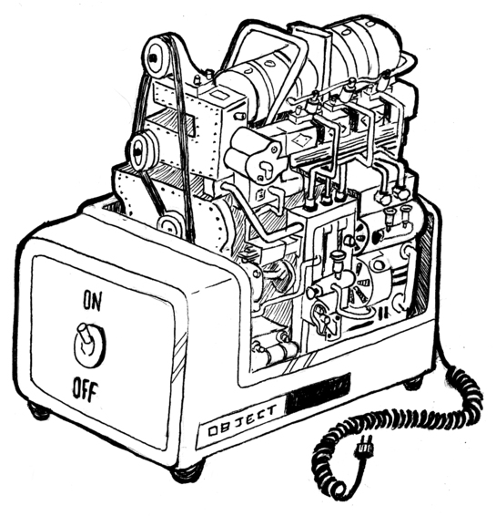
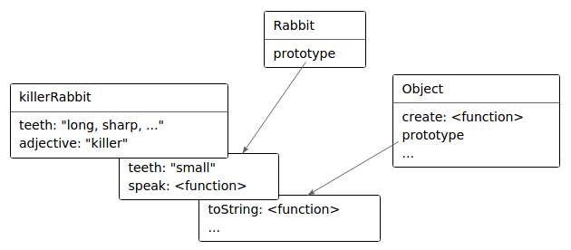

#Тайная жизнь объектов

<i>Проблема объектно-ориентированных языков в том, что они тащат с собой всё своё неявное окружение. Вам нужен был банан – а вы получаете гориллу с бананом, и целые джунгли впридачу.

Джо Армстронг, в интервью Coders at Work</i>

Термин «объект» в программировании сильно перегружен значениями. В моей профессии объекты – стиль жизни, тема священных войн и любимое заклинание, не теряющее своей магической силы.

Стороннему человеку всё это непонятно. Начнём же с краткой истории объектов как концепции в программировании.

##История
Эта история, как большинство историй о программировании, начинается с проблемы сложности. Одна из идей говорит, что сложность можно сделать управляемой, разделив её на небольшие части, изолированные друг от друга. Эти части стали называть объектами.

Объект – твёрдая скорлупа, скрывающая липкую сложность внутри, и вместо неё предлагающая нам несколько ручек настройки и контактов (вроде методов), представляющих интерфейс, посредством которого объект нужно использовать. Идея в том, что интерфейс относительно прост, и при работе с ним позволяет игнорировать все сложные процессы, происходящие внутри объекта.

Простой интерфейс может спрятать много сложного.



Для примера представьте объект, обеспечивающий интерфейс к участку экрана. С его помощью можно рисовать фигуры или выводить текст на этот участок, но при этом все детали, касающиеся превращения текста или фигур в пиксели, скрыты. У вас есть набор методов, к примеру drawCircle, и это всё, что вам нужно знать для использования такого объекта.

Такие идеи получили развитие в 70-80 годах, а в 90-х их вынесла на поверхность рекламная волна – революция объектно-ориентированного программирования. Внезапно большой клан людей объявил, что объекты – это правильный способ программирования. А всё, что не имеет объектов, является устаревшей ерундой.

Такой фанатизм всегда приводит к куче бесполезной чуши, и с тех пор идёт что-то вроде контрреволюции. В некоторых кругах объекты вообще имеют крайне плохую репутацию.

Я предпочитаю рассматривать их с практической, а не идеологической точки зрения. Есть несколько полезных идей, в частности инкапсуляция (различие между внутренней сложностью и внешней простотой), которые были популяризованы объектно-ориентированной культурой. Их стоит изучать.

Эта глава описывает довольно эксцентричный подход JavaScript к объектам, и то, как они соотносятся с классическими объектно-ориентированными техниками.

##Методы
Методы – свойства, содержащие функции. Простой метод:

```js
var rabbit = {};
rabbit.speak = function(line) {
  console.log("Кролик говорит '" + line + "'");
};

rabbit.speak("Я живой.");
// → Кролик говорит 'Я живой.'
```

Обычно метод должен что-то сделать с объектом, через который он был вызван. Когда функцию вызывают в виде метода – как свойство объекта, например object.method() – специальная переменная в её теле будет указывать на вызвавший её объект.

```js
function speak(line) {
  console.log("А " + this.type + " кролик говорит '" + line + "'");
}
var whiteRabbit = {type: "белый", speak: speak};
var fatRabbit = {type: "толстый", speak: speak};

whiteRabbit.speak("Ушки мои и усики, я же наверняка опаздываю!");
// → А белый кролик говорит 'Ушки мои и усики, я же наверняка опаздываю!'
fatRabbit.speak("Мне бы сейчас морковочки.");
// → А толстый кролик говорит 'Мне бы сейчас морковочки.'
```

Код использует ключевое слово this для вывода типа говорящего кролика.

Вспомните, что методы apply и bind принимают первый аргумент, который можно использовать для эмуляции вызова методов. Этот первый аргумент как раз даёт значение переменной this.

Есть метод, похожий на apply, под названием call. Он тоже вызывает функцию, методом которой является, только принимает аргументы как обычно, а не в виде массива. Как apply и bind, в call можно передать значение this.

```js
speak.apply(fatRabbit, ["Отрыжка!"]);
// → А толстый кролик говорит 'Отрыжка!'
speak.call({type: "старый"}, "О, господи.");
// → А старый кролик говорит 'О, господи.'
```

##Прототипы
Следите за руками.

```js
var empty = {};
console.log(empty.toString);
// → function toString(){…}
console.log(empty.toString());
// → [object Object]
```

Я достал свойство пустого объекта. Магия!

Ну, не магия, конечно. Я просто не всё рассказал про то, как работают объекты в JavaScript. В дополнение к набору свойств, почти у всех также есть прототип. Прототип – это ещё один объект, который используется как запасной источник свойств. Когда объект получает запрос на свойство, которого у него нет, это свойство ищется у его прототипа, затем у прототипа прототипа, и т. д.

Ну а кто же прототип пустого объекта? Это великий предок всех объектов, Object.prototype.

```js
console.log(Object.getPrototypeOf({}) == Object.prototype);
// → true
console.log(Object.getPrototypeOf(Object.prototype));
// → null
```

Как и следовало ожидать, функция Object.getPrototypeOf возвращает прототип объекта.

Прототипические отношения в JavaScript выглядят как дерево, в корне которого находится Object.prototype. Он предоставляет несколько методов, которые появляются у всех объектов. Например, toString, который преобразует объект в строковый вид.

Прототипом многих объектов служит не непосредственно Object.prototype, а какой-то другой объект, который предоставляет свои свойства по умолчанию. Функции происходят от Function.prototype, массивы – от Array.prototype.

```js
console.log(Object.getPrototypeOf(isNaN) == Function.prototype);
// → true
console.log(Object.getPrototypeOf([]) == Array.prototype);
// → true
```

У таких прототипов будет свой прототип – часто Object.prototype, поэтому он всё равно, хоть и не напрямую, предоставляет им методы типа toString.

Функция Object.getPrototypeOf возвращает прототип объекта. Можно использовать Object.create для создания объектов с заданным прототипом.

```js
var protoRabbit = {
  speak: function(line) {
    console.log("А " + this.type + " кролик говорит '" +  line + "'");
  }
};
var killerRabbit = Object.create(protoRabbit);
killerRabbit.type = "убийственный";
killerRabbit.speak("ХРЯЯЯСЬ!");
// → А убийственный кролик говорит 'ХРЯЯЯСЬ!'
```

Прото-кролик работает в качестве контейнера свойств, которые есть у всех кроликов. Конкретный объект-кролик, например убийственный, содержит свойства, применимые только к нему – например, свой тип – и наследует разделяемые с другими свойства от прототипа.

##Конструкторы
Более удобный способ создания объектов, наследуемых от некоего прототипа – конструктор. В JavaScript вызов функции с предшествующим ключевым словом new приводит к тому, что функция работает как конструктор. Конструктор создает новый объект и возвращает его, если только явно не задано возвращение другого объекта вместо созданного. При этом свежесозданный объект доступен изнутри конструктора через переменную this.

Говорят, что объект, созданный при помощи new, является экземпляром конструктора.

Вот простой конструктор кроликов. Имена конструкторов принято начинать с заглавной буквы, чтобы отличать их от других функций.

```js
function Rabbit(type) {
  this.type = type;
}

var killerRabbit = new Rabbit("убийственный");
var blackRabbit = new Rabbit("чёрный");
console.log(blackRabbit.type);
// → чёрный
```

Конструкторы (а вообще-то, и все функции) автоматически получают свойство под именем prototype, которое по умолчанию содержит простой пустой объект, происходящий от Object.prototype. Каждый экземпляр, созданный этим конструктором, будет иметь этот объект в качестве прототипа. Поэтому, чтобы добавить кроликам, созданным конструктором Rabbit, метод speak, мы просто можем сделать так:

```js
Rabbit.prototype.speak = function(line) {
  console.log("А " + this.type + " кролик говорит '" +   line + "'");
};
blackRabbit.speak("Всем капец...");
// → А чёрный кролик говорит 'Всем капец...'
```

Важно отметить разницу между тем, как прототип связан с конструктором (через свойство prototype) и тем, как у объектов есть прототип (который можно получить через Object.getPrototypeOf). На самом деле прототип конструктора – Function.prototype, поскольку конструкторы – это функции. Его свойство prototype будет прототипом экземпляров, созданных им, но не его прототипом.

##Перегрузка унаследованных свойств
Когда вы добавляете свойство объекту, есть оно в прототипе или нет, оно добавляется непосредственно к самому объекту. Теперь это его свойство. Если в прототипе есть одноимённое свойство, оно больше не влияет на объект. Сам прототип не меняется.

```js
Rabbit.prototype.teeth = "мелкие";
console.log(killerRabbit.teeth);
// → мелкие
killerRabbit.teeth = "длинные, острые и окровавленные";
console.log(killerRabbit.teeth);
// → длинные, острые и окровавленные
console.log(blackRabbit.teeth);
// → мелкие
console.log(Rabbit.prototype.teeth);
// → мелкие
```

На диаграмме нарисована ситуация после прогона кода. Прототипы Rabbit и Object находятся за killerRabbit на манер фона, и у них можно запрашивать свойства, которых нет у самого объекта.



Перегрузка свойств, существующих в прототипе, часто приносит пользу. Пример с зубами кролика показывает, как её можно использовать для выражения каких-то исключительных характеристик конкретных экземпляров объектов, оставляя прочим стандартные значения из прототипа.

Та же перегрузка используется, чтобы дать стандартным функциям и массивам свои методы toString, отличные от метода базового объекта.

```js
console.log(Array.prototype.toString == Object.prototype.toString);
// → false
console.log([1, 2].toString());
// → 1,2
```

Вызов toString массива выводит результат, похожий на .join(",") – получается список, разделённый запятыми. Вызов Object.prototype.toString напрямую для массива приводит к другому результату. Эта функция не знает ничего о массивах:

```js
console.log(Object.prototype.toString.call([1, 2]));
// → [object Array]
```

##Нежелательное взаимодействие прототипов
Прототип помогает в любое время добавлять новые свойства и методы всем объектам, которые основаны на нём. К примеру, нашим кроликам может понадобиться танец.

```js
Rabbit.prototype.dance = function() {
  console.log("А " + this.type + " кролик танцует джигу.");
};
killerRabbit.dance();
// → А убийственный кролик танцует джигу.
```

Это удобно. Но в некоторых случаях это приводит к проблемам. В предыдущих главах мы использовали объект как способ связать значения с именами – мы создавали свойства для этих имён, и давали им соответствующие значения. Вот пример из 4-й главы:

```js
var map = {};
function storePhi(event, phi) {
  map[event] = phi;
}

storePhi("пицца", 0.069);
storePhi("тронул дерево", -0.081);
```

Мы можем перебрать все значения фи в объекте через цикл for/in, и проверить наличие в нём имени через оператор in. К сожалению, нам мешается прототип объекта.

```js
Object.prototype.nonsense = "ку";
for (var name in map)
  console.log(name);
// → пицца
// → тронул дерево
// → nonsense
console.log("nonsense" in map);
// → true
console.log("toString" in map);
// → true

// Удалить проблемное свойство
delete Object.prototype.nonsense;
```

Это же неправильно. Нет события под названием “nonsense”. И тем более нет события под названием “toString”.

Занятно, что toString не вылезло в цикле for/in, хотя оператор in возвращает true на его счёт. Это потому, что JavaScript различает счётные и несчётные свойства.

Все свойства, которые мы создаём, назначая им значение – счётные. Все стандартные свойства в Object.prototype – несчётные, поэтому они не вылезают в циклах for/in.

Мы можем объявить свои несчётные свойства через функцию Object.defineProperty, которая позволяет указывать тип создаваемого свойства.

```js
Object.defineProperty(Object.prototype, "hiddenNonsense", {
  enumerable: false, value: "ку"
});
for (var name in map)
  console.log(name);
// → пицца
// → тронул дерево
console.log(map.hiddenNonsense);
// → ку
```

Теперь свойство есть, а в цикле оно не вылезает. Хорошо. Но нам всё ещё мешает проблема с оператором in, который утверждает, что свойства Object.prototype присутствуют в нашем объекте. Для этого нам понадобится метод hasOwnProperty.

```js
console.log(map.hasOwnProperty("toString"));
// → false
```

Он говорит, является ли свойство свойством объекта, без оглядки на прототипы. Часто это более полезная информация, чем выдаёт оператор in.

Если вы волнуетесь, что кто-то другой, чей код вы загрузили в свою программу, испортил основной прототип объектов, я рекомендую писать циклы for/in так:

```js
for (var name in map) {
  if (map.hasOwnProperty(name)) {
    // ... это наше личное свойство
  }
}
```

##Объекты без прототипов
Но кроличья нора на этом не заканчивается. А если кто-то зарегистрировал имя hasOwnProperty в объекте map и назначил ему значение 42? Теперь вызов map.hasOwnProperty обращается к локальному свойству, в котором содержится номер, а не функция.

В таком случае прототипы только мешаются, и нам бы хотелось иметь объекты вообще без прототипов. Мы видели функцию Object.create, что позволяет создавать объект с заданным прототипом. Мы можем передать null для прототипа, чтобы создать свеженький объект без прототипа. Это то, что нам нужно для объектов типа map, где могут быть любые свойства.

```js
var map = Object.create(null);
map["пицца"] = 0.069;
console.log("toString" in map);
// → false
console.log("пицца" in map);
// → true
```

Так-то лучше! Нам уже не нужна приблуда hasOwnProperty, потому что все свойства объекта заданы лично нами. Мы спокойно используем циклы for/in без оглядки на то, что люди творили с Object.prototype

##Полиморфизм
Когда вы вызываете функцию String, преобразующую значение в строку, для объекта, он вызовет метод toString, чтобы создать осмысленную строчку. Я упомянул, что некоторые стандартные прототипы объявляют свои версии toString для создания строк, более полезных, чем просто "[object Object]".

Это простой пример мощной идеи. Когда кусок кода написан так, чтобы работать с объектами через определённый интерфейс – в нашем случае через метод toString – любой объект, поддерживающий этот интерфейс, можно подключить к коду, и всё будет просто работать.

Такая техника называется полиморфизм, хотя никто и не меняет своей формы. Полиморфный код может работать со значениями самых разных форм, пока они поддерживают одинаковый интерфейс.

###Форматируем таблицу

Давайте рассмотрим пример, чтобы понять, как выглядит полиморфизм, да и вообще объектно-ориентированное программирование. Проект следующий: мы напишем программу, которая получает массив массивов из ячеек таблицы, и строит строку, содержащую красиво отформатированную таблицу. То есть, колонки и ряды выровнены. Типа вот этого:

```
name         height country
------------ ------ -------------
Kilimanjaro    5895 Tanzania
Everest        8848 Nepal
Mount Fuji     3776 Japan
Mont Blanc     4808 Italy/France
Vaalserberg     323 Netherlands
Denali         6168 United States
Popocatepetl   5465 Mexico
```

Работать она будет так: основная функция будет спрашивать каждую ячейку, какой она ширины и высоты, и потом использует эту информацию для определения ширины колонок и высоты рядов. Затем она попросит ячейки нарисовать себя, и соберёт результаты в одну строку.

Программа будет общаться с объектами ячеек через хорошо определённый интерфейс. Типы ячеек не будут заданы жёстко. Мы сможем добавлять новые стили ячеек – к примеру, подчёркнутые ячейки у заголовка. И если они будут поддерживать наш интерфейс, они просто заработают, без изменений в программе.
<b>Интерфейс:</b>

* <b>minHeight()</b> возвращает число, показывающее минимальную высоту, которую требует ячейка (выраженную в строчках)

* <b>minWidth()</b> возвращает число, показывающее минимальную ширину, которую требует ячейка (выраженную в символах)

* <b>draw(width, height)</b> возвращает массив длины height, содержащий наборы строк, каждая из которых шириной в width символов. Это содержимое ячейки.

Я буду использовать функции высшего порядка, поскольку они здесь очень уместны.

Первая часть программы вычисляет массивы минимальных ширин колонок и высот строк для матрицы ячеек. Переменная rows будет содержать массив массивов, где каждый внутренний массив – это строка ячеек.

```js
function rowHeights(rows) {
  return rows.map(function(row) {
    return row.reduce(function(max, cell) {
      return Math.max(max, cell.minHeight());
    }, 0);
  });
}

function colWidths(rows) {
  return rows[0].map(function(_, i) {
    return rows.reduce(function(max, row) {
      return Math.max(max, row[i].minWidth());
    }, 0);
  });
}
```

Используя переменную, у которой имя начинается с (или полностью состоит из) подчёркивания (_), мы показываем тому, кто будет читать код, что этот аргумент не будет использоваться.

Функция rowHeights не должна вызвать затруднений. Она использует reduce для подсчёта максимальной высоты массива ячеек, и заворачивает это в map, чтобы пройти все строки в массиве rows.

Ситуация с colWidths посложнее, потому что внешний массив – это массив строк, а не столбцов. Я забыл упомянуть, что map (как и forEach, filter и похожие методы массивов) передаёт в заданную функцию второй аргумент – индекс текущего элемента. Проходя при помощи map элементы первой строки и используя только второй аргумент функции, colWidths строит массив с одним элементом для каждого индекса столбца. Вызов reduce проходит по внешнему массиву rows для каждого индекса, и выбирает ширину широчайшей ячейки в этом индексе.

Код для вывода таблицы:

```js
function drawTable(rows) {
  var heights = rowHeights(rows);
  var widths = colWidths(rows);

  function drawLine(blocks, lineNo) {
    return blocks.map(function(block) {
      return block[lineNo];
    }).join(" ");
  }

  function drawRow(row, rowNum) {
    var blocks = row.map(function(cell, colNum) {
      return cell.draw(widths[colNum], heights[rowNum]);
    });
    return blocks[0].map(function(_, lineNo) {
      return drawLine(blocks, lineNo);
    }).join("\n");
  }

  return rows.map(drawRow).join("\n");
}
```

Функциия drawTable использует внутреннюю функцию drawRow для рисования всех строк, соединяя их через символы новой строки.

Функция drawRow сперва превращает объекты ячеек строки в блоки, которые являются массивами строк, представляющими содержимое ячеек, разделённые линиями. Одна ячейка, содержащая число 3776, может быть представлена массивом из одного элемента ["3776"], а подчёркнутая ячейка может занять две строки и выглядеть как массив ["name", "----"].

Блоки для строки, у которых одинаковая высота, должны выводиться рядом друг с другом. Второй вызов map в drawRow строит этот результат построчно, начиная с ячеек самого левого блока, и для каждой из них дополняя строку до полной ширины таблицы. Полученные строки затем соединяются через символ новой строки, создавая целый ряд, который и возвращает drawRow.

Функция drawLine выцепляет строки, которые должны располагаться рядом друг с другом, из массива блоков и соединяет их через пробел, чтобы создать промежуток в один символ между столбцами таблицы.

Давайте напишем конструктор для ячеек, содержащих текст, который предоставляет интерфейс для ячеек. Он разбивает строчку в массив строк при помощи метода split, который режет строчку каждый раз, когда в ней встречается его аргумент, и возвращает массив полученных кусочков. Метод minWidth находит максимальную ширину строки в массиве.

```js
function repeat(string, times) {
  var result = "";
  for (var i = 0; i < times; i++)
    result += string;
  return result;
}

function TextCell(text) {
  this.text = text.split("\n");
}
TextCell.prototype.minWidth = function() {
  return this.text.reduce(function(width, line) {
    return Math.max(width, line.length);
  }, 0);
};
TextCell.prototype.minHeight = function() {
  return this.text.length;
};
TextCell.prototype.draw = function(width, height) {
  var result = [];
  for (var i = 0; i < height; i++) {
    var line = this.text[i] || "";
    result.push(line + repeat(" ", width - line.length));
  }
  return result;
};
```

В коде используется вспомогательная функция repeat, которая возвращает переданную первым аргументом строку, повторённую переданное вторым аргументом количество раз. Метод draw использует её для создания отступов в ячейках, чтобы они все были необходимой длины.

Давайте нарисуем для опыта шахматную доску 5х5.

```js
var rows = [];
for (var i = 0; i < 5; i++) {
   var row = [];
   for (var j = 0; j < 5; j++) {
     if ((j + i) % 2 == 0)
       row.push(new TextCell("##"));
     else
       row.push(new TextCell("  "));
   }
   rows.push(row);
}
console.log(drawTable(rows));
// → ##    ##    ##
//      ##    ##
//   ##    ##    ##
//      ##    ##
//   ##    ##    ##
```

Работает! Но так как у всех ячеек один размер, код форматирования таблицы не делает ничего интересного.

Исходные данные для таблицы гор, которую мы строим, содержатся в переменной MOUNTAINS, их можно <a href="http://eloquentjavascript.net/code/mountains.js">скачать тут</a>.

Нам нужно выделить верхнюю строку, содержащую названия столбцов, при помощи подчёркивания. Никаких проблем – мы просто создаём тип ячейки, который этим занимается.

```js
function UnderlinedCell(inner) {
  this.inner = inner;
};
UnderlinedCell.prototype.minWidth = function() {
  return this.inner.minWidth();
};
UnderlinedCell.prototype.minHeight = function() {
  return this.inner.minHeight() + 1;
};
UnderlinedCell.prototype.draw = function(width, height) {
  return this.inner.draw(width, height - 1)
    .concat([repeat("-", width)]);
};
```

Подчёркнутая ячейка содержит другую ячейку. Она возвращает такие же размеры, как и у ячейки inner (через вызовы её методов minWidth и minHeight), но добавляет единичку к высоте из-за места, занятого чёрточками.

Рисовать её просто – мы берём содержимое ячейки inner и добавляем одну строку, заполненную чёрточками.

Теперь, имея основной движок, мы можем написать функцию, строящую сетку ячеек из нашего набора данных.

```js
function dataTable(data) {
  var keys = Object.keys(data[0]);
  var headers = keys.map(function(name) {
    return new UnderlinedCell(new TextCell(name));
  });
  var body = data.map(function(row) {
    return keys.map(function(name) {
      return new TextCell(String(row[name]));
    });
  });
  return [headers].concat(body);
}

console.log(drawTable(dataTable(MOUNTAINS)));
// → name         height country
//   ------------ ------ -------------
//   Kilimanjaro  5895   Tanzania
//   … и так далее
```

Стандартная функция Object.keys возвращает массив имён свойств объекта. Верхняя строка таблицы состоит из подчёркнутых ячеек с заголовками столбцов. Всё что ниже – значения из набора данных – имеет вид обычных ячеек. Мы извлекаем эти данные проходом функции map по массиву keys, чтобы гарантировать одинаковый порядок ячеек в каждой из строк.

Итоговая таблица напоминает таблицу из примера, только вот числа не выровнены по правому краю. Мы займёмся этим чуть позже.

##Геттеры и сеттеры
При создании интерфейса можно ввести свойства, не являющиеся методами. Мы могли бы определить minHeight и minWidth как переменные для хранения чисел. Но это потребовало бы от нас написать код вычисления их значений в конструкторе, что плохо, поскольку эти операции не связаны напрямую с конструированием объекта. Это может аукнуться, когда, например, внутренняя ячейка подчёркнутой ячейки изменяется – в этот момент размер подчеркивания тоже должен измениться.

Эти соображения привели к тому, что свойства, не являющиеся методами, многие не включают в интерфейс. Вместо прямого доступа к свойствам-значениям, используются методы типа getSomething и setSomething для чтения и записи значений свойств. Но в таком подходе есть и минус – приходится писать (и читать) много дополнительных методов.

К счастью, JavaScript даёт нам технику, использующую лучшее из обоих подходов. Мы можем задать свойства, которые снаружи выглядят обыкновенными, но втайне имеют связанные с ними методы.

```js
var pile = {
  elements: ["скорлупа", "кожура", "червяк"],
  get height() {
    return this.elements.length;
  },
  set height(value) {
    console.log("Игнорируем попытку задать высоту", value);
  }
};

console.log(pile.height);
// → 3
pile.height = 100;
// → Игнорируем попытку задать высоту 100
```

В объявлении объекта записи get или set позволяют задать функцию, которая будет вызвана при чтении или записи свойства. Можно также добавить такое свойство в существующий объект, к примеру, в prototype, используя функцию Object.defineProperty (раньше мы её уже использовали, создавая несчётные свойства).

```js
Object.defineProperty(TextCell.prototype, "heightProp", {
  get: function() { return this.text.length; }
});

var cell = new TextCell("да\nну");
console.log(cell.heightProp);
// → 2
cell.heightProp = 100;
console.log(cell.heightProp);
// → 2
```

Так же можно задавать свойство set в объекте, передаваемом в defineProperty, для задания метода-сеттера. Когда геттер есть, а сеттера нет, попытка записи в свойство просто игнорируется.

##Наследование
Но мы ещё не закончили с нашим упражнением по форматированию таблицы. Читать её было бы удобнее, если б числовой столбец был выровнен по правому краю. Нам нужно создать ещё один тип ячеек вроде TextCell, но чтобы текст дополнялся пробелами слева, а не справа — для выравнивания по правому краю.

Мы могли бы написать новый конструктор со всеми тремя методами в прототипе. Но прототипы могут сами иметь прототипы, и поэтому мы можем поступить умнее.

```js
function RTextCell(text) {
  TextCell.call(this, text);
}
RTextCell.prototype = Object.create(TextCell.prototype);
RTextCell.prototype.draw = function(width, height) {
  var result = [];
  for (var i = 0; i < height; i++) {
    var line = this.text[i] || "";
    result.push(repeat(" ", width - line.length) + line);
  }
  return result;
};
```

Мы повторно использовали конструктор и методы minHeight и minWidth из обычного TextCell. И RTextCell теперь в общем эквивалентен TextCell, за исключением того, что в методе draw находится другая функция.

Такая схема называется наследованием. Мы можем строить в чём-то отличные типы данных на основе существующих, не тратя много сил. Обычно новый конструктор вызывает старый (через метод call, чтобы передать ему новый объект и его значение). После этого мы можем предположить, что все поля, которые должны быть в старом объекте, добавлены. Мы наследуем прототип конструктора от старого так, что экземпляры этого типа будут иметь доступ к свойствам старого прототипа. И наконец, мы можем переопределить некоторые свойства, добавляя их к новому прототипу.

Если мы чуть отредактируем функцию dataTable, чтоб она использовала для числовых ячеек RTextCells, мы получим нужную нам таблицу.

```js
function dataTable(data) {
  var keys = Object.keys(data[0]);
  var headers = keys.map(function(name) {
    return new UnderlinedCell(new TextCell(name));
  });
  var body = data.map(function(row) {
    return keys.map(function(name) {
      var value = row[name];
      // Тут поменяли:
      if (typeof value == "number")
        return new RTextCell(String(value));
      else
        return new TextCell(String(value));
    });
  });
  return [headers].concat(body);
}

console.log(drawTable(dataTable(MOUNTAINS)));
// → … красиво отформатированная таблица
```

Наследование – основная часть объектно-ориентированной традиции, вместе с инкапсуляцией и полиморфизмом. Но, в то время как последние две воспринимают как отличные идеи, первая вызывает споры.

В основном потому, что её обычно путают с полиморфизмом, представляют более мощным инструментом, чем она на самом деле является, и используют не по назначению. Тогда как инкапсуляция и полиморфизм используются для разделения частей кода и уменьшения связанности программы, наследование связывает типы вместе и создаёт большую связанность.

Мы можем использовать полиморфизм без наследования. Я не советую вам полностью избегать наследования – я его использую регулярно в своих программах. Но относитесь к нему как к более хитрому трюку, который позволяет определять новые типы с минимумом кода – а не как к основному принципу организации кода. Предпочтительно расширять типы при помощи композиции – как UnderlinedCell построен на использовании другого объекта ячейки. Он просто хранит его в свойстве и перенаправляет вызовы из своих в его методы.

##Оператор instanceof
Иногда удобно знать, произошёл ли объект от конкретного конструктора. Для этого JavaScript даёт нам бинарный оператор instanceof.

```js
console.log(new RTextCell("A") instanceof RTextCell);
// → true
console.log(new RTextCell("A") instanceof TextCell);
// → true
console.log(new TextCell("A") instanceof RTextCell);
// → false
console.log([1] instanceof Array);
// → true
```

Оператор проходит и через наследованные типы. RTextCell является экземпляром TextCell, поскольку RTextCell.prototype происходит от TextCell.prototype. Оператор также можно применять к стандартным конструкторам типа Array. Практически все объекты – экземпляры Object.

##Итог
Получается, что объекты чуть более сложны, чем я их подавал сначала. У них есть прототипы – это другие объекты, и они ведут себя так, как будто у них есть свойство, которого на самом деле нет, если это свойство есть у прототипа. Прототипом простых объектов является Object.prototype.

Конструкторы – функции, имена которых обычно начинаются с заглавной буквы – можно использовать с оператором new для создания объектов. Прототипом нового объекта будет объект, содержащийся в свойстве prototype конструктора. Это можно использовать, помещая в прототип свойства, общие для всех экземпляров данного типа. Оператор instanceof, если ему дать объект и конструктор, может сказать, является ли объект экземпляром этого конструктора.

Для объектов можно сделать интерфейс и сказать всем, чтобы они общались с объектом только через этот интерфейс. Остальные детали реализации объекта теперь инкапсулированы, скрыты за интерфейсом.

А после этого никто не запрещал использовать разные объекты при помощи одинаковых интерфейсов. Если разные объекты имеют одинаковые интерфейсы, то и код, работающий с ними, может работать с разными объектами одинаково. Это называется полиморфизмом, и это очень полезная штука.

Определяя несколько типов, различающихся только в мелких деталях, бывает удобно просто наследовать прототип нового типа от прототипа старого типа, чтобы новый конструктор вызывал старый. Это даёт вам тип объекта, сходный со старым, но при этом к нему можно добавлять свойства или переопределять старые.

##Упражнения
###Векторный тип
Напишите конструктор Vector, представляющий вектор в двумерном пространстве. Он принимает параметры x и y (числа), которые хранятся в одноимённых свойствах.

Дайте прототипу Vector два метода, plus и minus, которые принимают другой вектор в качестве параметра и возвращают новый вектор, который хранит в x и y сумму или разность двух векторов (один this, второй – аргумент).

Добавьте геттер length в прототип, подсчитывающий длину вектора – расстояние от (0, 0) до (x, y).

```js
// Ваш код

console.log(new Vector(1, 2).plus(new Vector(2, 3)));
// → Vector{x: 3, y: 5}
console.log(new Vector(1, 2).minus(new Vector(2, 3)));
// → Vector{x: -1, y: -1}
console.log(new Vector(3, 4).length);
// → 5
```

###Ещё одна ячейка
Создайте тип ячейки StretchCell(inner, width, height), соответствующий интерфейсу ячеек таблицы из этой главы. Он должен оборачивать другую ячейку (как делает UnderlinedCell), и убеждаться, что результирующая ячейка имеет как минимум заданные ширину и высоту, даже если внутренняя ячейка – меньше.

```js
// Ваш код.

var sc = new StretchCell(new TextCell("abc"), 1, 2);
console.log(sc.minWidth());
// → 3
console.log(sc.minHeight());
// → 2
console.log(sc.draw(3, 2));
// → ["abc", "   "]
```

###Интерфейс к последовательностям
Разработайте интерфейс, абстрагирующий проход по набору значений. Объект с таким интерфейсом представляет собой последовательность, а интерфейс должен давать возможность в коде проходить по последовательности, работать со значениями, которые её составляют, и как-то сигнализировать о том, что мы достигли конца последовательности.

Задав интерфейс, попробуйте сделать функцию logFive, которая принимает объект-последовательность и вызывает console.log для первых её пяти элементов – или для меньшего количества, если их меньше пяти.

Затем создайте тип объекта ArraySeq, оборачивающий массив, и позволяющий проход по массиву с использованием разработанного вами интерфейса. Создайте другой тип объекта, RangeSeq, который проходит по диапазону чисел (его конструктор должен принимать аргументы from и to).

```js
// Ваш код.

logFive(new ArraySeq([1, 2]));
// → 1
// → 2
logFive(new RangeSeq(100, 1000));
// → 100
// → 101
// → 102
// → 103
// → 104
```
