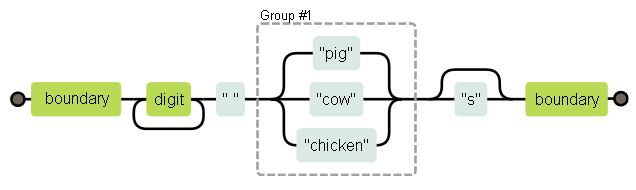
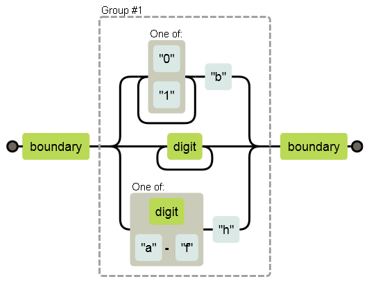
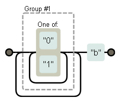

#Регулярные выражения

<i>Некоторые люди, столкнувшись с проблемой, думают: «О, а использую-ка я регулярные выражения». Теперь у них есть две проблемы.
Джейми Завински

Юан-Ма сказал: «Требуется большая сила, чтобы резать дерево поперёк структуры древесины. Требуется много кода, чтобы программировать поперёк структуры проблемы.
Мастер Юан-Ма, «Книга программирования»</i>

Инструменты и техники программирования выживают и распространяются хаотично-эволюционным способом. Иногда выживают не красивые и гениальные, а просто такие, которые достаточно хорошо работают в своей области – к примеру, если их интегрируют в другую успешную технологию.

В этой главе мы обсудим такой инструмент – регулярные выражения. Это способ описывать шаблоны в строковых данных. Они создают небольшой отдельный язык, который входит в JavaScript и во множество других языков и инструментов.

Регулярки одновременно очень странные и крайне полезные. Их синтаксис загадочен, а программный интерфейс в JavaScript для них неуклюж. Но это мощный инструмент для исследования и обработки строк. Разобравшись с ними, вы станете более эффективным программистом.

##Создаём регулярное выражение
Регулярка – тип объекта. Её можно создать, вызвав конструктор RegExp, или написав нужный шаблон, окружённый слешами.

```js
var re1 = new RegExp("abc");
var re2 = /abc/;
```

Оба этих регулярных выражения представляют один шаблон: символ “a”, за которым следует символ “b”, за которым следует символ “c”.

Если вы используете конструктор RegExp, тогда шаблон записывается как обычная строка, поэтому действуют все правила относительно обратных слешей.

Вторая запись, где шаблон находится между слешами, обрабатывает обратные слеши по-другому. Во-первых, так как шаблон заканчивается прямым слешем, то нужно ставить обратный слеш перед прямым слешем, который мы хотим включить в наш шаблон. Кроме того, обратные слеши, не являющиеся частью специальных символов типа \n, будут сохранены (а не проигнорированы, как в строках), и изменят смысл шаблона. У некоторых символов, таких, как знак вопроса или плюс, есть особое значение в регулярках, и если вам нужно найти такой символ, его также надо предварять обратным слешем.

```js
var eighteenPlus = /eighteen\+/;
```

Чтобы знать, какие символы надо предварять слешем, вам надо выучить список всех специальных символов в регулярках. Пока это нереально, поэтому в случае сомнений просто ставьте обратный слеш перед любым символом, не являющимся буквой, числом или пробелом.

##Проверяем на совпадения
У регулярок есть несколько методов. Простейший – test. Если передать ему строку, он вернёт булевское значение, сообщая, содержит ли строка вхождение заданного шаблона.

```js
console.log(/abc/.test("abcde"));
// → true
console.log(/abc/.test("abxde"));
// → false
```

Регулярка, состоящая только из неспециальных символов, просто представляет собой последовательность этих символов. Если abc есть где-то в строке, которую мы проверяем (не только в начале), test вернёт true.

##Ищем набор символов
Выяснить, содержит ли строка abc, можно было бы и при помощи indexOf. Регулярки позволяют пройти дальше и составлять более сложные шаблоны.

Допустим, нам надо найти любой номер. Когда мы в регулярке помещаем набор символов в квадратные скобки, это означает, что эта часть выражения совпадает с любым из символов в скобках.

Оба выражения находятся в строчках, содержащих цифру.

```js
console.log(/[0123456789]/.test("in 1992"));
// → true
console.log(/[0-9]/.test("in 1992"));
// → true
```

В квадратных скобках тире между двумя символами используется для задания диапазона символов, где последовательность задаётся кодировкой Unicode. Символы от 0 до 9 находятся там просто подряд (коды с 48 до 57), поэтому [0-9] захватывает их все и совпадает с любой цифрой.

У нескольких групп символов есть свои встроенные сокращения:  
`\d` – любая цифра  
`\w` – алфавитно-цифровой символ  
`\s` – пробельный символ (пробел, табуляция, перевод строки, и т.п.)  
`\D` – не цифра  
`\W` – не алфавитно-цифровой символ  
`\S` – не пробельный символ  
`.` – любой символ, кроме перевода строки

Таким образом можно задать формат даты и времени вроде 30-01-2003 15:20 следующим выражением:

```js
var dateTime = /\d\d-\d\d-\d\d\d\d \d\d:\d\d/;
console.log(dateTime.test("30-01-2003 15:20"));
// → true
console.log(dateTime.test("30-jan-2003 15:20"));
// → false
```

Выглядит ужасно, не так ли? Слишком много обратных слешей, которые затрудняют понимание шаблона. Позже мы слегка улучшим его.

Обратные слеши можно использовать и в квадратных скобках. Например, [\d.] означает любую цифру или точку. Заметьте, что точка внутри квадратных скобок теряет своё особое значение и превращается просто в точку. То же касается и других специальных символов, типа +.

Инвертировать набор символов – то есть, сказать, что вам надо найти любой символ, кроме тех, что есть в наборе – можно, поставив знак ^ сразу после открывающей квадратной скобки.

```js
var notBinary = /[^01]/;
console.log(notBinary.test("1100100010100110"));
// → false
console.log(notBinary.test("1100100010200110"));
// → true
```

##Повторяем части шаблона
Мы знаем, как найти одну цифру. А если нам надо найти число целиком – последовательность из одной или более цифр?

Если поставить после чего-либо в регулярке знак +, это будет означать, что этот элемент может быть повторён более одного раза. /\d+/ означает одну или несколько цифр.

```js
console.log(/'\d+'/.test("'123'"));
// → true
console.log(/'\d+'/.test("''"));
// → false
console.log(/'\d*'/.test("'123'"));
// → true
console.log(/'\d*'/.test("''"));
// → true
```

У звёздочки * значение почти такое же, но она разрешает шаблону присутствовать ноль раз. Если после чего-то стоит звёздочка, то оно никогда не препятствует нахождению шаблона в строке – оно просто находится там ноль раз.

Знак вопроса делает часть шаблона необязательной, то есть она может встретиться ноль или один раз. В следующем примере символ u может встречаться, но шаблон совпадает и тогда, когда его нет.

```js
var neighbor = /neighbou?r/;
console.log(neighbor.test("neighbour"));
// → true
console.log(neighbor.test("neighbor"));
// → true
```

Чтобы задать точное количество раз, которое шаблон должен встретиться, используются фигурные скобки. {4} после элемента означает, что он должен встретиться в строке 4 раза. Также можно задать промежуток: {2,4} означает, что элемент должен встретиться не менее 2 и не более 4 раз.

Ещё одна версия формата даты и времени, где разрешены дни, месяцы и часы из одной или двух цифр. И ещё она чуть более читаема.

```js
var dateTime = /\d{1,2}-\d{1,2}-\d{4} \d{1,2}:\d{2}/;
console.log(dateTime.test("30-1-2003 8:45"));
// → true
```

Можно использовать промежутки с открытым концом, опуская одно из чисел. {,5} означает, что шаблон может встретиться от нуля до пяти раз, а {5,} – от пяти и более.

##Группировка подвыражений
Чтобы использовать операторы * или + на нескольких элементах сразу, можно использовать круглые скобки. Часть регулярки, заключённая в скобки, считается одним элементом с точки зрения операторов.

```js
var cartoonCrying = /boo+(hoo+)+/i;
console.log(cartoonCrying.test("Boohoooohoohooo"));
// → true
```

Первый и второй плюсы относятся только ко вторым буквам о в словах boo и hoo. Третий + относится к целой группе (hoo+), находя одну или несколько таких последовательностей.

Буква i в конце выражения делает регулярку нечувствительной к регистру симолов – так, что B совпадает с b.

##Совпадения и группы
Метод test – самый простой метод проверки регулярок. Он только сообщает, было ли найдено совпадение, или нет. У регулярок есть ещё метод exec, который вернёт null, если ничего не было найдено, а в противном случае вернёт объект с информацией о совпадении.

```js
var match = /\d+/.exec("one two 100");
console.log(match);
// → ["100"]
console.log(match.index);
// → 8
```

У возвращаемого exec объекта есть свойство index, где содержится номер символа, с которого случилось совпадение. А вообще объект выглядит как массив строк, где первый элемент – строка, которую проверяли на совпадение. В нашем примере это будет последовательность цифр, которую мы искали.

У строк есть метод match, работающий примерно так же.

```js
console.log("one two 100".match(/\d+/));
// → ["100"]
```

Когда в регулярке содержатся подвыражения, сгруппированные круглыми скобками, текст, совпавший с этими группами, тоже появится в массиве. Первый элемент всегда совпадение целиком. Второй – часть, совпавшая с первой группой (той, у кого круглые скобки встретились раньше всех), затем со второй группой, и так далее.

```js
var quotedText = /'([^']*)'/;
console.log(quotedText.exec("she said 'hello'"));
// → ["'hello'", "hello"]
```

Когда группа не найдена вообще (например, если за ней стоит знак вопроса), её позиция в массиве содержит undefined. Если группа совпала несколько раз, то в массиве будет только последнее совпадение.

```js
console.log(/bad(ly)?/.exec("bad"));
// → ["bad", undefined]
console.log(/(\d)+/.exec("123"));
// → ["123", "3"]
```

Группы полезны для извлечения частей строк. Если нам не просто надо проверить, есть ли в строке дата, а извлечь её и создать представляющий дату объект, мы можем заключить последовательности цифр в круглые скобки и выбрать дату из результата exec.

Но для начала небольшое отступление, в котором мы узнаем предпочтительный способ хранения даты и времени в JavaScript.

##Тип даты
В JavaScript есть стандартный тип объекта для дат – а точнее, моментов во времени. Он называется Date. Если просто создать объект даты через new, вы получите текущие дату и ремя.

```js
console.log(new Date());
// → Sun Nov 09 2014 00:07:57 GMT+0300 (CET)
```

Также можно создать объект, содержащий заданное время

```js
console.log(new Date(2015, 9, 21));
// → Wed Oct 21 2015 00:00:00 GMT+0300 (CET)
console.log(new Date(2009, 11, 9, 12, 59, 59, 999));
// → Wed Dec 09 2009 12:59:59 GMT+0300 (CET)
```

JavaScript использует соглашение, в котором номера месяцев начинаются с нуля, а номера дней – с единицы. Это глупо и нелепо. Поберегитесь.

Последние четыре аргумента (часы, минуты, секунды и миллисекунды) необязательны, и в случае отсутствия приравниваются к нулю.

Метки времени хранятся как количество миллисекунд, прошедших с начала 1970 года. Для времени до 1970 года используются отрицательные числа (это связано с соглашением по Unix time, которое было создано примерно в то время). Метод getTime объекта даты возвращает это число. Оно, естественно, большое.

```js
console.log(new Date(2013, 11, 19).getTime());
// → 1387407600000
console.log(new Date(1387407600000));
// → Thu Dec 19 2013 00:00:00 GMT+0100 (CET)
```

Если задать конструктору Date один аргумент, он воспринимается как это количество миллисекунд. Можно получить текущее значение миллисекунд, создав объект Date и вызвав метод getTime, или же вызвав функцию Date.now.

У объекта Date для извлечения его компонентов есть методы getFullYear, getMonth, getDate, getHours, getMinutes, и getSeconds. Есть также метод getYear, возвращающий довольно бесполезный двузначный код, типа 93 или 14.

Заключив нужные части шаблона в круглые скобки, мы можем создать объект даты прямо из строки.

```js
function findDate(string) {
  var dateTime = /(\d{1,2})-(\d{1,2})-(\d{4})/;
  var match = dateTime.exec(string);
  return new Date(Number(match[3]),
                  Number(match[2]) - 1,
                  Number(match[1]));
}
console.log(findDate("30-1-2003"));
// → Thu Jan 30 2003 00:00:00 GMT+0100 (CET)
```

##Границы слова и строки
К сожалению, findDate так же радостно извлечёт бессмысленную дату 00-1-3000 из строки «100-1-30000». Совпадение может случиться в любом месте строки, так что в данном случае он просто начнёт со второго символа и закончит на предпоследнем.

Если нам надо принудить совпадение взять всю строку целиком, мы используем метки ^ и $. ^ совпадает с началом строки, а $ с концом. Поэтому /^\d+$/ совпадает со строкой, состоящей только из одной или нескольких цифр, /^!/ совпадает со сторокой, начинающейся с восклицательного знака, а /x^/ не совпадает ни с какой строчкой (перед началом строки не может быть x).

Если, с другой стороны, нам просто надо убедиться, что дата начинается и заканчивается на границе слова, мы используем метку \b. Границей слова может быть начало или конец строки, или любое место строки, где с одной стороны стоит алфавитно-цифровой символ \w, а с другой – не алфавитно-цифровой.

```js
console.log(/cat/.test("concatenate"));
// → true
console.log(/\bcat\b/.test("concatenate"));
// → false
```

Отметим, что метка границы не представляет из себя символ. Это просто ограничение, обозначающее, что совпадение происходит только если выполняется определённое условие.

##Шаблоны с выбором
Допустим, надо выяснить, содержит ли текст не просто номер, а номер, за которым следует pig, cow, или chicken в единственном или множественном числе.

Можно было бы написать три регулярки и проверить их по очереди, но есть способ лучше. Символ | обозначает выбор между шаблонами слева и справа от него. И можно сказать следующее:

```js
var animalCount = /\b\d+ (pig|cow|chicken)s?\b/;
console.log(animalCount.test("15 pigs"));
// → true
console.log(animalCount.test("15 pigchickens"));
// → false
```

Скобки ограничивают часть шаблона, к которой применяется |, и можно поставить много таких операторов друг за другом, чтобы обозначить выбор из более чем двух вариантов.

##Механизм поиска
Регулярные выражения можно рассматривать как блок-схемы. Следующая диаграмма описывает последний животноводческий пример.



Выражение совпадает со строкой, если можно найти путь с левой части диаграммы в правую. Мы запоминаем текущее положение в строке, и каждый раз, проходя прямоугольник, проверяем, что часть строки сразу за нашим положением в ней совпадает с содержимым прямоугольника.

Значит, проверка совпадения нашей регулярки в строке «the 3 pigs» при прохождении по блок-схеме выглядит так:

 — на позиции 4 есть граница слова, и проходим первый прямоугольник
 — начиная с 4 позиции находим цифру, и проходим второй прямоугольник
 — на позиции 5 один путь замыкается назад перед вторым прямоугольником, а второй проходит далее к прямоугольнику с пробелом. У нас пробел, а не цифра, и мы выбираем второй путь.
 — теперь мы на позиции 6, начало “pigs”, и на тройном разветвлении путей. В строке нет “cow” или “chicken”, зато есть “pig”, поэтому мы выбираем этот путь.
 — на позиции 9 после тройного разветвления, один путь обходит “s” и направляется к последнему прямоугольнику с границей слова, а второй проходит через “s”. У нас есть “s”, поэтому мы идём туда.
 — на позиции 10 мы в конце строки, и совпасть может только граница слова. Конец строки считается границей, и мы проходим через последний прямоугольник. И вот мы успешно нашли наш шаблон.

В принципе, работают регулярные выражения следующим образом: алгоритм начинает в начале строки и пытается найти совпадение там. В нашем случае там есть граница слова, поэтому он проходит первый прямоугольник – но там нет цифры, поэтому на втором прямоугольнике он спотыкается. Потом он двигается ко второму символу в строке, и пытается найти совпадение там… И так далее, пока он не находит совпадение или не доходит до конца строки, в каком случае совпадение на найдено.

##Откаты
Регулярка /\b([01]+b|\d+|[\da-f]h)\b/ совпадает либо с двоичным числом, за которым следует b, либо с десятичным числом без суффикса, либо шестнадцатеричным (цифры от 0 до 9 или символы от a до h), за которым идёт h. Соответствующая диаграмма:



В поисках совпадения может случиться, что алгоритм пошёл по верхнему пути (двоичное число), даже если в строке нет такого числа. Если там есть строка “103”, к примеру, понятно, что только достигнув цифры 3 алгоритм поймёт, что он на неправильном пути. Вообще строка совпадает с регуляркой, просто не в этой ветке.

Тогда алгоритм совершает откат. На развилке он запоминает текущее положение (в нашем случае, это начало строки, сразу после границы слова), чтобы можно было вернуться назад и попробовать другой путь, если выбранный не срабатывает. Для строки “103” после встречи с тройкой он вернётся и попытается пройти путь для десятичных чисел. Это сработает, поэтому совпадение будет найдено.

Алгоритм останавливается, как только найдёт полное совпадение. Это значит, что даже если несколько вариантов могут подойти, используется только один из них (в том порядке, в каком они появляются в регулярке).

Откаты случаются при использовании операторов повторения, таких, как + и *. Если вы ищете /^.*x/ в строке «abcxe», часть регулярки .* попробует поглотить всю строчку. Алгоритм затем сообразит, что ему нужен ещё и “x”. Так как никакого “x” после конца строки нет, алгоритм попробует поискать совпадение, откатившись на один символ. После abcx тоже нет x, тогда он снова откатывается, уже к подстроке abc. И после строчки он находит x и докладывает об успешном совпадении, на позициях с 0 по 4.

Можно написать регулярку, которая приведёт ко множественным откатам. Такая проблема возникает, когда шаблон может совпасть с входными данными множеством разных способов. Например, если мы ошибёмся при написании регулярки для двоичных чисел, мы можем случайно написать что-то вроде /([01]+)+b/.



Если алгоритм будет искать такой шаблон в длинной строке из нолей и единиц, не содержащей в конце “b”, он сначала пройдёт по внутренней петле, пока у него не кончатся цифры. Тогда он заметит, что в конце нет “b”, сделает откат на одну позицию, пройдёт по внешней петле, опять сдастся, попытается откатиться на ещё одну позицию по внутренней петле… И будет дальше искать таким образом, задействуя обе петли. То есть, количество работы с каждым символом строки будет удваиваться. Даже для нескольких десятков символов поиск совпадения займёт очень долгое время.

##Метод replace
У строк есть метод replace, который может заменять часть строки другой строкой.

```js
console.log("папа".replace("п", "м"));
// → мапа
```

Первый аргумент может быть и регулярной, в каком случае заменяется первое вхождение регулярки в строке. Когда к регулярке добавляется опция “g” (global, всеобщий), заменяются все вхождения, а не только первое

```js
console.log("Borobudur".replace(/[ou]/, "a"));
// → Barobudur
console.log("Borobudur".replace(/[ou]/g, "a"));
// → Barabadar
```

Имело бы смысл передавать опцию «заменить все» через отдельный аргумент, или через отдельный метод типа replaceAll. Но к сожалению, опция передаётся через саму регулярку.

Вся сила регулярок раскрывается, когда мы используем ссылки на найденные в строке группы, заданные в регулярке. Например, у нас есть строка, содержащая имена людей, одно имя на строчку, в формате «Фамилия, Имя». Если нам надо поменять их местами и убрать запятую, чтобы получилось «Имя Фамилия», мы пишем следующее:

```js
console.log(
  "Hopper, Grace\nMcCarthy, John\nRitchie, Dennis"
    .replace(/([\w ]+), ([\w ]+)/g, "$2 $1"));
// → Grace Hopper
//   John McCarthy
//   Dennis Ritchie
```

$1 и $2 в строчке на замену ссылаются на группы символов, заключённые в скобки. $1 заменяется текстом, который совпал с первой группой, $2 – со второй группой, и так далее, до $9. Всё совпадение целиком содержится в переменной $&amp;.

Также можно в качестве второго аргумента передавать и функцию. Для каждой замены будет вызвана функция, аргументами которой будут найденные группы (и вся совпадающая часть строки целиком), а её результат будет вставлен в новую строку.

Простой пример:

```js
var s = "the cia and fbi";
console.log(s.replace(/\b(fbi|cia)\b/g, function(str) {
  return str.toUpperCase();
}));
// → the CIA and FBI
```

А вот более интересный:

```js
var stock = "1 lemon, 2 cabbages, and 101 eggs";
function minusOne(match, amount, unit) {
  amount = Number(amount) - 1;
  if (amount == 1) // остался только один, удаляем 's' в конце
    unit = unit.slice(0, unit.length - 1);
  else if (amount == 0)
    amount = "no";
  return amount + " " + unit;
}
console.log(stock.replace(/(\d+) (\w+)/g, minusOne));
// → no lemon, 1 cabbage, and 100 eggs
```

Код принимает строку, находит все вхождения чисел, за которыми идёт слово, и возвращает строчку, где каждое число уменьшено на единицу.

Группа (\d+) попадает в аргумент amount, а (\w+) – в unit. Функция преобразовывает amount в число – и это всегда срабатывает, потому что наш шаблон как раз \d+. И затем вносит изменения в слово, на случай если остался всего 1 предмет.

##Жадность
Несложно при помощи replace написать функцию, убирающую все комментарии из кода JavaScript. Вот первая попытка:

```js
function stripComments(code) {
  return code.replace(/\/\/.*|\/\*[^]*\*\//g, "");
}
console.log(stripComments("1 + /* 2 */3"));
// → 1 + 3
console.log(stripComments("x = 10;// ten!"));
// → x = 10;
console.log(stripComments("1 /* a */+/* b */ 1"));
// → 1  1
```

Часть перед оператором «или» совпадает с двумя слешами, за которыми идут любое количество символов, кроме символов перевода строки. Часть, убирающая многострочные комментарии, более сложна. Мы используем [^], т.е. любой символ, не являющийся пустым, в качестве способа найти любой символ. Мы не можем использовать точку, потому что блочные комментарии продолжаются и на новой строке, а символ перевода строки не совпадает с точкой.

Но вывод предыдущего примера неправильный. Почему?

Часть [^]* сначала попытается захватить столько символов, сколько может. Если из-за этого следующая часть регулярки не найдёт себе совпадения, произойдёт откат на один символ и попробует снова. В примере, алгоритм пытается захватить всю строку, и затем откатывается. Откатившись на 4 символа назад, он найдёт в строчке */ — а это не то, чего мы добивались. Мы-то хотели захватить только один комментарий, а не пройти до конца строки и найти последний комментарий.

Из-за этого мы говорим, что операторы повторения (+, *, ?, and {}) жадные, то есть они сначала захватывают, сколько могут, а потом идут назад. Если вы поместите вопрос после такого оператора (+?, *?, ??, {}?), они превратятся в нежадных, и начнут находить самые маленькие из возможных вхождений.

И это то, что нам нужно. Заставив звёздочку находить совпадения в минимально возможном количестве символов строчки, мы поглощаем только один блок комментариев, и не более того.

```js
function stripComments(code) {
  return code.replace(/\/\/.*|\/\*[^]*?\*\//g, "");
}
console.log(stripComments("1 /* a */+/* b */ 1"));
// → 1 + 1
```

Множество ошибок возникает при использовании жадных операторов вместо нежадных. При использовании оператора повтора сначала всегда рассматривайте вариант нежадного оператора.

##Динамическое создание объектов RegExp
В некоторых случаях точный шаблон неизвестен во время написания кода. Например, вам надо будет искать имя пользователя в тексте, и заключать его в подчёркивания. Так как вы узнаете имя только после запуска программы, вы не можете использовать запись со слешами.

Но вы можете построить строку и использовать конструктор RegExp. Вот пример:

```js
var name = "гарри";
var text = "А у Гарри на лбу шрам.";
var regexp = new RegExp("\\b(" + name + ")\\b", "gi");
console.log(text.replace(regexp, "_$1_"));
// → А у _Гарри_ на лбу шрам.
```

При создании границ слова приходится использовать двойные слеши, потому что мы пишем их в нормальной строке, а не в регулярке с прямыми слешами. Второй аргумент для RegExp содержит опции для регулярок – в нашем случае “gi”, т.е. глобальный и регистро-независимый.

Но что, если имя будет «dea+hl[]rd» (если наш пользователь – кульхацкер)? В результате мы получим бессмысленную регулярку, которая не найдёт в строке совпадений.

Мы можем добавить обратных слешей перед любым символом, который нам не нравится. Мы не можем добавлять обратные слеши перед буквами, потому что \b или \n – это спецсимволы. Но добавлять слеши перед любыми не алфавитно-цифровыми символами можно без проблем.

```js
var name = "dea+hl[]rd";
var text = "Этот dea+hl[]rd всех достал.";
var escaped = name.replace(/[^\w\s]/g, "\\$&");
var regexp = new RegExp("\\b(" + escaped + ")\\b", "gi");
console.log(text.replace(regexp, "_$1_"));
// → Этот _dea+hl[]rd_ всех достал.
```

##Метод search
Метод indexOf нельзя использовать с регулярками. Зато есть метод search, который как раз ожидает регулярку. Как и indexOf, он возвращает индекс первого вхождения, или -1, если его не случилось.

```js
console.log("  word".search(/\S/));
// → 2
console.log("    ".search(/\S/));
// → -1
```

К сожалению, никак нельзя задать, чтобы метод искал совпадение, начиная с конкретного смещения (как это можно сделать с indexOf). Это было бы полезно.

##Свойство lastIndex
Метод exec тоже не даёт удобного способа начать поиск с заданной позиции в строке. Но неудобный способ даёт.

У объекта регулярок есть свойства. Одно из них – source, содержащее строку. Ещё одно – lastIndex, контролирующее, в некоторых условиях, где начнётся следующий поиск вхождений.

Эти условия включают необходимость присутствия глобальной опции g, и то, что поиск должен идти с применением метода exec. Более разумным решением было бы просто допустить дополнительный аргумент для передачи в exec, но разумность – не основополагающая черта в интерфейсе регулярок JavaScript.

```js
var pattern = /y/g;
pattern.lastIndex = 3;
var match = pattern.exec("xyzzy");
console.log(match.index);
// → 4
console.log(pattern.lastIndex);
// → 5
```

Если поиск был успешным, вызов exec обновляет свойство lastIndex, чтоб оно указывало на позицию после найденного вхождения. Если успеха не было, lastIndex устанавливается в ноль – как и lastIndex у только что созданного объекта.

При использовании глобальной переменной-регулярки и нескольких вызовов exec эти автоматические обновления lastIndex могут привести к проблемам. Ваша регулярка может начать поиск с позиции, оставшейся с предыдущего вызова.

```js
var digit = /\d/g;
console.log(digit.exec("here it is: 1"));
// → ["1"]
console.log(digit.exec("and now: 1"));
// → null
```

Ещё один интересный эффект опции g в том, что она меняет работу метода match. Когда он вызывается с этой опцией, вместо возврата массива, похожего на результат работы exec, он находит все вхождения шаблона в строке и возвращает массив из найденных подстрок.

```js
console.log("Банан".match(/ан/g));
// → ["ан", "ан"]
```

Так что поосторожнее с глобальными переменными-регулярками. В случаях, когда они необходимы – вызовы replace или места, где вы специально используете lastIndex – пожалуй и все случаи, в которых их следует применять.

##Циклы по вхождениям

Типичная задача – пройти по всем вхождениям шаблона в строку так, чтобы иметь доступ к объекту match в теле цикла, используя lastIndex и exec.

```js
var input = "Строчка с 3 числами в ней... 42 и 88.";
var number = /\b(\d+)\b/g;
var match;
while (match = number.exec(input))
  console.log("Нашёл ", match[1], " на ", match.index);
// → Нашёл 3 на 14
//   Нашёл 42 на 33
//   Нашёл 88 на 40
```

Используется тот факт, что значением присвоения является присваиваемое значение. Используя конструкцию match = re.exec(input) в качестве условия в цикле while, мы производим поиск в начале каждой итерации, сохраняем результат в переменной, и заканчиваем цикл, когда все совпадения найдены.

##Разбор INI файлы

В заключение главы рассмотрим задачу с использованием регулярок. Представьте, что мы пишем программу, собирающую сведения о наших врагах через интернет в автоматическом режиме. (Всю программу писать не будем, только ту часть, которая читает файл с настройками. Извините.) Файл выглядит так:

```ini
searchengine=http://www.google.com/search?q=$1
spitefulness=9.7

; перед комментариями ставится точка с запятой
; каждая секция относится к отдельному врагу
[larry]
fullname=Larry Doe
type=бычара из детсада
website=http://www.geocities.com/CapeCanaveral/11451

[gargamel]
fullname=Gargamel
type=злой волшебник
outputdir=/home/marijn/enemies/gargamel
```

Точный формат файла (который довольно широко используется, и обычно называется INI), следующий:

 — пустые строки и строки, начинающиеся с точки с запятой, игнорируются
 — строки, заключённые в квадратные скобки, начинают новую секцию
 — строки, содержащие алфавитно-цифровой идентификатор, за которым следует =, добавляют настройку в данной секции

Всё остальное – неверные данные.

Наша задача – преобразовать такую строку в массив объектов, каждый со свойством name и массивом настроек. Для каждой секции нужен один объект, и ещё один – для глобальных настроек сверху файла.

Так как файл надо разбирать построчно, неплохо начать с разбиения файла на строки. Для этого в главе 6 мы использовали string.split("\n"). Некоторые операционки используют для перевода строки не один символ \n, а два — \r\n. Так как метод split принимает регулярки в качестве аргумента, мы можем делить линии при помощи выражения /\r?\n/, разрешающего и одиночные \n и \r\n между строками.

```js
function parseINI(string) {
  // Начнём с объекта, содержащего настройки верхнего уровня
  var currentSection = {name: null, fields: []};
  var categories = [currentSection];

  string.split(/\r?\n/).forEach(function(line) {
    var match;
    if (/^\s*(;.*)?$/.test(line)) {
      return;
    } else if (match = line.match(/^\[(.*)\]$/)) {
      currentSection = {name: match[1], fields: []};
      categories.push(currentSection);
    } else if (match = line.match(/^(\w+)=(.*)$/)) {
      currentSection.fields.push({name: match[1],
                                  value: match[2]});
    } else {
      throw new Error("Строчка '" + line + "' содержит неверные данные.");
    }
  });

  return categories;
}
```

Код проходит все строки, обновляя объект текущей секции “current section”. Сначала он проверяет, можно ли игнорировать строчку, при помощи регулярки /^\s*(;.*)?$/. Соображаете, как это работает? Часть между скобок совпадает с комментариями, а? делает так, что регулярка совпадёт и со строчками, состоящими из одних пробелов.

Если строка – не комментарий, код проверяет, начинает ли она новую секцию. Если да, он создаёт новый объект для текущей секции, к которому добавляются последующие настройки.

Последняя осмысленная возможность – строка является обычной настройкой, и в этом случае она добавляется к текущему объекту.

Если ни один вариант не сработал, функция выдаёт ошибку.

Заметьте, как частое использование ^ и $ заботится о том, что выражение совпадает со всей строкой целиком, а не с частью. Если их не использовать, код в целом будет работать, но иногда будет выдавать странные результаты, и такую ошибку будет трудно отследить.

Конструкция if (match = string.match(...)) похожа на трюк, использующий присвоение как условие в цикле while. Часто вы не знаете, что вызов match будет успешным, поэтому вы можете получить доступ к результирующему объекту только внутри блока if, который это проверяет. Чтоб не разбивать красивую цепочку проверок if, мы присваиваем результат поиска переменной, и сразу используем это присвоение как проверку.

##Международные символы
Из-за изначально простой реализации языка, и последующей фиксации такой реализации «в граните», регулярки JavaScript тупят с символами, не встречающимися в английском языке. К примеру, символ «буквы» с точки зрения регулярок JavaScript, может быть одним из 26 букв английского алфавита, и почему-то ещё подчёркиванием. Буквы типа é или β, однозначно являющиеся буквами, не совпадают с \w (и совпадут с \W, то есть с не-буквой).

По странному стечению обстоятельств, исторически \s (пробел) совпадает со всеми символами, которые в Unicode считаются пробельными, включая такие штуки, как неразрывный пробел или монгольский разделитель гласных.

У некоторых реализаций регулярок в других языках есть особый синтаксис для поиска специальных категорий символов Unicode, типа «все прописные буквы», «все знаки препинания» или «управляющие символы». Есть планы по добавлению таких категорий и в JavaScript, но они, видимо, будут реализованы не скоро.

##Итог

Регулярки – это объекты, представляющие шаблоны поиска в строках. Они используют свой синтаксис для выражения этих шаблонов.

`/abc/` Последовательность символов
`/[abc]/` Любой символ из списка
`/[^abc]/` Любой символ, кроме символов из списка
`/[0-9]/` Любой символ из промежутка
`/x+/` Одно или более вхождений шаблона x
`/x+?/` Одно или более вхождений, нежадное
`/x*/` Ноль или более вхождений
`/x?/` Ноль или одно вхождение
`/x{2,4}/` От двух до четырёх вхождений
`/(abc)/` Группа
`/a|b|c/` Любой из нескольких шаблонов
`/\d/` Любая цифра
`/\w/` Любой алфавитно-цифровой символ («буква»)
`/\s/` Любой пробельный символ
`/./` Любой символ, кроме переводов строки
`/\b/` Граница слова
`/^/` Начало строки
`/$/` Конец строки

У регулярки есть метод test, для проверки того, есть ли шаблон в строке. Есть метод exec, возвращающий массив, содержащий все найденные группы. У массива есть свойство index, показывающее, где начался поиск.

У строк есть метод match для поиска шаблонов, и метод search, возвращающий только начальную позицию вхождения. Метод replace может заменять вхождения шаблона на другую строку. Кроме этого, вы можете передать в replace функцию, которая будет строить строчку на замену, основываясь на шаблоне и найденных группах.

У регулярок есть настройки, которые пишут после закрывающего слеша. Опция i делает регулярку регистронезависимой, а опция g делает её глобальной, что, кроме прочего, заставляет метод replace заменять все найденные вхождения, а не только первое.

Конструктор RegExp можно использовать для создания регулярок из строк.

Регулярки – острый инструмент с неудобной ручкой. Они сильно упрощают одни задачи, и могут стать неуправляемыми при решении других, сложных задач. Часть умения пользоваться регулярками состоит в том, чтобы уметь сопротивляться искушению запихнуть в них задачу, для которой они не предназначены.

##Упражнения
Неизбежно при решении задач у вас возникнут непонятные случаи, и вы можете иногда отчаиваться, видя непредсказуемое поведение некоторых регулярок. Иногда помогает изучить поведение регулярки через онлайн-сервис типа debuggex.com, где можно посмотреть её визуализацию и сравнить с желаемым эффектом.

###Регулярный гольф
«Гольфом» в коде называют игру, где нужно выразить заданную программу минимальным количеством символов. Регулярный гольф – практическое упражнение по написанию наименьших возможных регулярок для поиска заданного шаблона, и только его.

Для каждой из подстрочек напишите регулярку для проверки их нахождения в строке. Регулярка должна находить только эти указанные подстроки. Не волнуйтесь насчёт границ слов, если это не упомянуто особо. Когда у вас получится работающая регулярка, попробуйте её уменьшить.

 — car и cat
 — pop и prop
 — ferret, ferry, и ferrari
 — Любое слово, заканчивающееся на ious
 — Пробел, за которым идёт точка, запятая, двоеточие или точка с запятой.
 — Слово длинее шести букв
 — Слово без букв e

```js
// Впишите свои регулярки

verify(/.../,
       ["my car", "bad cats"],
       ["camper", "high art"]);

verify(/.../,
       ["pop culture", "mad props"],
       ["plop"]);

verify(/.../,
       ["ferret", "ferry", "ferrari"],
       ["ferrum", "transfer A"]);

verify(/.../,
       ["how delicious", "spacious room"],
       ["ruinous", "consciousness"]);

verify(/.../,
       ["bad punctuation ."],
       ["escape the dot"]);

verify(/.../,
       ["hottentottententen"],
       ["no", "hotten totten tenten"]);

verify(/.../,
       ["red platypus", "wobbling nest"],
       ["earth bed", "learning ape"]);

function verify(regexp, yes, no) {
  // Ignore unfinished exercises
  if (regexp.source == "...") return;
  yes.forEach(function(s) {
    if (!regexp.test(s))
      console.log("Не нашлось '" + s + "'");
  });
  no.forEach(function(s) {
    if (regexp.test(s))
      console.log("Неожиданное вхождение '" + s + "'");
  });
}
```

###Кавычки в тексте
Допустим, вы написали рассказ, и везде для обозначения диалогов использовали одинарные кавычки. Теперь вы хотите заменить кавычки диалогов на двойные, и оставить одинарные в сокращениях слов типа aren’t.

Придумайте шаблон, различающий два этих использования кавычек, и напишите вызов метода replace, который производит замену.

###Снова числа
Последовательности цифр можно найти простой регуляркой /\d+/.

Напишите выражение, находящее только числа, записанные в стиле JavaScript. Оно должно поддерживать возможный минус или плюс перед числом, десятичную точку, и экспоненциальную запись 5e-3 или 1E10 – опять-таки с возможными плюсом или минусом. Также заметьте, что до или после точки не обязательно могут стоять цифры, но при этом число не может состоять из одной точки. То есть, .5 или 5. – допустимые числа, а одна точка сама по себе – нет.

```js
// Впишите сюда регулярку.
var number = /^...$/;

// Tests:
["1", "-1", "+15", "1.55", ".5", "5.", "1.3e2", "1E-4",
 "1e+12"].forEach(function(s) {
  if (!number.test(s))
    console.log("Не нашла '" + s + "'");
});
["1a", "+-1", "1.2.3", "1+1", "1e4.5", ".5.", "1f5",
 "."].forEach(function(s) {
  if (number.test(s))
    console.log("Неправильно принято '" + s + "'");
});
```
